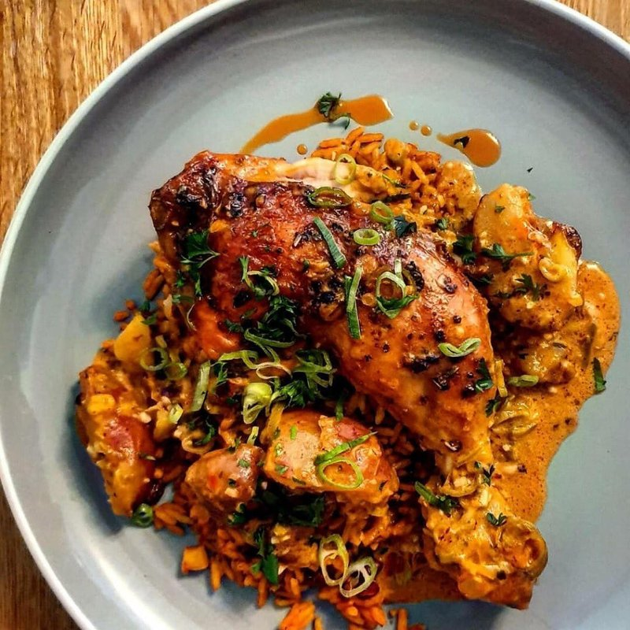

# Galinha à Zambeziana

*Zambezia province's coastal chicken: spatchcocked bird marinated in coconut milk, lime and piri-piri, grilled and bathed in a coconut-cashew-paprika sauce.*

**Serves:** 4

**Prep Time:** 15 minutes (plus 2 hours marinating)

**Cook Time:** 50 minutes

## Overview
The chicken marinates in coconut milk, lime juice, garlic and a couple of crushed chillies. It roasts at a moderate temperature so the marinade glazes rather than burns. A pan sauce builds with cashew nuts ground into the coconut milk, paprika, and the chicken juices, and gets poured over the carved bird at the table.

## Ingredients

### Marinade
- 1 whole chicken (1.6-1.8 kg) (spatchcocked)
- 200 ml coconut milk
- 2 limes (plus zest of 1, juice)
- 6 garlic cloves (crushed)
- 3 bird's-eye chillies (finely chopped)
- 1 tablespoon paprika
- 1 teaspoon salt
- 1 teaspoon ground black pepper

### Coconut-cashew sauce
- 50 g raw cashew nuts (lightly toasted, finely ground)
- 200 ml coconut milk
- 1 tablespoon paprika
- 1 tablespoon piri-piri sauce (or chilli paste)
- 1 tablespoon lime juice
- ½ teaspoon salt
- 1 tablespoon coriander leaves (chopped, to finish)

## Method

### Stage 1 - Marinade
1. Whisk the coconut milk, lime juice and zest, garlic, chillies, paprika, salt and pepper in a wide dish.
1. Score the thick parts of the chicken. Turn the bird in the marinade; cover; refrigerate 2 hours minimum.

### Stage 2 - Roast
1. Heat oven to 200°C (180°C fan).
1. Place the chicken skin-up on a wire rack over a roasting tray. Spoon over half the marinade.
1. Roast 40 minutes, basting twice with pan juices. The skin should be golden and the juices clear from the thigh.

### Stage 3 - Sauce
1. While the chicken rests, pour any pan juices into a small pan.
1. Add the ground cashew, coconut milk, paprika and piri-piri.
1. Simmer gently 5-6 minutes until thick enough to coat a spoon.
1. Stir in lime juice and salt.

### Stage 4 - Serve
1. Joint the chicken onto a platter. Pour over the warm coconut-cashew sauce. Scatter coriander.
1. Serve with coconut rice and a green salad.

## Notes
- **Cashews:** Grind them in a small food processor or a mortar. Some pieces are fine - the sauce isn't expected to be glass-smooth.
- **Heat balance:** The coconut milk softens the chilli; the sauce ends up rich rather than fiery. Add more piri-piri at the end if you want more bite.
- **Spatchcock for even cooking:** A whole upright chicken won't cook evenly under this sauce. Flat is the way.

## Storage
- Refrigerate 3 days; reheat in the oven covered.
- The sauce thickens cold - loosen with a splash of coconut milk when reheating.
