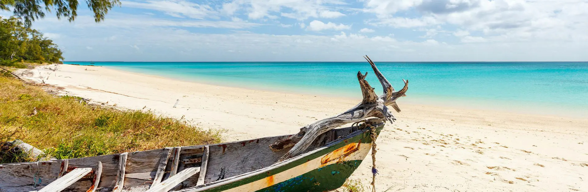

# Mozambique Cuisine

Indian Ocean cooking that married Portuguese colonial technique with coconut, cashew, peri-peri and the produce of the Lusophone trading routes. Frango piri-piri (the famous flame-grilled chicken), matata (clam and peanut stew), galinha à zambeziana and prawns in coconut sauce define the savoury table; xima (the white-maize staple) and coconut rice fill out the plate. Cashew, peanut, lemon and the smoky burn of piri-piri are everywhere; rissóis (filled pastries) and bolinhos open meals.
