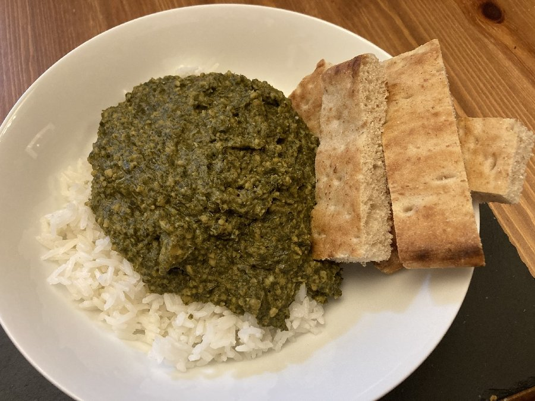

# Matata

*A Mozambican coastal stew of clams (or shrimp), peanut paste and tender greens. Coastal Portuguese-Mozambican cooking at its richest: shellfish meets peanut, lime and coconut. Eaten with xima or coconut rice; the sauce is the point, and the bread (or rice) just there to mop.*

**Serves:** 4

**Prep Time:** 20 minutes

**Cook Time:** 35 minutes

## Overview
Onion, garlic and tomato fry to a sofrito. Peanut paste loosened with hot water becomes the body of the sauce. Clams or shrimp poach quickly in the sauce just until cooked. Tender pumpkin leaves (or spinach) wilt in at the end. Lime and coriander finish.

## Ingredients

- 800 g clams (live, scrubbed) OR 500 g raw shrimp, peeled
- 3 tablespoons vegetable oil
- 1 onion (large, finely chopped)
- 4 garlic cloves (crushed)
- 2 fresh tomatoes (grated)
- 1 tablespoon tomato puree
- 1 teaspoon paprika
- 1-2 bird's-eye chillies (finely chopped, to taste)
- 4 tablespoons smooth peanut butter (unsweetened) or peanut paste
- 200 ml hot water (plus more as needed)
- 200 g pumpkin leaves, spinach (or chard, stems removed, shredded)
- 1 lime (juice)
- 2 tablespoons fresh coriander (chopped)
- Salt to taste

## Method

### Stage 1 - Prep
1. If using clams: rinse well; tap any open shells. Discard any that stay open.
1. If using shrimp: peel, devein, pat dry, season lightly with salt.

### Stage 2 - Build the sauce
1. Heat the oil in a wide pan over medium heat.
1. Soften the onion 6-7 minutes until pale gold.
1. Add garlic, paprika and chilli; cook 30 seconds.
1. Stir in the grated tomato and tomato puree; reduce until thick (5 minutes).

### Stage 3 - Peanut sauce
1. Whisk the peanut butter with the hot water in a small bowl until smooth.
1. Pour into the pan; stir to combine. The sauce should be the texture of double cream; add a splash more water if too thick.
1. Simmer 5 minutes.

### Stage 4 - Shellfish
1. **For clams:** Tip in the clams; cover; cook 4-5 minutes, shaking occasionally, until the shells open. Discard any that don't.
1. **For shrimp:** Stir in the shrimp; cook 3-4 minutes until pink and just firm.

### Stage 5 - Finish
1. Add the greens; stir; cover briefly until wilted (2 minutes).
1. Squeeze in lime juice; taste and adjust salt.
1. Scatter coriander; serve with xima or coconut rice.

## Notes
- **Live clams:** Soak in salted cold water 30 minutes before cooking to purge any sand. Tap any open shells before cooking; discard ones that stay open. Same after cooking with any that stay closed.
- **Shrimp swap:** Easier weekday version. The flavour stays Mozambican; you lose the brininess that clam liquor brings.
- **Pumpkin leaves:** Traditional. In their absence, baby spinach or chard works.

## Storage
- Best eaten same day. The peanut sauce keeps without the shellfish (refrigerate 2 days); cook fresh shellfish into reheated sauce.
