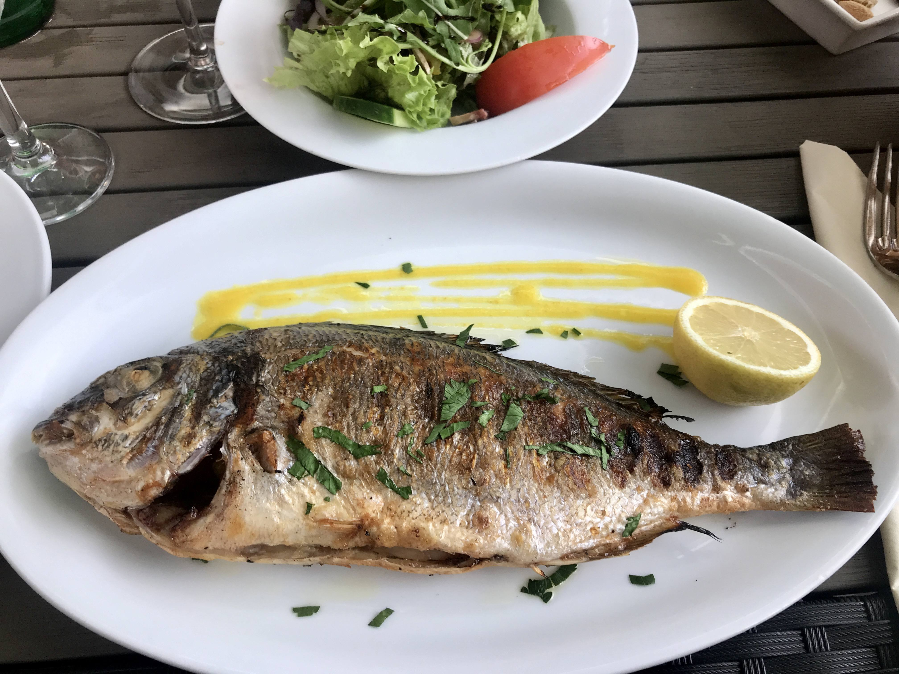

# Peixe Grelhado à Moçambicana

*Mozambique's whole grilled fish: a whole white-fleshed fish (red snapper, kingfish or rock cod) butterflied open, marinated in a paste of garlic, fresh herbs, piri-piri, lemon and olive oil, grilled over hot charcoal till the skin chars and the flesh stays sweet and moist. The Maputo seaside classic, eaten with arroz de coco and a green salad.*

**Serves:** 4

**Prep Time:** 30 minutes (plus 30 minutes marination)

**Cook Time:** 20 minutes

## Overview
Peixe grelhado à Moçambicana is one of Mozambique's most beloved fish dishes and a coastal specialty across the country: a whole white-fleshed ocean fish (red snapper, kingfish, rock cod or sea bream; the canonical preference is the local pargo do norte red snapper) butterflied open from the belly side and laid flat, marinated briefly in a piri-piri-infused paste of garlic, fresh coriander, parsley, lemon, smoked paprika and olive oil, then grilled over hot charcoal till the skin chars deeply and the flesh stays sweet and just cooked through. The Mozambican answer to the great whole-fish-grilled traditions of Southeast Asia, the Caribbean and the Mediterranean: simple ingredients, charcoal grill, the fish's freshness as the main flavour. Use the freshest whole fish you can find. The Mozambican butterfly cut goes through the belly side, leaving the back attached, which gives a flat surface that cooks evenly over the grill. Served on a large platter with arroz de coco, a green salad, lemon wedges and a small bowl of warm piri-piri butter for dipping.

## Ingredients

### Fish
- 1 large whole white-fleshed fish (about 1.2-1.5 kg; red snapper, sea bream, kingfish, or rock cod; gutted, scaled, head and tail on)

### Marinade
- 6 garlic cloves (crushed)
- 1 large bunch fresh coriander (about 40 g; chopped)
- 1 small bunch fresh parsley (about 15 g; chopped)
- 1 thumb (3 cm) fresh ginger (finely grated)
- 4 tablespoons olive oil
- 3 tablespoons fresh lemon juice
- Zest of 1 lemon
- 2 tablespoons smoked paprika
- 1 tablespoon hot paprika
- 2 tablespoons piri-piri sauce (or substitute with hot chilli sauce)
- 2 teaspoons fine sea salt
- 1 teaspoon ground black pepper
- 1 teaspoon dried oregano
- 1 small fresh chilli (deseeded, finely chopped; optional)

### Piri-piri butter (for serving)
- 80 g unsalted butter
- 4 garlic cloves (crushed)
- 2 tablespoons piri-piri sauce
- 1 tablespoon fresh lemon juice
- 1 tablespoon fresh parsley (chopped)
- 1 tablespoon fresh coriander (chopped)

### To serve
- Arroz de coco (coconut rice; see existing Mozambique recipe)
- Salada Mozambicana (lettuce, tomato, cucumber, red onion, with olive oil, lemon juice, salt)
- Lemon wedges
- Crispy chips or boiled new potatoes
- Extra piri-piri sauce
- Cold beer or vinho verde

## Method

### Stage 1 - Prepare the fish
1. Rinse the fish under cold running water; pat dry inside and out with kitchen paper.
2. To butterfly through the belly: open the gutted cavity wider; cut along the backbone from inside the cavity (cut through the ribs but not through the back skin) so the fish can be opened flat.
3. Alternatively (easier): score the fish with 4 deep cuts on each side, going through to the bone (this lets the marinade penetrate and the heat cook evenly without the butterfly cut).
4. Place the fish in a wide shallow dish.

### Stage 2 - Make the marinade
1. Combine the crushed garlic, chopped coriander, parsley, grated ginger, olive oil, lemon juice, lemon zest, both paprikas, piri-piri sauce, salt, pepper, oregano and chopped chilli (if using) in a bowl.
2. Whisk to a smooth marinade.

### Stage 3 - Marinate
1. Pour the marinade over the fish, rubbing into the scores (or the open butterfly), the cavity, and over the outside of the fish.
2. Cover and refrigerate 30 minutes (don't exceed 1 hour; the citrus starts to cure the flesh).

### Stage 4 - Prepare the grill
1. Light a charcoal grill; let burn down to glowing embers (about 30 minutes).
2. Or heat a heavy ridged grill pan over high heat till smoking.
3. Have a fish-grilling basket or large spatula ready for turning.

### Stage 5 - Make the piri-piri butter
1. Melt the butter in a small saucepan over low heat.
2. Add the crushed garlic; cook 30 seconds till fragrant (don't brown).
3. Stir in the piri-piri sauce, lemon juice, parsley and coriander.
4. Keep warm.

### Stage 6 - Grill the fish
1. Brush the grill grates with oil to prevent sticking.
2. If using a fish basket: place the fish inside, close the basket, place over the hot coals.
3. If grilling directly: place the fish on the hot grates.
4. Grill 8-10 minutes on the first side (don't move the fish; let the skin char).
5. Flip carefully; grill 6-8 minutes on the second side.
6. Brush with the piri-piri butter halfway through the second side.
7. The fish is done when the flesh through the cuts is opaque and flakes easily with a fork; the eyes should be cloudy.

### Stage 7 - Serve immediately
1. Transfer the fish carefully to a large warm wooden platter.
2. Drizzle generously with the remaining piri-piri butter.
3. Scatter extra chopped coriander and parsley over.
4. Surround with lemon wedges, arroz de coco, salad and chips.
5. Provide extra piri-piri sauce in a small bowl.
6. Eat at the centre of the table; pick the flesh from the bones with a fork or hands.

## Notes
- **Fresh fish is essential:** the dish depends on fish quality. Caught-that-morning is the proper Mozambican experience; outside the country, get the freshest whole fish you can find.
- **Score or butterfly:** both work. Scoring is easier; butterflying gives more even cooking. The Mozambican preference is for opening the fish flat via butterfly through the belly.
- **Charcoal gives the proper character:** the smoky charred flavour comes from open-flame charcoal cooking. A grill pan works in a pinch but lacks the depth.
- **Use a fish basket if you have one:** prevents the fish breaking apart when you flip. Available at fishing-supply and outdoor cooking shops.
- **Don't overcook:** white-fleshed fish goes dry quickly. 8-10 minutes per side for a 1.2-1.5 kg fish is the maximum; check the flesh through the cuts and stop as soon as it's opaque.

## Variations
**Smaller fish version:** use 2-4 smaller whole fish (300-500 g each; sea bream, mojarra); cook 5-6 minutes per side. Easier to handle.
**Spicier version:** double the piri-piri sauce in both the marinade and the butter; serve with extra-hot piri-piri on the side.
**Coconut-and-lime butter version:** swap the piri-piri butter for a coconut-cream-and-lime sauce; gives a tropical version common in coastal Inhambane.
**Banana-leaf wrapped:** wrap the fish in fresh banana leaves before grilling; gives a smoky aromatic version common in northern Mozambique (closer to Zambezian style).

## Serving
On a large wooden platter at the centre of the table, fish whole with the sides scattered around. Cold beer (2M or Laurentina; Mozambique's locals) or chilled vinho verde. As a Sunday lunch at the seaside, a weekend special-occasion dinner, or a beach cookout.

## Storage
- Best eaten fresh off the grill; the skin loses crispness as it cools.
- Keeps refrigerated 2 days; reheat in a hot oven (180°C / 350°F) for 8-10 minutes covered with foil to retain moisture.
- The piri-piri butter keeps refrigerated 1 week; reheat gently before serving.
- The leftover fish flakes beautifully into rice salads or fish cakes for lunch the next day.
- Don't freeze cooked grilled fish; the texture suffers.
