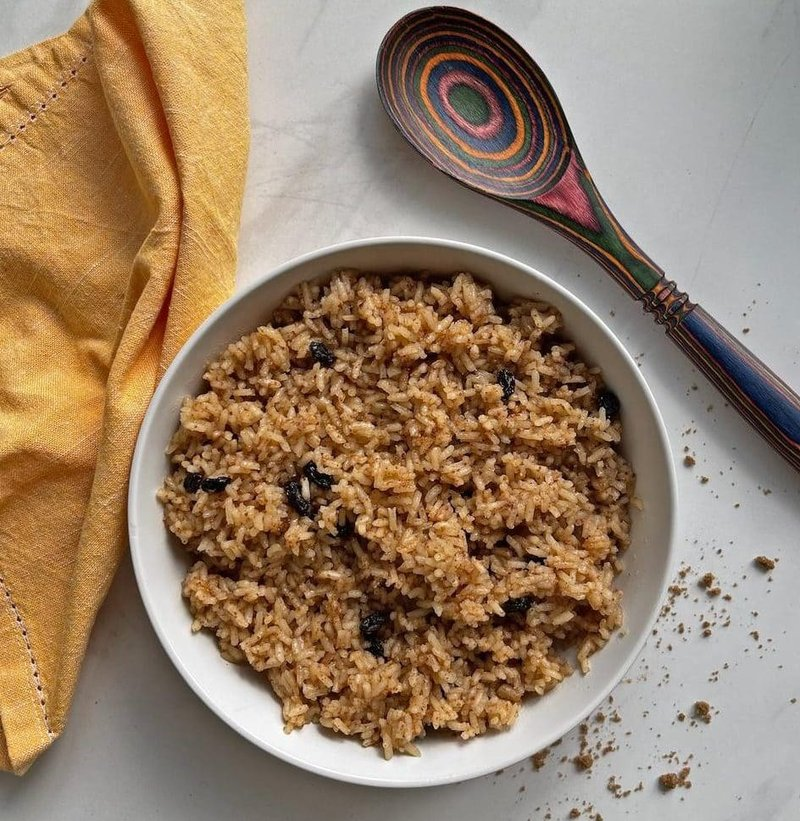

# Arroz de Coco

*Coconut rice, Mozambican-style: long-grain rice cooked in coconut milk with a little salt and sometimes a strip of fresh coconut, finished with a knob of butter. The standard accompaniment to frango piri-piri, matata and any coastal seafood. Subtle, sticky, faintly sweet.*

**Serves:** 4

**Prep Time:** 5 minutes

**Cook Time:** 25 minutes

## Overview
The rice toasts briefly in oil with a chopped onion (optional), then cooks absorption-style in a mixture of coconut milk and water. Covered, undisturbed, 18 minutes; rest for 5 minutes covered off the heat; fluff with a fork. The coconut milk gives a soft sheen and a slight sweetness that balances the heat of piri-piri.

## Ingredients

- 300 g long-grain rice (basmati or jasmine)
- 1 tablespoon vegetable oil (or butter)
- 1 onion (small, finely chopped, optional)
- 1 (400 ml) tin coconut milk
- 250 ml water
- 1 teaspoon salt
- 1 bay leaf (optional)
- Knob of butter (to finish, optional)

## Method

### Stage 1 - Rinse and toast
1. Rinse the rice in a sieve under cold water until the water runs almost clear. Drain well.
1. Heat the oil in a heavy-bottomed pot over medium heat.
1. Soften the onion (if using) 4 minutes.
1. Add the rice; toast 1 minute, stirring, until coated.

### Stage 2 - Cook
1. Pour in the coconut milk and water; add salt and bay leaf.
1. Bring to a boil; stir once; reduce heat to the lowest setting.
1. Cover tightly; cook 18 minutes undisturbed.

### Stage 3 - Rest
1. Remove from heat (lid on); rest 5 minutes.
1. Lift the lid; remove the bay leaf; drop in a knob of butter if using.
1. Fluff with a fork.

### Stage 4 - Serve
1. Tip into a warmed bowl. Serve with grilled chicken, matata, prawns or any chilli-heavy main.

## Notes
- **Coconut milk quality:** Full-fat tinned coconut milk. Light coconut milk gives bland rice.
- **Don't lift the lid:** The steam does the cooking. Lifting it mid-cook bleeds it away.
- **Toasted coconut:** A handful of dried, lightly toasted coconut flakes scattered at the end is a nice touch but not traditional.

## Storage
- Refrigerate 3 days. Reheat covered with a splash of water.
- Don't freeze - the texture goes spongy.
