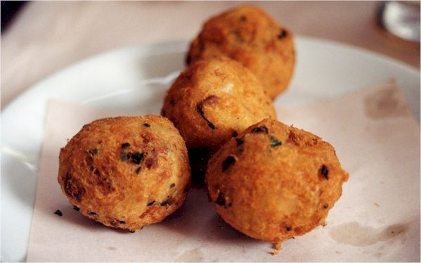

# Bolinhos de Bacalhau

*The great Lusophone snack: flaked salt cod folded into a mash of potato, onion, parsley and egg, shaped into small oval croquettes and deep-fried.*

**Serves:** 6 (makes about 24)

**Prep Time:** 25 minutes (plus 24 hours soaking the bacalhau)

**Cook Time:** 30 minutes

## Overview
The great Lusophone snack and the small fritter that turns up at every Mozambican wedding, Sunday brunch and Portuguese tasca: flaked salt cod folded into hot mashed potato with onion, parsley and egg, shaped between two tablespoons into classic oval quenelles, deep-fried golden. The desalt is the catch; under-soaked bacalhau makes inedibly salty fritters, so 24 hours with three or four water changes is the minimum, and tasting a small piece on the second day tells you if it's ready. You poach the desalted cod in fresh cold water for eight minutes till it flakes easily, skin and bone it, flake into small pieces. Meanwhile boil floury potatoes till tender, drain, return to the dry pot to dry off briefly, mash smooth (wet mash makes fritters that won't shape, so the dry-off step earns its keep). Combine the warm mash with the flaked cod, finely chopped onion, crushed garlic, chopped parsley, beaten eggs and white pepper into a uniform thick paste; don't overwork, you want light bolinhos. Heat oil to 170°C, warm two tablespoons in hot water, scoop and quenelle the mixture into ovals straight into the oil. Fry in batches for three or four minutes till deep gold. Drain on kitchen paper, eat warm with lemon wedges and a cold beer (or a glass of vinho verde).

## Ingredients

- 400 g salt cod (bacalhau)
- 600 g floury potatoes (peeled, cut into chunks)
- 1 onion (small, very finely chopped)
- 3 tablespoons fresh parsley (finely chopped)
- 2 eggs (large, beaten)
- 1 garlic clove (crushed)
- ¼ teaspoon ground white pepper
- 1 litre vegetable oil for deep frying
- 1 lemon (cut into wedges, to serve)

## Method

### Stage 1 - Desalt the cod
1. Rinse the salt cod under cold water; place in a bowl; cover with cold water.
1. Refrigerate 24 hours, changing the water 3-4 times. Taste a small piece on the second day - it should be salted but not overpowering.
1. Drain.

### Stage 2 - Poach and flake
1. Place the cod in a pan; cover with fresh cold water; bring to just under a simmer.
1. Cook 8 minutes - the cod should flake easily.
1. Drain; cool slightly; remove skin and any bones; flake into small pieces.

### Stage 3 - Potato
1. While the cod cooks, boil the potatoes in salted water until tender (12-15 minutes).
1. Drain; return to the dry pot; dry off over low heat 1 minute.
1. Mash smooth - no lumps.

### Stage 4 - Mix
1. Combine the warm mash, flaked cod, onion, garlic, parsley, beaten eggs and pepper.
1. Mix to a uniform, thick paste. Don't overwork - the fritters should be light.
1. Taste; add a pinch of salt only if needed.

### Stage 5 - Shape and fry
1. Heat the oil to 170°C.
1. With two tablespoons (warmed in hot water), scoop and quenelle the mixture into oval shapes. Drop straight into the oil.
1. Fry in batches of 5-6, 3-4 minutes total, turning, until deep gold.
1. Drain on kitchen paper.

### Stage 6 - Serve
1. Eat warm with lemon wedges and a cold beer (or vinho verde).

## Notes
- **Soak fully:** 24 hours with water changes is the minimum. Skipping this gives inedibly salty fritters.
- **Mash must be dry:** Wet mash makes wet bolinhos that won't shape. Dry the potato in the pot before mashing.
- **Two-spoon shape:** A classic quenelle - oval, three-sided. A small ice cream scoop works for cleaner balls but isn't traditional.

## Storage
- Best eaten same day. Re-crisp leftover bolinhos at 200°C for 5 minutes (microwave makes them sad).
- The uncooked mix keeps 24 hours refrigerated; shape and fry fresh.
