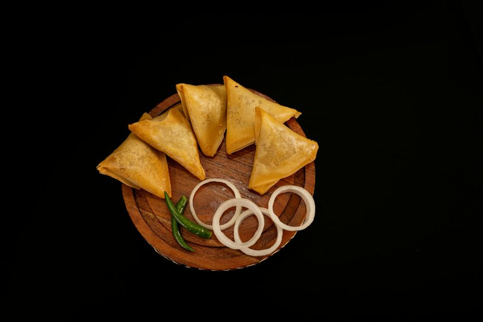

# Chamucas

*Mozambique's samosa: smaller and crisper than the Indian original, filled with spiced minced beef and onion, folded into neat triangles and deep-fried.*

**Serves:** 6 (makes about 20)

**Prep Time:** 40 minutes

**Cook Time:** 20 minutes

## Overview
Mince browns with onion, garlic, curry powder, ginger and a small chopped chilli; the filling is cooled. Spring-roll pastry strips are folded into triangular pouches around a teaspoon of filling, sealed with a flour-water paste, and deep-fried 170°C until deep gold. Crisp shell, hot savoury inside.

## Ingredients

### Filling
- 400 g beef mince
- 1 tablespoon vegetable oil
- 1 onion (medium, very finely chopped)
- 3 garlic cloves (crushed)
- 1 thumb fresh ginger (grated)
- 2 teaspoons [Curry Powder](../../indian/Spice-Mixes/curry-powder.md)
- 1 teaspoon paprika
- 1 fresh bird's-eye chilli (very finely chopped)
- 2 tablespoons fresh coriander (chopped)
- ½ lime (juice)
- salt
- pepper

### Pastry and sealing
- 20 spring-roll pastry sheets (cut into 8 x 25 cm strips)
- 2 tablespoons plain flour mixed with 3 tablespoons water (paste, for sealing)
- 1 litre vegetable oil for deep frying

## Method

### Stage 1 - Filling
1. Heat the oil in a wide pan over medium-high.
1. Brown the mince hard, breaking up clumps. Pour off excess fat.
1. Add the onion; cook 5 minutes until softened.
1. Stir in garlic, ginger, curry powder, paprika and chilli; cook 1 minute.
1. Splash in 100 ml water; simmer 5 minutes until almost dry.
1. Stir in coriander, lime juice, salt and pepper. Taste; adjust seasoning.
1. Cool completely on a tray.

### Stage 2 - Fold
1. Take a pastry strip; place a teaspoon of filling on the bottom-right corner.
1. Fold the corner up to the left edge to form a triangle.
1. Continue folding the triangle up the strip in a zig-zag (flag-fold method) - each fold makes a triangular packet.
1. At the end, seal the tail with the flour-water paste.
1. Repeat until filling is used up.

### Stage 3 - Fry
1. Heat the oil to 170°C in a deep pan.
1. Fry in batches of 6, 3-4 minutes total, turning, until deep gold and crisp.
1. Drain on kitchen paper.

### Stage 4 - Serve
1. Eat hot or warm with piri-piri sauce or a chilli dip.

## Notes
- **Folding technique:** YouTube "samosa fold" - the flag/zig-zag method is universal across South Asia, East Africa and the Lusophone world. After two or three you'll have it.
- **Cool filling is essential:** Warm filling steams the pastry from the inside and ruins the seal.
- **Sealing paste:** A small amount of flour-water at every tucked corner; without it the parcels open in the fryer and shed filling.

## Storage
- Refrigerate 2 days; re-crisp at 180°C for 6 minutes.
- Freeze unfried up to 2 months. Fry from frozen, adding 1-2 minutes.
