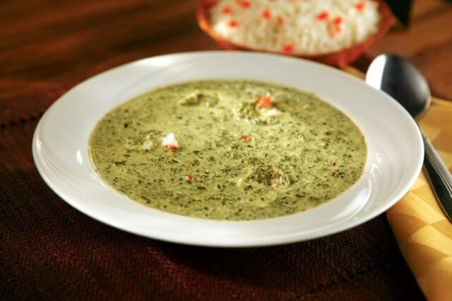

# Matapa com Castanha

*Mozambique's cassava-leaf-and-cashew dish: tender young cassava leaves (or substitute spinach + kale) slow-cooked with crushed roasted cashews, coconut milk, garlic, onion and a small amount of dried shrimp into a thick savoury green stew. The northern Mozambican (Zambezia, Nampula) speciality, eaten with rice, xima or cassava.*

**Serves:** 4-6

**Prep Time:** 25 minutes

**Cook Time:** 1 hour

## Overview
Matapa com castanha is one of Mozambique's most distinctive dishes and a Zambezia-Nampula northern specialty. Matapa means "cassava leaves" in the local Sena and Makua languages: tender young cassava leaves are pounded or finely chopped, then slow-cooked with onion, garlic, crushed roasted cashews (castanha de caju, Mozambique's famous cashews), coconut milk and a small amount of dried shrimp (camarão seco) for umami, till the leaves break down and the dish becomes a thick savoury green stew with a creamy nutty texture. The Mozambican answer to the wider Lusophone African cassava-leaf tradition (closely related to Angolan kizaca, São Tomean kalulu and Liberian palava sauce); the Mozambican version is distinguished by the cashews and coconut milk. Outside Africa, cassava leaves are sold frozen at African markets ("manioc leaves" or "cassava leaves"); a workable substitute is 70% fresh spinach with 30% kale or collards, finely chopped. Crush the cashews by hand to a coarse meal; don't take them to a smooth paste. Slow-simmered forty-five to sixty minutes for the proper soft thick consistency; under-cooked leaves stay stringy.

## Ingredients

### Greens
- 500 g cassava leaves (frozen at African markets; or substitute with 400 g fresh spinach + 200 g fresh kale or collard greens; finely chopped)

### Cashew paste
- 200 g roasted unsalted cashews
- 4 tablespoons warm water (for mixing)

### Aromatics
- 4 tablespoons olive oil (or vegetable oil)
- 1 large onion (finely chopped)
- 6 garlic cloves (crushed)
- 1 thumb (3 cm) fresh ginger (finely grated)
- 1 fresh red chilli (deseeded, finely chopped; or 2 piri-piri if available)
- 2 medium tomatoes (chopped; or 1 small can chopped tomatoes)

### Liquid and seasoning
- 1 tin (400 ml) coconut milk
- 300 ml hot water (or chicken/vegetable stock)
- 30 g dried small shrimp (rinsed, drained, finely chopped)
- 2 tablespoons fish sauce or Worcestershire sauce (optional, for umami)
- 1 ½ teaspoons fine sea salt
- 1 teaspoon ground black pepper
- 1 teaspoon ground turmeric (optional, for colour)

### To finish
- 2 tablespoons fresh coriander (chopped)
- 1 tablespoon fresh lemon juice
- Extra crushed roasted cashews (for garnish)

## Method

### Stage 1 - Prepare the greens
1. If using frozen cassava leaves: defrost and squeeze out excess water. Chop finely if not already chopped.
2. If using the spinach-kale mix: wash thoroughly; chop very finely (or pulse briefly in a food processor; the texture should be like fresh-chopped herbs).
3. Set aside.

### Stage 2 - Make the cashew paste
1. Place the roasted cashews in a food processor.
2. Pulse 6-8 times till you have a coarse meal (don't go to a smooth paste; some texture is right).
3. Transfer to a bowl; add 4 tablespoons of warm water and stir to a thick paste.
4. Alternatively: crush the cashews in a mortar with a pestle till coarse; mix with water.

### Stage 3 - Sweat the aromatics
1. Heat the oil in a wide heavy saucepan over medium heat.
2. Add the chopped onion; cook 6-7 minutes till soft and starting to colour.
3. Add the crushed garlic, grated ginger and chopped chilli; cook 30 seconds.

### Stage 4 - Add the tomatoes
1. Add the chopped tomatoes; cook 5 minutes till they break down to a thick base.

### Stage 5 - Add the greens
1. Add the chopped cassava leaves (or spinach-kale mix); stir to combine with the aromatic base.
2. Cook 5 minutes; the leaves will wilt down considerably.

### Stage 6 - Add the cashew paste and liquid
1. Stir in the cashew paste; mix till evenly distributed.
2. Add the coconut milk and hot water (or stock).
3. Add the chopped dried shrimp.
4. Add the fish sauce (if using), salt, pepper and turmeric.

### Stage 7 - Slow-simmer
1. Bring to a low simmer.
2. Cover with the lid slightly ajar.
3. Cook 45-60 minutes; stir occasionally to prevent sticking.
4. The greens should break down completely; the sauce should be thick and creamy with a deep green colour.
5. If the matapa is too thick, add a splash of water; if too thin, simmer uncovered for 5 more minutes.

### Stage 8 - Finish
1. Take off the heat.
2. Stir in the chopped coriander and lemon juice.
3. Taste; adjust salt.

### Stage 9 - Serve
1. Spoon onto warm plates as a side, alongside rice or xima (maize porridge).
2. Or as a main with steamed rice and a portion of grilled fish or chicken.
3. Garnish with extra crushed cashews.

## Notes
- **Cassava leaves if you can find them:** the proper texture and flavour come from cassava leaves. Frozen ones at African markets work well. The spinach-kale substitute is workable; don't use kale alone.
- **Cashews give the proper creamy nutty character:** Mozambique's cashews are exceptional. Good roasted unsalted cashews from any market are an acceptable substitute. Don't substitute with peanut butter; the flavour profile is different.
- **Coarse cashew paste:** don't go to a smooth paste; some texture is traditional. Pulse the food processor briefly.
- **Slow-cook the leaves:** 45-60 minutes is essential. The leaves need time to break down completely.
- **The dried shrimp gives umami:** small dried shrimp (available at Asian and African markets) gives a savoury depth. Vegetarians can skip and add 1 tablespoon of soy sauce or miso instead.

## Variations
- **Matapa with prawns (matapa de camarão):** add 200 g of cooked peeled prawns in the last 5 minutes of cooking; gives a luxurious version common at coastal restaurants.
- **Vegetarian matapa:** skip the dried shrimp and fish sauce; replace with 1 tablespoon of miso paste or 2 tablespoons of soy sauce for umami. Add 100 g of chopped mushrooms with the aromatics.
- **Matapa with peanut butter:** add 2 tablespoons of unsweetened peanut butter alongside the cashew paste; gives a richer nuttier version. Common variation.
- **Matapa de feijão (with beans):** add 200 g of cooked white beans or chickpeas to the dish; turns it into a more substantial main course.

## Serving
- As a side alongside arroz de coco, grilled fish, frango piri-piri or matata. As a main with rice and a fried egg on top (a common Mozambican home-cook serving). Drink: 2M or Laurentina beer, or vinho verde for the more upscale version.

## Storage
- Keeps refrigerated 4 days; the flavour deepens noticeably overnight.
- Reheat gently in a covered pan over low heat with a splash of water (the coconut milk can split if reheated too aggressively).
- Freezes 3 months in portioned containers; defrost in the fridge and reheat gently.
- Day-old matapa is excellent stirred through rice with an egg on top for breakfast.
- Don't microwave aggressively; the coconut milk splits.
