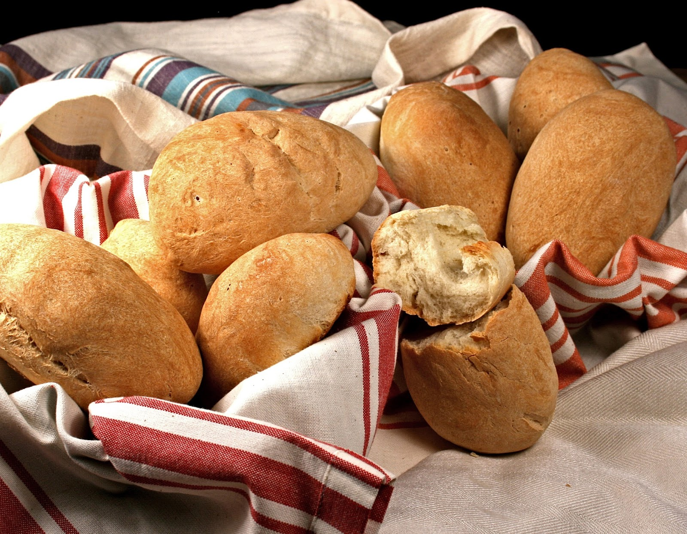

# Pão Moçambicano

*Mozambique's everyday white bread roll: a small soft enriched white roll with a slightly crisp golden crust and a soft pillowy interior, brushed with egg wash and dusted with flour. The breakfast-and-lunch bread of every Maputo café, dunked in coffee, split with butter and queijo, or used to mop up grilled-fish sauces.*

**Serves:** 12 rolls

**Prep Time:** 30 minutes (plus 2 hours rising)

**Cook Time:** 25 minutes

## Overview
Pão moçambicano is Mozambique's everyday white bread, inherited from Portuguese colonial cooking and now thoroughly Mozambican: a small soft enriched white roll, shaped into 50 to 80 g portions, slashed with a single cut on top, brushed with egg wash and dusted lightly with flour, baked at high heat till the outside is deep golden and the inside stays soft and pillowy. What every Mozambican eats at breakfast (with strong sweet milky coffee and butter or jam), at lunch (split open and filled with cheese, ham or grilled fish), and at dinner (used to mop up the sauces of grilled fish, prawns or chicken). Sold at every padaria across the country, fresh every morning, eaten the same day. Sits in the wider Lusophone bread family alongside Portuguese pão-de-leite, Brazilian pãozinho francês and Angolan pão-de-leite, but with subtle Mozambican touches: slightly sweeter, often with a touch of coconut milk in the dough, and the traditional small-roll size.

## Ingredients

- 600 g strong bread flour
- 10 g instant dried yeast (1.5 sachets)
- 60 g caster sugar
- 1 ½ teaspoons fine sea salt
- 60 g unsalted butter (softened)
- 2 large eggs (1 for dough, 1 for egg wash)
- 1 large egg yolk (for dough enrichment)
- 280 ml warm whole milk (or use 200 ml milk + 80 ml warm coconut milk for the proper Mozambican touch)

### Egg wash
- 1 large egg (beaten with 1 tablespoon milk)
- Extra flour for dusting

## Method

### Stage 1 - Make the dough
1. In a large bowl (or stand mixer with dough hook), whisk together the flour, yeast, sugar and salt.
2. Add the softened butter; rub in with your fingertips till the mixture looks like fine breadcrumbs.
3. In a smaller bowl, whisk together the warm milk (and coconut milk if using), the whole egg and the egg yolk.
4. Pour the wet ingredients into the flour mixture.
5. Stir to combine; once a rough dough forms, knead by hand on a lightly floured surface (or in the mixer) for 8-10 minutes till smooth, elastic and slightly tacky but not sticky.

### Stage 2 - First rise
1. Place the dough in a large oiled bowl; cover with a damp cloth.
2. Let rise 1.5 hours at room temperature till doubled.

### Stage 3 - Shape the rolls
1. Knock back the risen dough; divide into 12 equal pieces (about 75 g each).
2. Roll each piece into a smooth ball by tucking the edges underneath.
3. Place the balls on a baking sheet lined with parchment paper, leaving 4 cm between each.
4. Or shape into small oval ovals/torpedoes (the traditional Mozambican shape).

### Stage 4 - Second prove
1. Cover loosely with a damp cloth.
2. Let prove 30-40 minutes till slightly puffed.

### Stage 5 - Score, wash and bake
1. Preheat the oven to 220°C (425°F).
2. Using a sharp knife or razor blade, make one shallow cut down the centre of each roll (about 5 mm deep).
3. Brush each roll generously with the egg wash.
4. Sprinkle lightly with extra flour (for the iconic floured look).
5. Bake for 12 minutes at 220°C.
6. Reduce the temperature to 190°C / 375°F; bake for another 12-15 minutes till deeply golden and the rolls sound hollow when tapped on the bottom.

### Stage 6 - Cool and serve
1. Transfer to a wire rack to cool slightly.
2. Serve warm or at room temperature.

## Notes
- **Enriched dough for soft crumb:** the egg, butter and milk give the proper Mozambican softness. Plain water-based bread gives a harder crustier result.
- **Knead properly:** 8-10 minutes of vigorous kneading. Under-kneaded dough gives dense bread; over-kneaded dough gives tough bread.
- **Coconut milk for the proper Mozambican touch:** the small addition of coconut milk gives a faint tropical note that distinguishes Mozambican pão from Portuguese pão.
- **Two-temperature bake:** 220°C at the start for crust development; drop to 190°C to finish cooking through. Constant high heat burns the top before the interior cooks.
- **Don't skip the score:** the slash on top lets steam escape during baking and gives the iconic look.

## Variations
**Whole wheat version:** swap 200 g of the bread flour for whole wheat flour; gives a heartier rougher roll.
**Cheese pão:** sprinkle a small amount of grated cheese (Parmesan or cheddar) over the egg wash before baking; gives a cheese-crusted variation.
**Olive oil pão:** swap the butter for 60 ml of olive oil; gives a slightly different flavour and crumb.
**Sweeter pão (pão doce):** double the sugar to 120 g; gives a slightly sweeter breakfast roll. Common Mozambican variant.

## Serving
Warm with strong sweet milky coffee (the traditional Mozambican breakfast). Split open with butter, queijo (cheese), jam, or honey. At lunch with grilled fish, sausages, or cheese. At dinner to mop up sauces from grilled prawns, peri-peri chicken, or matata.

## Storage
- Keeps in a sealed container at room temperature 2 days; the bread firms up after 24 hours.
- Refrigerated 5 days; reheat in a hot oven (160°C / 320°F) for 5-7 minutes to refresh.
- Don't microwave; the bread goes rubbery.
- Freezes 2 months wrapped tightly in foil; defrost at room temperature 2 hours and warm in the oven.
- Day-old pão is excellent for French toast (rabanada Mozambicana), or sliced and toasted with butter for breakfast.
