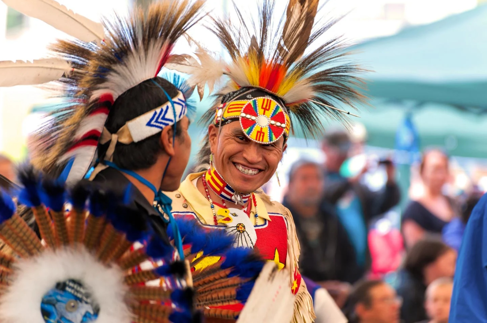

# Native North American Cuisine

The cooking traditions of the indigenous peoples of North America, drawing from regional larders: Pacific Northwest cedar-planked salmon, Plains bison and wild rice, Eastern woodlands maple and corn, Southwestern beans and chillies. The Three Sisters (corn, beans, squash) are foundational; foraged greens, berries and nuts complete the table. Slow-pit cooking, smoking over hardwoods, and stews simmered in clay or cast iron define the techniques. Frybread, while a 19th-century product of forced relocation, is now an iconic across-tribes shared dish.
