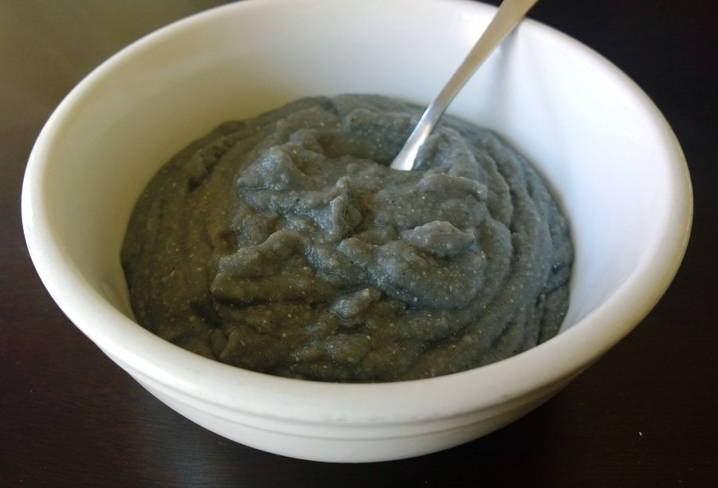

# Blue Corn Mush

*A Pueblo breakfast porridge: roasted blue cornmeal whisked into hot water with a pinch of ash, simmered thick. Topped with maple and piñon.*

**Serves:** 4

**Prep Time:** 5 minutes

**Cook Time:** 15 minutes

## Overview
Cold water and a pinch of baking soda (standing in for juniper ash, the ash's alkali helps the corn release niacin and keeps the colour blue rather than grey) come to a simmer. Blue cornmeal whisks in steadily as the heat continues. The mush thickens over 10 minutes of stirring; salt seasons; it cooks another 3 minutes to lose any raw-flour edge. Served in bowls with honey or maple, toasted piñon nuts (or pumpkin seeds), dried cranberries or blueberries, and a splash of cream.

## Ingredients

- 800 ml water
- ¼ teaspoon baking soda (or, traditionally, a pinch of culinary juniper ash if you have it)
- ½ teaspoon salt
- 200 g fine blue cornmeal (sold in many specialist or American shops; or order online)
- 30 g butter (optional, modern addition)

### Toppings (per bowl)
- 1 tablespoon honey (or maple syrup)
- 1 tablespoon toasted piñon nuts (or pumpkin seeds or sliced almonds)
- 1 tablespoon dried cranberries (or blueberries)
- 1-2 tablespoons single cream (optional)

## Method

### Stage 1 - Boil
1. Bring the water to a low boil in a heavy saucepan.
1. Whisk in the baking soda and salt - the water will fizz briefly.

### Stage 2 - Whisk in the cornmeal
1. Reduce heat to medium-low.
1. With the water at a gentle simmer, pour the cornmeal in a thin steady stream while whisking vigorously - this is critical to avoid lumps.
1. Keep whisking 1 minute as it thickens.

### Stage 3 - Cook
1. Swap the whisk for a wooden spoon.
1. Cook 10-12 minutes over low heat, stirring every 30 seconds to prevent scorching. The mush will thicken to a thick porridge consistency that holds a peak on the spoon.

### Stage 4 - Finish
1. Stir in the butter if using.
1. Taste; add a pinch more salt if needed.

### Stage 5 - Serve
1. Ladle into warm bowls.
1. Top each with a drizzle of honey or maple, a scatter of piñon nuts and dried berries, and a splash of cream.

## Notes
- **Why blue cornmeal:** Blue corn is a Pueblo and Hopi heritage variety; the colour is from anthocyanins. Different in flavour from yellow - earthier, slightly more bitter, faintly smoky. White or yellow cornmeal makes a similar mush (atole), but the dish is properly blue.
- **Baking soda or ash:** The alkali isn't optional in the historical version - it's what makes the corn's niacin bioavailable (the Pueblo were spared the pellagra that plagued some other corn-eating cultures). Even in this short-cook version, a pinch keeps the colour blue.
- **No lumps, no scorch:** The two failure modes. Whisking constantly during the addition prevents lumps; stirring constantly during the cook prevents scorching.

## Storage
- Best eaten hot. Refrigerated, it sets firm and can be sliced like polenta; reheat with a splash of water/milk.
- Fried slices of set mush (the next-day form) are a delicious second use.
