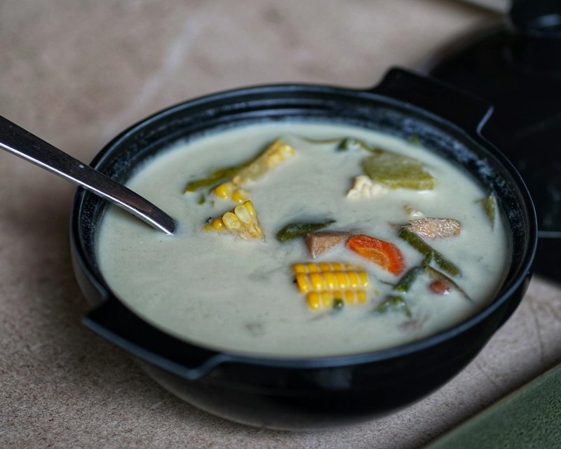

# Corn Soup

*The Haudenosaunee ceremonial soup: nixtamalised white corn slow-simmered with kidney beans and pork (or venison) into a thick, milky-white stew.*

**Serves:** 6

**Prep Time:** 20 minutes (plus overnight soak)

**Cook Time:** 3 hours

## Overview
Dried hulled white corn (nixtamalised, also called posole or hominy corn, distinct from tinned hominy) soaks overnight. Pork hocks (or venison neck, or smoked turkey legs) simmer in salted water 2 hours to make a rich broth. Soaked corn joins; cooks for 45 minutes more until tender. Tinned red kidney beans go in; the soup simmers for 15 minutes to integrate. Salt to taste. Served plain, possibly with a side of frybread.

## Ingredients

- 250 g dried white hominy corn (nixtamalised, not just dried corn - sold as "posole corn" or "hominy", alternatively 2 tins drained hominy for a faster version)
- 1 kg pork hocks (smoked or fresh, OR 800 g venison neck, OR 2 smoked turkey legs)
- 3 litres water
- 2 bay leaves
- 1 onion (large, halved)
- 2 garlic cloves (whole)
- 2 teaspoons salt (to start; adjust)
- 1 (400 g) tin red kidney beans (drained and rinsed, OR 200 g dried, soaked and pre-cooked)
- 1 teaspoon black pepper

## Method

### Stage 1 - Soak the corn
1. Place the dried hominy corn in a deep bowl with 2 litres of cold water.
1. Soak overnight (12+ hours).
1. Drain.
1. (Skip this stage if using tinned hominy - drain and add later.)

### Stage 2 - Pork broth
1. Place the pork hocks (or venison/turkey) in a large stockpot.
1. Cover with the 3 litres of water.
1. Add bay leaves, halved onion, garlic and 2 teaspoons salt.
1. Bring to a boil; skim the foam thoroughly.
1. Reduce to a low simmer; cover loosely.
1. Cook 1 hour 30 minutes until the meat is becoming tender.

### Stage 3 - Add the corn
1. Add the drained soaked hominy.
1. Continue simmering 45-60 minutes until the corn is tender - the kernels should be firm but yielding, not crunchy and not mush.

### Stage 4 - Beans and finish
1. Lift the pork hocks from the pot; cool slightly.
1. Pull the meat off the bones in shreds; return the meat to the pot. Discard the bones, bay and aromatics.
1. Add the drained kidney beans.
1. Simmer 15 minutes uncovered to integrate.

### Stage 5 - Season
1. Add pepper.
1. Taste; adjust salt - the soup should be well-seasoned but not aggressively salty.

### Stage 6 - Rest
1. Off heat; let stand 10 minutes.

### Stage 7 - Serve
1. Ladle into deep bowls.
1. Eat plain - no garnish is traditional. Frybread on the side optional.

## Notes
- **Nixtamalised corn is not sweetcorn:** The corn for this soup is dried field corn that has been treated with wood ash or lime (nixtamalisation). This is what gives it the distinctive flavour, the chewy texture, and unlocks the niacin. Tinned hominy is the same thing, cooked. Sweetcorn (yellow, sweet kernels) is a totally different ingredient and won't work.
- **Salt at the end:** Salt during the corn cook can slow the softening. Start with a modest salt level in the broth; finish to taste after the corn is tender.
- **Pork hocks vs venison vs turkey:** Pork hocks are the everyday modern choice and give a smoky-savoury broth. Venison neck (the original) makes a leaner, gamier soup. Smoked turkey legs are the easy compromise - pork-like richness without pork, used when serving people who don't eat pork.

## Storage
- Refrigerate 5 days; reheats brilliantly and tastes better on day 2.
- Freezes 3 months.
