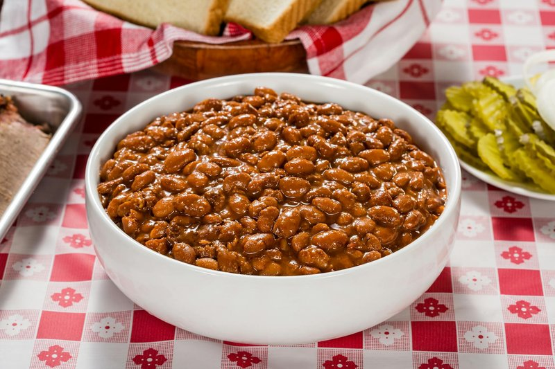

# Maple Baked Beans

*The Wabanaki and New England original: navy beans slow-baked all day with maple syrup, salt pork, mustard and onion.*

**Serves:** 6

**Prep Time:** 15 minutes (plus overnight soak)

**Cook Time:** 5 hours

## Overview
Dried navy beans soak overnight, then drain. They go into a deep heavy lidded pot (a bean crock is traditional) with chopped onion, salt pork or bacon, maple syrup, mustard, salt and just enough water to cover. The pot bakes at 130°C for 5 hours, lid on for the first 4 hours, lid off for the last hour to reduce the liquor and develop the dark glaze on the surface beans. Real maple syrup is non-negotiable.

## Ingredients

- 500 g dried navy beans (or haricot beans)
- 1 tablespoon salt (for the soaking water - softens the skins)
- 150 g salt pork or thick-cut smoked bacon (cut into 2 cm pieces)
- 1 onion (large, diced)
- 150 ml pure maple syrup (Grade A dark or Grade B; not maple-flavoured syrup)
- 2 tablespoons brown mustard (or 1 tablespoon dried mustard powder)
- 1 tablespoon molasses (optional - for extra depth)
- 1 ½ teaspoons salt
- ½ teaspoon black pepper
- 800 ml water (enough to cover the beans by 2 cm)

## Method

### Stage 1 - Soak
1. Place beans in a deep bowl; add 2 litres of cold water and 1 tablespoon salt.
1. Soak 12 hours (overnight).
1. Drain and rinse.

### Stage 2 - Combine
1. Heat oven to 130°C (110°C fan).
1. Place soaked beans in a deep heavy lidded ovenproof pot (Dutch oven or bean crock).
1. Add the salt pork or bacon (scatter the pieces among the beans, not just on top).
1. Add the onion, maple syrup, mustard, molasses (if using), salt and pepper.
1. Pour in water until the beans are just covered (about 800 ml).
1. Stir gently.

### Stage 3 - Bake covered
1. Clamp the lid on.
1. Bake 4 hours.
1. Check at the 2-hour mark - top up with hot water if the liquid drops below the beans (it shouldn't, but the lid seal matters).

### Stage 4 - Bake uncovered
1. Lift the lid.
1. Stir gently - the beans on top should be glossy and starting to darken.
1. Bake 1 hour uncovered to reduce the liquor and brown the top.

### Stage 5 - Rest
1. Pull out of the oven; let stand 15 minutes.
1. The beans will absorb more of the remaining liquid as they rest.

### Stage 6 - Serve
1. Tip into a wide bowl or serve from the pot.
1. Eat with cornbread, grilled meat, frybread, or alongside roast pork.

## Notes
- **Pure maple, not pancake syrup:** The dish requires real maple syrup - the smoky-caramel of slow-boiled tree sap. Grade A dark or Grade B (now called "Grade A dark amber" in the new labelling) has the deepest flavour. Pancake syrup is corn syrup with brown colouring and ruins the dish.
- **Salt pork or bacon:** Salt pork (uncured pork fat, cured in salt only) is traditional. Thick-cut smoked bacon is the easy substitute and adds smoke, which is good.
- **Low and slow, lid on:** The all-day low cook is what makes baked beans different from quick beans. The beans hold their shape but go soft inside; the liquor reduces to a thick mahogany glaze.

## Storage
- Refrigerate 5 days; reheats wonderfully and tastes better on day 2 and 3.
- Freezes 3 months.
