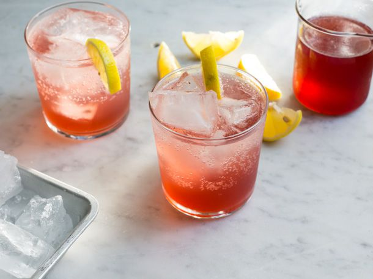

# Sumac Lemonade

*The Eastern Woodlands cold drink - also called "sumacade" or "indian lemonade" - made from the deep-crimson fruit clusters of staghorn or smooth sumac, steeped briefly in cool water to release their tart citric edge, then strained and sweetened with maple. The dried red drupes contain malic and citric acids that give the drink an unmistakable lemonade-like sharpness, with a faint resin-and-rose note. Drunk by Algonquian, Iroquois and Wabanaki peoples for centuries; entirely caffeine-free and refreshing.*

**Serves:** 4 (makes about 1.2 litres)

**Prep Time:** 5 minutes active

**Total Time:** 20 minutes (steep)

## Overview
Two whole staghorn sumac drupes (or 3 tablespoons of dried, ground culinary sumac as a substitute) go into cold water for 20 minutes - never hot water, which extracts bitter tannins from the woody stems. The water steeps to a pale rose-pink with a tart citrus aroma. Strained twice through a coffee filter or fine muslin to remove the fine sumac hairs. Sweetened to taste with maple syrup; served over ice with a lemon wheel.

## Ingredients

- 2 whole staghorn sumac drupes (foraged in late summer / early autumn; bright red, fully formed, dry to the touch) - OR substitute 3 tablespoons ground culinary sumac (the Middle Eastern spice; same plant family)
- 1.2 litres cold filtered water
- 3-4 tablespoons pure maple syrup (or honey)
- Lemon wheels, ice cubes, fresh mint (to serve)

## Method

### Stage 1 - Identify the sumac (foraged version only)
1. Use only STAGHORN SUMAC (Rhus typhina) or SMOOTH SUMAC (Rhus glabra). The drupes are bright deep red, in upright cone-shaped clusters, with fuzzy fruit.
1. NEVER use POISON SUMAC (Toxicodendron vernix) - which has WHITE drooping berries, NOT red, and grows in swamps. If in any doubt, don't forage; use the dried ground spice from a shop.
1. Pick on a dry day (rain washes away the citric acid coating on the drupes).

### Stage 2 - Cold steep
1. Place the drupes (whole) in a large jug.
1. Pour cold water over.
1. Press and bruise the drupes against the side of the jug with the back of a spoon for 1 minute to release the citric acid coating.
1. Let stand 20 minutes (no longer - extended steeping draws tannins).

### Stage 3 - Strain
1. Strain through a fine sieve.
1. Strain a second time through a coffee filter or three layers of muslin - sumac drupes have tiny hairs that you don't want in the drink.

### Stage 4 - Sweeten
1. Stir in maple syrup; taste; add more until balanced. The drink should be sharp like a soft lemonade.

### Stage 5 - Serve
1. Pour into glasses over ice.
1. Garnish with a lemon wheel and a sprig of fresh mint.

### Alternative: ground culinary sumac version
1. Place 3 tablespoons ground sumac in a muslin bag or tea strainer.
1. Steep in 1.2 litres cold water 30 minutes.
1. Strain twice; sweeten as above.

## Notes
- **Cold water, not hot:** This is the critical step. Hot water extracts tannins from the woody parts of the cluster and gives a bitter, harsh drink. Cold steeping draws only the citric acid coating.
- **Two strainings:** Sumac drupes are covered in fine reddish hairs that are mildly irritating to the throat. Two strainings (a sieve then a coffee filter) eliminates them.
- **Identification matters:** Staghorn / smooth sumac (red, upright fruit clusters) is the edible one. Poison sumac (white, drooping clusters, swamp habitat) is dangerous. If unsure, use the cheap ground spice from a Middle Eastern shop - same plant, dried and ground, safe and widely available.

## Storage
- Refrigerate up to 3 days; flavour fades after that.
- Best served the day it's made.
