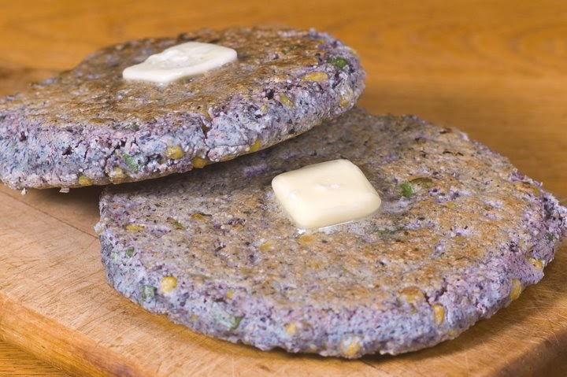

# Thin Blue Corn Cakes

*A home version of Hopi piki bread: paper-thin blue cornmeal pancakes cooked one at a time on a hot griddle. Served with stew.*

**Serves:** 4 (makes 8 large thin cakes)

**Prep Time:** 5 minutes

**Cook Time:** 15 minutes

## Overview
Fine blue cornmeal whisks with hot water, a pinch of baking soda (substituting for juniper ash), salt and a small amount of plain flour for handleability. The batter rests for 10 minutes to hydrate. A wide non-stick pan or flat griddle heats over medium-high without oil. Tablespoon portions of batter spread thinly across the pan with a wet hand or thin spatula into 18 cm rounds. Each cooks for 1 minute per side, lifts off the pan, and stacks under a cloth to stay soft.

## Ingredients

- 200 g fine blue cornmeal
- 30 g plain flour
- ¼ teaspoon baking soda
- ¾ teaspoon salt
- 400 ml hot water (just off the boil)
- 1 tablespoon sunflower oil (for the batter)
- Extra hot water as needed (the batter should be the texture of single cream)

## Method

### Stage 1 - Mix
1. In a wide bowl, whisk blue cornmeal, plain flour, baking soda and salt.
1. Pour in the hot water in a thin stream, whisking constantly to avoid lumps.
1. Whisk in the sunflower oil.
1. The batter should be runny - the texture of single cream. If too thick, thin with extra hot water 1 tablespoon at a time.
1. Let rest 10 minutes.

### Stage 2 - Heat the pan
1. Heat a wide flat non-stick pan or griddle (28 cm+) over medium-high heat 3 minutes.
1. No oil - the pan must be dry.

### Stage 3 - Cook
1. Take a wet metal spoon and ladle 4 tablespoons of batter into the centre of the hot pan.
1. Immediately spread the batter with the back of a wet metal spoon (or a thin spatula, or with a wet hand if the pan isn't too hot) in a spiral motion, working outward into a thin circle 16-18 cm across. Speed matters - the batter will set within seconds.
1. Cook 60-75 seconds - the surface goes dry, the edges crisp slightly.
1. Flip with a thin spatula; cook 30 seconds on the second side.
1. Lift onto a plate; cover with a clean tea towel to keep soft.
1. Repeat with the rest of the batter, stirring well between each (the cornmeal settles).

### Stage 4 - Serve
1. Stack the cakes loosely; serve warm.
1. Roll or fold around a savoury filling, or use as a wrap, or eat plain alongside soup.

## Notes
- **Blue cornmeal is the dish:** Yellow or white cornmeal works mechanically but doesn't taste of piki. Order blue cornmeal from a specialist or online - Native American-owned producers in New Mexico and Arizona sell it directly.
- **Spread thin or it's not piki-style:** The whole point is "paper thin". A 4 mm pancake would be a corn tortilla. Spread the batter as wide as it'll go.
- **No oil:** The dry pan is what gives the slightly crisp edges and the matte surface. Oil makes them more like a normal pancake.

## Storage
- Best within an hour of cooking; they soften under a cloth for 30 minutes, then start to dry out.
- Refrigerate 2 days wrapped; reheat in a dry pan 20 seconds per side.
- Don't freeze well - the texture suffers.
