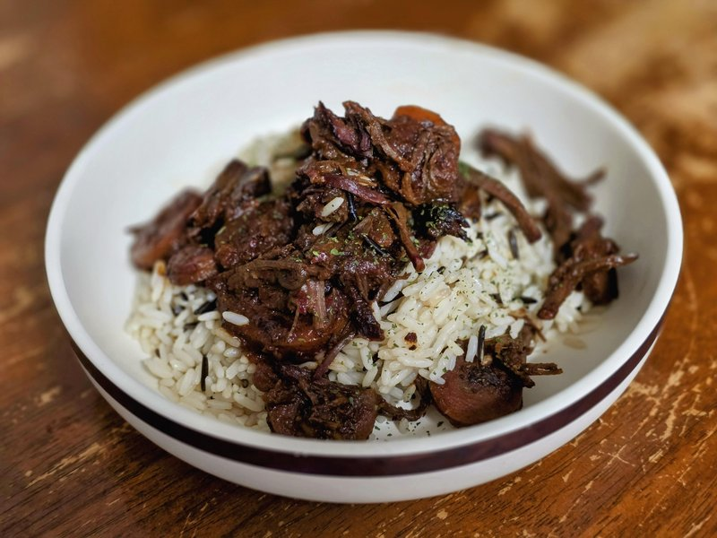

# Wild Rice with Venison

*A Great Lakes one-pot: hand-harvested wild rice stewed with venison shoulder, dried mushrooms, juniper and a final spoon of maple.*

**Serves:** 4

**Prep Time:** 15 minutes

**Cook Time:** 1 hour 15 minutes

## Overview
A Great Lakes one-pot built around true hand-harvested wild rice, the long black grain native to the lakes of Minnesota, Wisconsin and Ontario, harvested by Anishinaabe communities from canoes for thousands of years: venison shoulder stewed with the grain, dried wild mushrooms, juniper berries and a final spoon of maple. Real hand-harvested wild rice is parched over a low smoke fire as part of the traditional process, which gives the grain a flavour that paddy-grown cultivated wild rice can't quite match. Both work, but the hand-harvested is the dish. The dark soaking liquor from the dried mushrooms becomes part of the cooking water, so strain it carefully and don't pour it away. The maple at the end wants to be a single tablespoon, not three; it balances the mineral grassiness without taking over.

## Ingredients

- 400 g venison shoulder (cut into 2 cm cubes, substitute beef chuck if unavailable)
- 2 tablespoons sunflower oil
- 25 g dried wild mushrooms (porcini, morel or a mix)
- 400 ml water (just-boiled, for the mushrooms)
- 1 onion (large, diced)
- 3 garlic cloves (sliced)
- 200 g wild rice (the long black grain - not "wild rice blend" with brown rice mixed in)
- 1 teaspoon juniper berries (lightly crushed)
- 1 teaspoon dried thyme
- 600 ml game (or beef stock)
- 1 ½ teaspoons salt
- ½ teaspoon black pepper
- 1 tablespoon maple syrup

### Garnish
- 2 tablespoons toasted pumpkin seeds
- 1 tablespoon fresh thyme leaves
- 2 spring onions (sliced)

## Method

### Stage 1 - Mushrooms
1. Place dried mushrooms in a heatproof bowl; cover with the just-boiled water; soak 20 minutes.
1. Lift out the mushrooms; squeeze; chop coarsely. Strain the soaking liquid through a paper-lined sieve into a measuring jug - it should be a dark mahogany liquor. Reserve.

### Stage 2 - Brown the venison
1. Heat oil in a wide heavy lidded pot over medium-high.
1. Pat the venison dry; brown in two batches, 4 minutes per batch, deep crusty colour.
1. Lift to a plate.

### Stage 3 - Aromatics
1. Reduce heat to medium; add onion to the same pot.
1. Cook 8 minutes until soft.
1. Add garlic, juniper, thyme and the chopped soaked mushrooms; cook 2 minutes.

### Stage 4 - Toast the rice
1. Add the wild rice to the pot; stir 1 minute - you'll smell the grass aroma intensify.

### Stage 5 - Simmer
1. Return the venison and any juices.
1. Pour in the strained mushroom liquor and the stock; add salt and pepper.
1. Bring to a boil; reduce to a low simmer; cover.
1. Cook 45 minutes until the wild rice is tender and the grains have curled and split.

### Stage 6 - Finish
1. Off heat; let stand covered 10 minutes.
1. Stir in the maple syrup.
1. Taste; adjust salt.

### Stage 7 - Serve
1. Tip onto a wide platter; scatter toasted pumpkin seeds, fresh thyme and spring onion.

## Notes
- **Real wild rice, not a blend:** Hand-harvested wild rice from the Great Lakes (or from First Nations producers in Ontario/Minnesota) has a parching step in its processing - a low smoke fire - that gives it a flavour you cannot get from cultivated paddy-grown wild rice. Both work; the hand-harvested is the dish.
- **Maple at the end:** A small amount of maple at the finish is traditional and balances the mineral grassiness. Don't use it like sugar - a tablespoon, not three.
- **Venison vs beef:** Venison gives the cleanest, most traditional flavour. Beef chuck makes a fine substitute but lacks the gamey edge.

## Storage
- Refrigerate 4 days; reheat with a splash of stock.
- Freezes 2 months.
