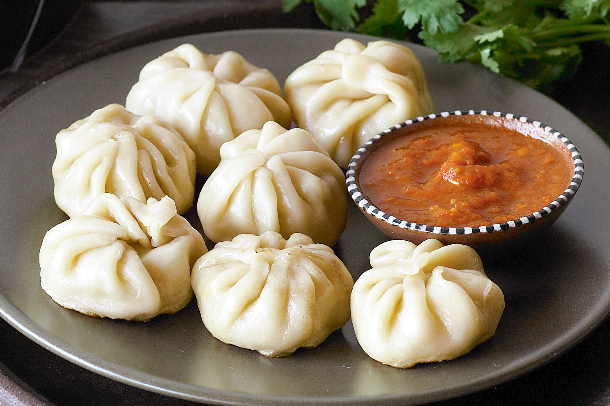

# Chicken Momos

*Nepal's street-food dumpling: thin wheat wrappers around spiced minced chicken with onion, ginger, garlic and coriander, steamed in tiered bamboo baskets and served with a fierce sesame-tomato achaar.*

**Makes:** about 30 momos (serves 4-6)

**Prep Time:** 1 hour

**Cook Time:** 20 minutes

## Overview
Momos came south from Tibet centuries ago and have since become as Nepali as anything on the menu, found in every street stall, every restaurant, every household kitchen. They are first cousins to Chinese jiaozi and Japanese gyoza but with a recognisable Nepali fingerprint: more aromatic (ginger, coriander, sometimes a touch of timur/Sichuan pepper), often served with a tomato-and-sesame chutney that is itself one of the more interesting dipping sauces in Asia.

Three cooking methods are common: **steamed** (mo:mo, the classic), **fried** (kothey: pan-fried base for crispness, then steamed to finish), and **deep-fried** (less traditional but on every menu). This recipe gives the steamed version. The filling and dough are identical for all three; only the final cooking changes.

Bamboo steamers stacked over a wok are ideal but a metal steamer with a single tier works. Line whichever you use with a lightly oiled lettuce leaf or parchment so the momos don't stick.

## Ingredients

### Dough
- 350 g plain flour
- ½ tsp fine salt
- 180 ml warm water (approximate)

### Filling
- 500 g minced chicken (thigh meat is best; breast is leaner but drier)
- 1 small onion (very finely chopped)
- 4 spring onions (finely sliced)
- 4 garlic cloves (minced)
- 25 g fresh ginger (grated)
- Small handful fresh coriander (chopped)
- 1 tsp ground cumin
- ½ tsp ground coriander
- ½ tsp ground timur (Sichuan pepper) or black pepper
- ½ tsp salt
- 1 tbsp neutral oil
- 1 tbsp soy sauce

### Achaar (dipping sauce)
- 3 large tomatoes
- 2 tbsp toasted sesame seeds
- 2 dried red chillies (or to taste)
- 2 garlic cloves
- 2 cm fresh ginger
- 1 tbsp mustard oil (or neutral oil)
- 1 tsp salt
- 1 tbsp lemon juice
- ½ tsp turmeric

## Method

### Stage 1 - Make the dough
1. Combine flour and salt in a wide bowl.
1. Add the warm water gradually, mixing with a fork then your hand, until the dough comes together as a soft but not sticky ball.
1. Knead 8-10 minutes on a clean surface, until smooth and elastic. Cover with cling film and rest 30 minutes at room temperature.

### Stage 2 - Make the filling
1. Combine the minced chicken with onion, spring onions, garlic, ginger, coriander, cumin, ground coriander, timur, salt, oil and soy sauce in a wide bowl.
1. Mix thoroughly with your hands or a wooden spoon until everything is evenly combined. The filling should be sticky and hold together when pressed.

### Stage 3 - Make the achaar (parallel)
1. Char the tomatoes whole over a flame or under a hot grill, turning, until the skins blister and blacken in spots, 5-6 minutes.
1. Peel off the loose skins (some char can stay).
1. In a dry pan, briefly toast the sesame seeds (1 minute, shaking) until fragrant. Tip into a mortar or food processor.
1. Grind the sesame to a coarse paste.
1. Add the charred tomatoes, dried chillies (broken), garlic, ginger, mustard oil, salt, lemon juice and turmeric.
1. Pound or blitz to a thick, slightly chunky chutney.
1. Tip into a small bowl. Cover and rest while you wrap.

### Stage 4 - Roll and fill
1. Divide the rested dough into 30 small balls (about 15-20 g each).
1. Working with one ball at a time (keep the rest covered to prevent drying), roll each into a thin disc about 8 cm in diameter and 2 mm thick. The edges should be thinner than the centre.
1. Place a heaped teaspoon of filling in the centre.
1. Pleat: starting from one side, pinch the edge and fold a small pleat over toward the centre, holding the pleat with your other hand. Continue around the circle, gathering pleats into a tight purse with a small twisted top. (A simpler half-moon fold also works: just fold over and pinch the edge shut.)
1. Place finished momos on a lightly floured tray, well-spaced so they don't stick.

### Stage 5 - Steam
1. Set up your steamer with water boiling vigorously.
1. Line each tier with an oiled lettuce leaf or parchment paper with a few holes punched.
1. Arrange the momos with 1-2 cm gap between them.
1. Steam 12-14 minutes. The wrappers should look translucent in places and the filling should be cooked through (cut one open to check; chicken should be opaque white).
1. Lift onto a serving plate. Brush each momo with a thin coating of warm oil if you want a glossy finish.

### Stage 6 - Serve
1. Plate the hot momos. Set out the sesame-tomato achaar in a small bowl alongside.
1. Eat with the fingers; dip generously.

## Notes
- **Thigh mince is better than breast.** Fat is what keeps a steamed dumpling moist. Breast mince gives a drier, slightly chalky momo.
- **Timur is the Nepali fingerprint.** Sichuan pepper (the same plant family) substitutes well. Black pepper alone gives a fine but less distinctive momo.
- **Pleating is a skill.** Aim for 8-10 pleats per momo. The first dozen will look messy; you will improve by the time you reach the second tray.
- **The achaar is the dish.** A momo without the sesame-tomato achaar is incomplete. Make twice as much achaar as you think you need.
- **Mustard oil over neutral.** Mustard oil's pungent note is structural in the achaar; neutral oil gives a milder result.

## Variations
- **Kothey momos:** pan-fry the steamed momos on the flat side for 2-3 minutes until crisp, then serve. The Nepali equivalent of pot-stickers.
- **Buffalo (buff) momos:** the Newari favourite. Substitute minced water-buffalo or beef for the chicken; everything else identical.
- **Vegetable momos:** finely chopped cabbage, carrot, mushroom and onion, salted briefly and squeezed dry to remove water; otherwise same method.
- **Jhol momos:** steamed momos served in a thin broth made from the same achaar ingredients (warmed with stock). Eaten with a spoon.

## Serving
- Steamed momos are eaten as a meal or a snack; six per person is a small lunch, ten per person is a hearty one. Serve with the achaar and a glass of hot or cold milk tea (chiya).

## Storage
- Uncooked momos freeze 3 months: lay flat on a tray to freeze individually, then bag. Steam straight from frozen, adding 5 minutes to the time.
- Cooked momos refrigerate 2 days; reheat by steaming for 5-7 minutes (do not microwave; the wrapper goes gummy).
- The achaar keeps 1 week refrigerated and improves overnight.
