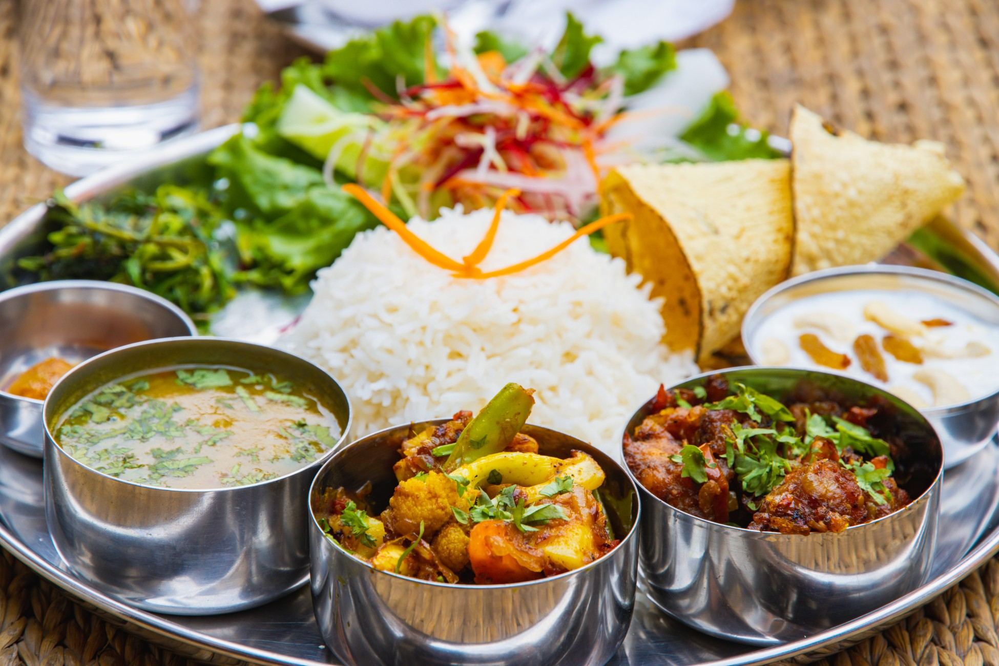

# Dal Bhat Tarkari

*The Nepali plate: rice, lentil dal, seasonal vegetable curry and a sour pickle, eaten twice a day across the country. The whole meal, never just the main; the meal that defines the cuisine.*

**Serves:** 4

**Prep Time:** 20 minutes

**Cook Time:** 45 minutes

## Overview
Dal bhat is the staple meal of Nepal. The phrase translates as "lentils and rice"; the full plate, dal bhat tarkari, adds the vegetable curry (tarkari) that completes the trio. Most Nepalis eat dal bhat twice a day, in the morning and the evening, often with a small piece of meat or curd on the side and always with a sharp pickle (achaar) for contrast. It is energy food for trekkers and labourers; it is also the everyday meal of the urban middle class.

The dal is a thin yellow lentil soup, lightly spiced and finished with a final hot tarka of mustard seeds, cumin, garlic and dried chilli sizzled in ghee and poured over at the end. The bhat is plain basmati or another long-grain rice. The tarkari (here, a potato and green bean version) carries the spice. Everything is served separately on a steel plate (thali) and combined by hand on the diner's own plate.

This recipe gives all three components for one full plate.

## Ingredients

### Dal (lentils)
- 200 g yellow split lentils (toor dal or moong dal)
- 1 litre water
- ½ tsp ground turmeric
- 1 tsp salt
- 1 tsp ghee (for the tarka)
- 1 tsp neutral oil (for the tarka)
- 1 tsp cumin seeds
- ½ tsp mustard seeds
- 2 dried red chillies (broken)
- 2 garlic cloves (sliced)
- 10 fresh curry leaves (optional but bright)
- Pinch of asafoetida (hing)
- Small handful fresh coriander (chopped, to finish)

### Bhat (rice)
- 300 g basmati rice (or see [plain basmati rice](../indian/rice/plain-basmati.md))
- 450 ml water
- ½ tsp salt

### Tarkari (potato and green bean curry)
- 400 g waxy potatoes (peeled, cut into 2 cm cubes)
- 200 g green beans (trimmed, cut into 4 cm pieces)
- 1 medium onion (finely chopped)
- 3 garlic cloves (minced)
- 15 g fresh ginger (grated)
- 2 medium tomatoes (chopped)
- 2 tbsp neutral oil
- 1 tsp ground cumin
- 1 tsp ground coriander
- ½ tsp ground turmeric
- ½ tsp Nepali masala (or garam masala)
- ½ tsp salt
- 1 small green chilli (slit)
- 200 ml water
- Small handful coriander (chopped, to finish)

## Method

### Stage 1 - Soak and start the dal
1. Rinse the lentils in cold water until the water runs clear, 3-4 times.
1. Place in a heavy pot with 1 litre water, the turmeric and salt.
1. Bring to a boil. Skim any foam. Reduce to a low simmer, cover loosely.
1. Simmer 30-40 minutes, stirring occasionally, until the lentils have broken down completely into a soft, slightly thick soup. Add a splash of water if it gets too thick.

### Stage 2 - Start the rice
1. Rinse the basmati until the water runs clear (5 changes).
1. Soak 20 minutes, then drain.
1. Combine with 450 ml cold water and salt in a heavy lidded saucepan.
1. Bring to a boil, then drop to lowest heat, clamp lid on.
1. Cook 12 minutes; rest off the heat 5 minutes.

### Stage 3 - Cook the tarkari (in parallel)
1. Heat the oil in a wide pan over medium heat. Add the chopped onion and cook 6-7 minutes, until soft and just gold.
1. Stir in the garlic, ginger, slit green chilli, cumin, coriander, turmeric, masala and salt. Cook 1 minute.
1. Add the chopped tomatoes. Cook 3-4 minutes, breaking down with the back of a spoon, until they form a thick base.
1. Tip in the potato cubes. Stir to coat. Add the water.
1. Cover and simmer 15 minutes, until the potatoes are tender (a knife slides in easily).
1. Add the green beans. Cover and cook 5-7 more minutes, until the beans are bright green and tender-crisp.
1. Uncover. If still soupy, simmer uncovered 2-3 minutes to reduce. The tarkari should be moist but not watery.
1. Stir in fresh coriander.

### Stage 4 - Finish the dal with tarka
1. Once the dal is fully broken down, taste and adjust salt.
1. In a small pan, heat the ghee and oil together over medium-high heat.
1. Add the cumin and mustard seeds. They will sizzle and pop in 10-15 seconds.
1. Add the dried chillies, garlic slices, curry leaves and asafoetida. Stir 10-15 seconds; the garlic should just turn gold.
1. Immediately pour the entire tarka, including the oil, over the dal. The dal will hiss and the aromatics will perfume the whole pot.
1. Stir once. Scatter fresh coriander.

### Stage 5 - Plate
1. Steel plates if you have them, otherwise wide shallow bowls.
1. Mound the rice on one side.
1. Ladle the dal into a small bowl on the plate, or pour a pool next to the rice.
1. Spoon the tarkari into a third position on the plate.
1. Add a spoonful of [tomato achaar](side-dishes/tomato-achaar.md) if you have one alongside.
1. Eat with the right hand, mixing dal and rice with the fingers and pinching tarkari with the dal-soaked rice.

## Notes
- **The tarka is the dal.** A dal cooked plain is bland; the final pour of sizzled spices is what makes it sing. Do not skip.
- **Yellow lentils, not red.** Toor and moong are the standard Nepali lentils; red lentils give a brighter, simpler flavour and a soupier texture. Either works; toor is closest to the home version.
- **Asafoetida is optional but classic.** A pinch in the tarka gives the dal a faint onion-garlic depth that a Nepali kitchen would recognise immediately.
- **Tarkari changes by season.** Spring: peas and cauliflower. Summer: aubergine and okra. Autumn: pumpkin and beans. Winter: root vegetables. Adjust freely.
- **Eat with your hands.** The proper Nepali way. The rice picks up the dal; the dal-soaked rice picks up the tarkari. Cutlery makes it harder.

## Variations
- **With chicken**: serve a small portion of [chicken momos](chicken-momos.md) or a simple chicken curry alongside.
- **With curd**: a tablespoon of plain yoghurt on the plate, eaten with the dal-rice.
- **With pickle**: any sharp pickle works; [tomato achaar](side-dishes/tomato-achaar.md) or lime pickle are the standard pairings.
- **Khichdi version**: cook the rice and dal together for a simpler one-pot meal.

## Serving
The complete plate has dal, rice, tarkari, achaar, and ideally a small piece of meat or curd. Tea (chiya) on the side; cold water in summer.

## Storage
- Dal and tarkari refrigerate 3 days each.
- Cooked rice keeps 2 days; reheat with a splash of water.
- The tarka is best made fresh, but the dal will keep with a tarka folded in.
