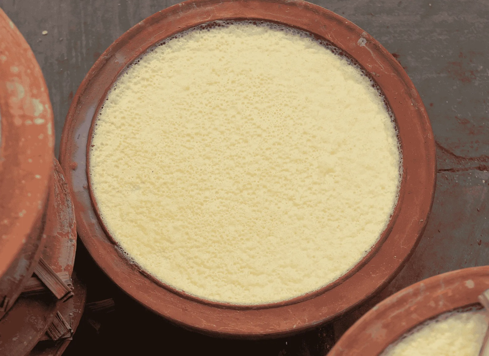

# Juju Dhau

*"The king of curd": a thick, set, sweet Nepali yoghurt from Bhaktapur. Buffalo milk slow-reduced with sugar and cardamom, then cultured in clay pots overnight until firm enough to invert. The royal dessert of the Kathmandu Valley.*

**Serves:** 6 (4 small pots)

**Prep Time:** 20 minutes

**Cook Time:** 30 minutes (plus 8-10 hours setting)

## Overview
Juju dhau (literally "king curd") is a Newari speciality from the city of Bhaktapur, in the Kathmandu Valley. It is not yoghurt in the everyday sense - it is something denser, sweeter, more dessert-like. Buffalo milk (or, outside Nepal, full-fat cow's milk plus cream) is slowly reduced with sugar and cardamom until thickened to about three-quarters of the original volume, cooled to body temperature, cultured with a small amount of existing yoghurt, and poured into unglazed clay pots called katas. The pots are wrapped in cloth and left in a warm spot overnight. By morning, the milk has set into a thick, sweet, perfumed curd firm enough to slice with a spoon.

The clay pots matter: the porous walls allow excess water to evaporate slowly during setting, leaving the juju dhau denser than a plate-set yoghurt. Glass ramekins or terracotta pots make a reasonable substitute outside Bhaktapur; mason jars give a denser, glossier result; metal containers are wrong.

The traditional version uses water-buffalo milk, which has nearly twice the fat of cow's milk and gives the proper richness. Cow's milk plus double cream is the realistic substitute outside Nepal.

## Ingredients
- 1 litre full-fat whole milk
- 250 ml double cream
- 80 g granulated sugar
- 1 tsp ground cardamom
- A few strands of saffron (optional, but traditional)
- 2 tbsp plain live yoghurt (the starter culture; must contain live cultures)

## Method

### Stage 1 - Reduce and sweeten
1. Combine the whole milk and double cream in a heavy-bottomed saucepan.
1. Bring to a gentle boil over medium heat, stirring frequently to prevent the milk from sticking. Scrape the bottom of the pan with a wooden spoon.
1. Once boiling, reduce heat to low. Continue to simmer 20-25 minutes, stirring every few minutes and skimming the skin that forms on top. The milk should reduce by about a quarter and look noticeably thicker.
1. Stir in the sugar and cardamom. Crumble in the saffron threads if using. Simmer another 3-4 minutes, until the sugar dissolves completely.
1. Off the heat.

### Stage 2 - Cool to setting temperature
1. Pour the warm milk into a wide bowl to cool faster.
1. Cool to **42-45°C** (108-113°F). At this temperature it should feel comfortably warm to the touch but not hot - about the temperature of a baby's bath. Too hot will kill the cultures; too cool and the yoghurt will not set firmly.
1. A digital thermometer is the safest way; the back-of-the-wrist test is the traditional way.

### Stage 3 - Culture
1. Place the live yoghurt in a small bowl. Whisk in a ladleful of the warm milk to slacken it.
1. Pour the slackened starter back into the warm milk. Whisk gently to distribute.

### Stage 4 - Pour and set
1. Divide the cultured milk between 4 small unglazed clay pots, terracotta ramekins, or 6 small heatproof glass jars/cups.
1. Cover each loosely with a piece of cloth or a small saucer (do not seal completely; the porosity of the cover matters).
1. Place in a warm spot - an unlit oven with the door closed and the light on, a yoghurt maker, or a thermal box with a hot water bottle. Aim for around 30°C ambient.
1. Set undisturbed 8-10 hours, or overnight.

### Stage 5 - Chill
1. After setting, the juju dhau will be a firm wobbling curd in each pot. Transfer to the fridge and chill at least 2 hours before serving.
1. Cold juju dhau is firmer and sweeter on the palate; warm or room-temperature is also acceptable but more sour.

### Stage 6 - Serve
1. Serve in its own pot, with a small spoon. The diner eats directly from the pot.
1. A scatter of pistachios, saffron threads, or rose petals on top is optional but pretty.

## Notes
- **Clay pots are structural.** They wick moisture out of the curd as it sets, producing the dense, slightly grainy texture that defines juju dhau. Glass works, but the result is wetter and softer.
- **Buffalo milk is the original.** Outside Nepal, cow's milk + double cream approximates the fat content. Whole milk alone gives a thinner, less rich result.
- **The reduction is non-negotiable.** Twenty-five minutes of gentle simmering concentrates the milk solids; skipping leaves you with sweetened cultured milk, not juju dhau.
- **Temperature matters at the culture step.** Above 50°C kills the bacteria; below 40°C and the yoghurt sets weakly. The hand-on-the-back-of-the-wrist test: should feel warm, not hot.
- **Skim or stir the skin?** The thin skin that forms on top can be skimmed off (cleaner texture) or stirred back in (slightly more rustic mouthfeel). Either is correct.
- **Overnight setting in a warm spot.** A working refrigerator turned off but with the door closed works as a thermal box. A camping cool-box with a hot water bottle is another option.

## Variations
- **Mishti doi** (the Bengali cousin): identical technique but caramelise the sugar separately first, then dissolve into the warm milk. The colour goes deep amber and the flavour leans toward caramel.
- **Saffron juju dhau:** double the saffron threads for a brighter colour and stronger perfume.
- **Rose juju dhau:** add 2 tsp rosewater after the milk reduction. A modern Kathmandu café variation.

## Serving
Eaten as a dessert at the end of a Newari meal, or as a sweet snack with no other context. A small clay pot per person is the proper portion. Cold from the fridge.

The traditional Bhaktapur experience is to buy juju dhau already set in its pot from a street vendor near the Pottery Square and eat it warm, walking, with a small wooden spoon.

## Storage
- Keeps 3 days refrigerated, covered.
- Does not freeze; the curd separates and the texture is ruined.
- The 2 tbsp of starter for the next batch: scoop a tablespoon from this set juju dhau to start the next, and the culture self-perpetuates indefinitely.
