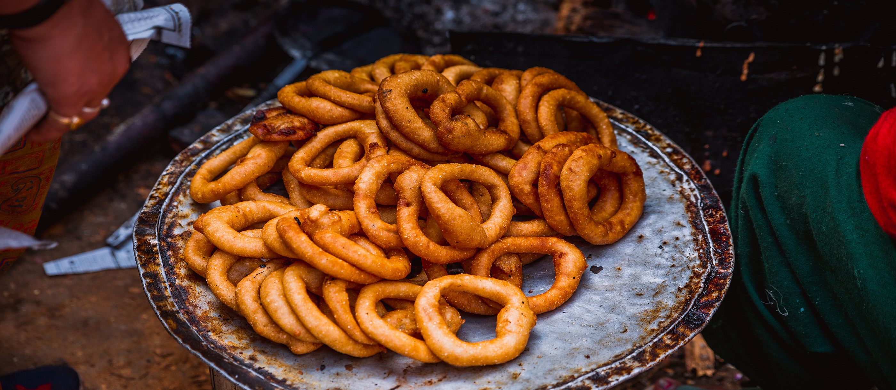

# Sel Roti

*The Nepali festival ring: a sweet rice-flour dough drizzled in a circle into hot ghee, fried until deep gold, crisp at the edges and soft in the middle. Made for Tihar, Dashain, and every wedding.*

**Makes:** about 12 rings

**Prep Time:** 20 minutes (plus 4 hours resting the batter)

**Cook Time:** 25 minutes

## Overview
Sel roti is the Nepali festival bread - a sweet, ring-shaped, fried rice-flour dough that appears at Tihar (the festival of lights), Dashain (the great autumn festival), weddings, religious offerings and any occasion that calls for something celebratory. It looks like a giant donut and tastes a little like one, but the rice flour gives it a distinctly different texture: crisp and slightly crackly outside, soft and faintly chewy inside, with a light cardamom-and-fennel perfume.

The technique is precise. The batter is poured from a height in a single thin stream into hot ghee, forming a ring as the dough hits the oil. Skilled grandmothers form a perfect circle in one continuous pour; first-timers will produce something more like a question mark. Either way it tastes good.

The dough is traditionally made by soaking rice grains, then grinding to a thick batter - this gives the best texture. A faster version uses rice flour straight; the result is slightly denser but still pleasing.

## Ingredients

### Soaking method (traditional, better texture)
- 400 g basmati or any long-grain rice (soaked in cold water overnight, then drained)
- 200 g granulated sugar
- 100 g unsalted butter (melted)
- 100 ml whole milk (warmed)
- 1 tsp ground cardamom
- ½ tsp ground fennel seeds
- ½ tsp salt
- A pinch of ground cinnamon (optional)
- 1 ripe banana (mashed; optional but classic - gives flavour and helps the batter bind)

### Quick method (rice flour)
- 400 g fine rice flour
- 100 g plain flour (adds a little binding)
- 200 g granulated sugar
- 100 g unsalted butter (melted)
- 300 ml whole milk (warmed)
- 1 tsp ground cardamom
- ½ tsp ground fennel seeds
- ½ tsp salt
- 1 ripe banana (mashed; optional)

### Frying
- 1 litre ghee (or half ghee, half neutral oil - the traditional medium is pure ghee but it is expensive)

## Method

### Stage 1 - Make the batter (soaking method)
1. Drain the soaked rice. Tip into a high-powered blender with the warm milk, melted butter, sugar, salt, cardamom, fennel and mashed banana (if using).
1. Blend on high until smooth - 2-3 minutes. The batter should be thick enough to coat the back of a spoon but pourable in a slow stream. Add a tablespoon of milk if too thick; a tablespoon of rice flour if too thin.
1. Cover and rest at room temperature 4 hours (or refrigerate overnight). The batter ferments very lightly and the texture improves.

### Stage 1 - Make the batter (quick method)
1. Whisk the rice flour, plain flour, sugar, salt, cardamom and fennel together in a wide bowl.
1. Mash the banana into the warm milk and melted butter with a fork.
1. Pour the wet into the dry. Whisk until smooth. The consistency should match the soaking method: thick but pourable.
1. Cover and rest 30 minutes (no fermentation here; just hydration).

### Stage 2 - Heat the ghee
1. Pour the ghee into a wide deep heavy pan (a karahi or deep skillet is ideal). The depth should be at least 3 cm so the rings can float.
1. Heat to 175°C (350°F). A small drop of batter should sizzle, rise immediately and turn pale gold in about 60 seconds. If it browns instantly, the ghee is too hot; if it sinks slowly, too cold.

### Stage 3 - Form the rings
1. Transfer the batter to a piping bag with a 5-6 mm round opening, OR a strong food-safe ziplock bag with a corner snipped to the same size, OR a metal funnel-and-jar with your finger blocking the spout (a traditional Nepali approach).
1. Hold the bag 15-20 cm above the surface of the hot ghee. Gently squeeze a steady thin stream of batter into the oil, moving in a circular motion to form a ring of about 12-15 cm diameter. Try to close the circle by overlapping the start point.
1. The batter will float and start to puff immediately.

### Stage 4 - Fry
1. Cook the ring 60-90 seconds on the first side, until the underside is deep gold. Use a long-handled chopstick or skewer to flip carefully.
1. Cook another 30-45 seconds on the second side, until uniformly deep gold and crisp.
1. Lift with a slotted spoon onto kitchen paper.
1. Allow the ghee to return to temperature before forming the next ring. (Fry one at a time until you are confident with the technique; experienced cooks fry 2-3 simultaneously.)

### Stage 5 - Serve
1. Sel roti is best warm but eats well at room temperature.
1. Serve plain, or with a small bowl of yoghurt for dipping, or alongside a cup of [chiya](../../../drinks/regional/india/masala-chai.md) (sweet masala milk tea).

## Notes
- **The pour is the skill.** The thinner and more controlled the stream, the more delicate the ring. A thick stream gives a chunky lopsided sel roti. The first few will be imperfect; persist.
- **Ghee gives the proper flavour.** Half ghee, half neutral oil is a reasonable compromise for cost; all-oil is fine but less aromatic.
- **The banana is optional but classic.** Adds sweetness, a faint banana background note, and helps the batter bind. Skip for a cleaner rice flavour.
- **Cardamom and fennel.** The two non-negotiable spices. Cinnamon is sometimes added; nutmeg never.
- **Rest the batter.** Either 4 hours (soaking method) or 30 minutes (quick method). The hydration step produces a better texture; skipping makes the rings chewier than they should be.
- **Sugar caramelises at the edges.** A properly fried sel roti has slightly darker, sweeter, crisp edges. This is correct, not a sign of burning.

## Variations
- **Plain sel roti:** no banana, no cinnamon; pure rice-cardamom-fennel flavour. The traditional everyday version.
- **Coloured sel roti:** add a pinch of saffron threads to the warm milk for golden colour and perfume. Festival upgrade.
- **Khowa sel roti:** add 50 g khoya (reduced milk solids) to the batter for a richer, slightly chewier version. Wedding-grade.

## Serving
A tier of warm sel roti at the centre of the festival table, with bowls of plain yoghurt, [aloo tama](../aloo-tama.md), [choila](../side-dishes/choila.md) and pickled vegetables around it. Each diner takes a ring and dips, tears, eats.

## Storage
- Best the day it is made; the crisp edge softens overnight.
- Refrigerates 3 days in an airtight container; revive in a hot dry pan for 30 seconds a side.
- Freezes 1 month wrapped; defrost at room temperature and warm in a dry pan.
