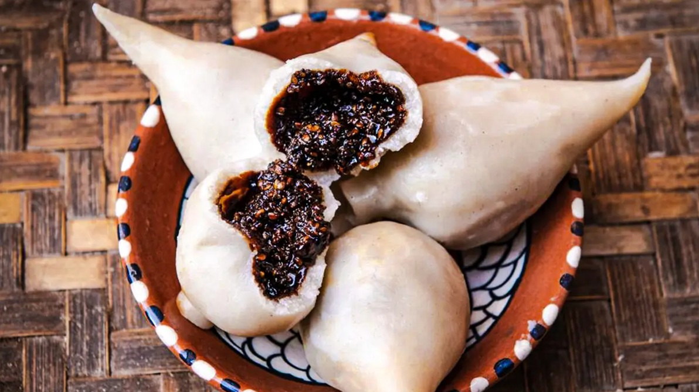

# Yomari

*The Newari fig-shaped steamed dumpling: a rice-flour dough wrapped around a molasses-and-sesame filling, steamed until translucent. The traditional sweet of Yomari Punhi, the Newari festival of December's full moon.*

**Makes:** 12-14 yomari

**Prep Time:** 45 minutes

**Cook Time:** 25 minutes

## Overview
Yomari is the signature sweet of the Newar people of the Kathmandu Valley, prepared specifically for Yomari Punhi (the full-moon day in December) but eaten year-round in Newari households and at sweet shops in Patan and Bhaktapur. The dumpling is shaped like a fig: a fat round body tapering to a slender pointed tip, said to represent prosperity (yo = "favourite", mari = "bread"). The wrapper is rice-flour dough, the filling is molasses (chaku) mixed with sesame, coconut and sometimes khowa (reduced milk).

The shaping is the signature: the dough is rolled into a thin round, folded into a cone, filled, and the top twisted into the pointed cap. Each yomari is steamed for about 20 minutes until the wrapper turns slightly translucent. Cut open, the molasses inside has melted into a sticky dark filling that pools sweetly on the plate.

This recipe uses chaku (palm sugar molasses), which is the proper traditional filling. Substitutes are noted.

## Ingredients

### Dough
- 400 g fine rice flour
- ½ tsp fine salt
- 300 ml hot water (boiling)
- 1 tbsp neutral oil

### Filling
- 200 g chaku (palm sugar molasses; substitute jaggery or dark muscovado)
- 50 g toasted sesame seeds
- 30 g desiccated coconut
- 30 g khowa (reduced milk solids): optional but classic
- 1 tsp ground cardamom
- Pinch of salt

## Method

### Stage 1 - Make the dough
1. Place the rice flour and salt in a wide heatproof bowl.
1. Pour the boiling water over in two additions, mixing rapidly with a wooden spoon as you go. The flour will start to come together as a dough.
1. Once cool enough to handle, knead in the bowl with your hands. Add the neutral oil and continue kneading 5-6 minutes, until you have a soft, smooth dough that is pliable but not sticky. If too dry, add a teaspoon of warm water; if too wet, a tablespoon of rice flour.
1. Cover with a damp cloth. Rest 15 minutes.

### Stage 2 - Make the filling
1. If using chaku, chop it roughly into small pieces and melt in a small heavy saucepan over low heat. (If using jaggery, grate it; if using dark muscovado, use as is.)
1. Add the toasted sesame, desiccated coconut, khowa (if using), cardamom and salt.
1. Stir together off the heat. The mixture should be a thick, sticky paste that holds its shape when pressed. If too dry, add a teaspoon of melted ghee; if too wet, add a tablespoon more sesame.
1. Cool slightly so you can handle it. Divide into 12-14 small balls, each about 15 g.

### Stage 3 - Shape the yomari
1. Divide the rested dough into 12-14 equal balls.
1. Working with one dough ball at a time (keep the rest covered), flatten between your palms into a disc, then roll on a clean surface to a thin round about 10 cm in diameter and 2 mm thick. The edges should be thinner than the centre.
1. Lift the disc and form a small cone in your hand: fold one third of the circumference toward the centre, then bring the opposite third around to meet it, creating a cone-shaped pocket.
1. Drop a filling ball into the cone.
1. Close the top by pinching the two edges together along the seam, then twisting the very top into a slender pointed cap (about 1-2 cm tall). The finished yomari looks like a small fig: round bottom, tapered pointed top.
1. Set on a tray. Repeat with the rest. Keep covered with a damp cloth while you shape the others.

### Stage 4 - Steam
1. Set up a steamer with water boiling vigorously.
1. Line the steamer tier with a lightly oiled banana leaf, a lightly oiled lettuce leaf, or parchment paper with a few holes punched.
1. Arrange the yomari with 2-3 cm gap between them, they expand slightly and stick if crowded.
1. Steam 20 minutes, covered. The wrappers will turn from opaque white to slightly translucent. The filling inside will be molten.
1. Lift carefully onto a serving plate.

### Stage 5 - Serve
1. Yomari is eaten warm. Tear open the pointed top with your fingers and either suck the molten filling out (the proper way) or eat the whole thing in two bites.
1. The melted filling is HOT; warn first-time eaters.

## Notes
- **Hot water for the dough.** This partially cooks the rice flour and gives the dough its characteristic pliability. Cold water gives a stiff, crackly dough.
- **Knead in the bowl while warm.** The dough is easier to work when warm; cold dough cracks during shaping.
- **The cone-and-twist is the technique.** Imperfect yomari taste just as good but lose visual elegance. Watch one Newari demonstration before your first attempt; the shape is hard to capture in words.
- **Steam, do not boil.** Boiling yomari in water makes the dough swell unattractively and the filling can leak out.
- **The pointed cap.** Make it tall enough (1-2 cm) that it stays distinct after steaming; a stubby cap disappears.
- **Chaku (palm sugar molasses) is the proper sweetener.** It is sold at Nepali groceries; if unavailable, jaggery is the closest substitute. Brown sugar gives a flat, less interesting filling.

## Variations
- **Khowa yomari:** double the khowa in the filling for a richer, more festival-grade version. Sometimes wrapped around a small piece of pure khowa for a cream centre.
- **Savoury yomari:** filled with grated paneer, finely chopped vegetables and spice. A less common but real variant.
- **Saffron-tinted dough:** add a pinch of saffron threads to the hot water for a faintly golden wrapper. Wedding upgrade.

## Serving
- Three or four per person as a dessert; one per person as a sweet snack with tea. Plain hot milk tea (chiya) is the traditional drink alongside.

- For Yomari Punhi celebrations, the dumplings are also offered at the family shrine and to married daughters as a blessing.

## Storage
- Best eaten warm the day they are steamed. The filling firms up as it cools.
- Refrigerates 2 days; reheat by steaming for 5-7 minutes to bring the filling back to molten.
- Frozen unsteamed yomari keeps 2 months; steam from frozen, adding 5 minutes to the time.
