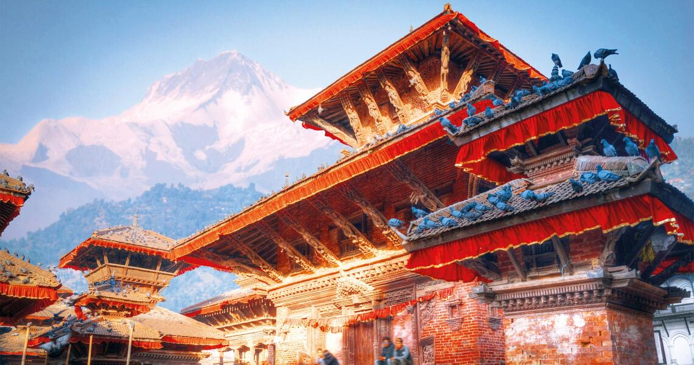

# Nepalese Cuisine

Himalayan cooking at the crossroads of India, Tibet and the Newari Kathmandu Valley. Dal bhat tarkari (lentils, rice and seasonal vegetable curry) is the staple plate, eaten twice a day across the country. Tibetan-rooted momos and thukpa share the table with Indian-spiced curries and the Newari ferments of gundruk and sinki. Mustard oil, timur (Sichuan-type pepper), turmeric, garlic and fresh coriander define the seasoning; chiya (sweet milk tea) is the everyday drink. Lighter on the spice than Indian cooking, more vegetal, with a distinctive sour-funky pickling tradition.
