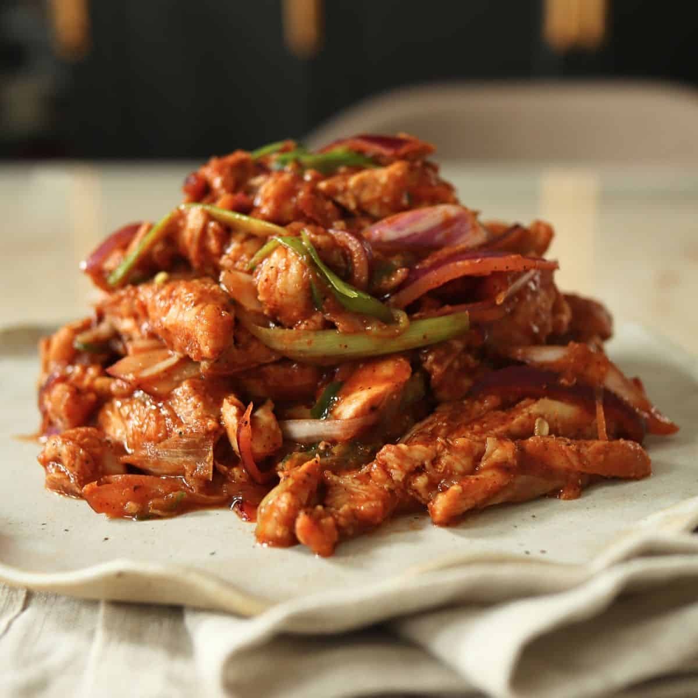

# Choila

*The Newari grilled-meat salad: charred chicken or buffalo torn into strips and tossed hot with mustard oil, timur, ginger, garlic, dried chilli and fresh herbs. Smoky, fierce, drinking food.*

**Serves:** 4 (as a side or with drinks)

**Prep Time:** 20 minutes

**Cook Time:** 12 minutes

## Overview
Choila (or chhwela) is a Newari dish from the Kathmandu Valley, traditionally made with buffalo (kachila when raw, sukula when air-dried, choila when grilled and dressed). Outside Nepal the chicken version is more accessible and just as good. The technique is simple but the result is striking: meat grilled hard over open flame until charred at the edges, torn into bite-sized strips, and dressed warm with smoking-hot mustard oil and a dressing of timur (Sichuan-type pepper), ginger, garlic, dried chilli, lemon and a fistful of fresh coriander. The hot oil hits the spices and the meat at the same moment, releasing a perfume that fills the room. This is drinking food. In Kathmandu it is served at bhattis (small Newari taverns) with chyangra (millet beer), raksi (rice spirit) or chiya. A heavy cast-iron pan on a screaming hob or a barbecue both work; a domestic grill is acceptable but loses some of the char character.

## Ingredients

### Meat
- 500 g chicken thigh fillets (boneless, skinless; or buffalo / beef chuck cut into 4 cm chunks)
- 1 tbsp mustard oil
- ½ tsp salt
- ½ tsp ground turmeric
- ½ tsp Nepali masala (or garam masala)

### Dressing
- 3 tbsp mustard oil
- 4 garlic cloves (very finely chopped)
- 25 g fresh ginger (very finely chopped)
- 1 tsp cumin seeds
- ½ tsp fenugreek seeds (methi)
- 3 dried red chillies (broken)
- 1 tsp ground timur (Sichuan pepper)
- 1 tsp ground cumin
- ½ tsp ground turmeric
- 1 tsp salt (or to taste)
- 2 tbsp fresh lemon juice (or to taste)
- 1 small green chilli (finely sliced)
- 4 spring onions (finely sliced)
- Large handful fresh coriander (chopped)

## Method

### Stage 1 - Marinate and grill the meat
1. Toss the chicken thighs with the mustard oil, salt, turmeric and masala in a bowl. Massage in.
1. Set aside 15 minutes.
1. Heat a cast-iron griddle pan, barbecue or grill to maximum heat.
1. Lay the chicken pieces on the hot surface. Grill 4-5 minutes per side, until the surface is properly charred (dark brown to black in spots) and the meat is just cooked through. Lift onto a board.
1. Rest 5 minutes, then tear by hand into rough bite-size strips. Place in a wide warm bowl.

### Stage 2 - Make the hot dressing
1. While the meat rests, finely chop the garlic, ginger, green chilli and spring onions (whites and greens together). Have the chopped coriander, lemon juice and ground spices ready in small piles or bowls, this happens fast.
1. Heat the 3 tbsp mustard oil in a small heavy pan over high heat until smoking heavily. (Mustard oil benefits from being heated until smoking, then briefly cooled; this removes the raw sharpness.)
1. Reduce heat to medium. Add the cumin seeds, fenugreek seeds and broken dried chillies. They will sizzle violently for 10-15 seconds. The chillies should darken; do not let them burn black.
1. Off the heat. Add the chopped garlic, ginger and green chilli. They will hiss and aromatise immediately.

### Stage 3 - Dress the meat
1. Pour the entire hot dressing, oil, spices, aromatics, over the torn chicken in the bowl.
1. Sprinkle over the ground timur, ground cumin, ground turmeric and salt.
1. Add the lemon juice and chopped spring onions and coriander.
1. Toss vigorously with two large spoons or your hands (be cautious; the oil is hot). The meat should be uniformly coated in the spiced oil; the herbs should look freshly wilted from the heat.
1. Taste. The flavour should be smoky, hot, sharp from the lemon, herbaceous from the coriander, with the slow tingle of timur underneath. Adjust salt and lemon.

### Stage 4 - Serve
1. Tip onto a wide plate. Eat warm with the fingers, with cold beer or millet wine.

## Notes
- **Mustard oil is the dish.** Hot mustard oil is structural to Newari food; nothing else gives the same pungency. Heat it until smoking before adding the spices. Neutral oil produces a fine grilled-chicken salad but not choila.
- **Char is the point.** A properly grilled choila has visible black flecks. Under-grilled gives a milder, less interesting result.
- **Tear, do not chop.** Hand-torn strips have rough edges that catch more of the dressing than knife-cut cubes.
- **Timur is the Nepali fingerprint.** Sichuan pepper substitutes. Black pepper alone gives a less distinctive choila.
- **Serve immediately.** Choila is at its best in the first 15 minutes; the heat of the dressing on the just-grilled meat is the experience.

## Variations
- **Buff (buffalo) choila:** the Newari original. Substitute buffalo or beef chuck cut into chunks; grill harder (8-10 minutes), tear, dress as above. The fattier meat is more characteristic.
- **Sukula choila:** made from air-dried buffalo (sukula); the dried meat is briefly grilled to revive, then dressed. Saltier and chewier.
- **Smoked choila:** finish the dressed choila under a smoking-dish setup (a heated piece of charcoal in a small bowl, covered for 60 seconds). Pushes the smokiness further.
- **With beaten rice (chiura):** serve a handful of beaten rice (chura, available at South Asian groceries) alongside; eaten in alternating bites of meat and rice.

## Serving
The classic Newari samay baji platter ("auspicious food") includes choila, beaten rice (chiura), black soybeans, hard-boiled egg, fried fish and a small dish of dipping spice. Choila on its own is bar food: with raksi (rice spirit), tongba (hot millet beer) or any cold lager.

## Storage
- Best eaten warm and fresh. Refrigerates 2 days; the meat firms up and the herbs darken.
- Day-old choila is still good cold as a salad topping or stuffed into a roti.
- Does not freeze well; the texture of the dressed meat is the whole point.
