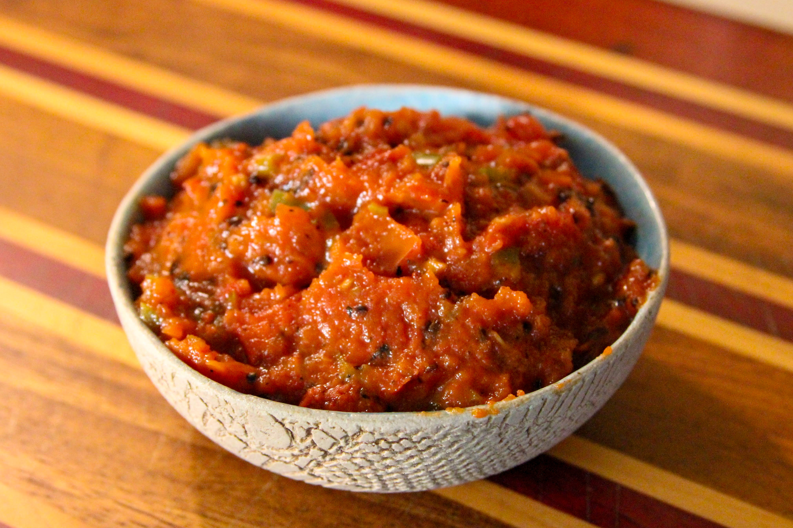

# Tomato Achaar

*Golbheda ko achaar: charred tomato mashed with toasted sesame, garlic, chilli and hot mustard oil. The smoky, fierce, everyday Nepali pickle that turns a plate of dal bhat into a feast.*

**Serves:** 6 (makes about 250 ml)

**Prep Time:** 10 minutes

**Cook Time:** 8 minutes

## Overview
Tomato achaar (golbheda ko achaar) is the everyday Nepali pickle, the spoonful of sharp-smoky-sour-hot relish that sits at the corner of every dal bhat plate and at every momo stall in the country. The technique is straightforward but the order matters: ripe tomatoes are charred whole over a flame until the skin blackens and the flesh starts to weep, sesame seeds are toasted and ground with dried chillies into a coarse spice paste, and mustard oil is heated to smoking before being poured over the whole thing to mellow its raw pungency. Everything is then mashed together with garlic, ginger, salt and lemon into a thick brick-red relish that smells of bonfire and toasted nuts.

This is a same-day achaar, bracing on day one, fading by day three. It is also the dipping sauce for [chicken momos](../chicken-momos.md), where it is sometimes thinned with a tablespoon of water and called momo ko achaar.

## Ingredients
- 5 large ripe tomatoes (about 600 g)
- 3 tbsp toasted sesame seeds (plus extra to garnish)
- 4 garlic cloves
- 2 cm fresh ginger
- 1 small green chilli (or to taste)
- 3 dried red chillies (or to taste)
- 3 tbsp mustard oil
- 1 tsp salt (or to taste)
- 2 tbsp fresh lemon juice
- ½ tsp ground turmeric
- ½ tsp ground timur (Sichuan pepper)
- Small handful fresh coriander (chopped)

## Method

### Stage 1 - Char the tomatoes
1. Place the whole tomatoes directly over a gas flame (use tongs) or under a hot grill at full power.
1. Turn every 60-90 seconds until the skin is blackened in patches on all sides and the flesh has started to soften and weep its juice. Total time: 6-8 minutes.
1. Tip into a bowl and cover with a plate. The steam helps loosen the skins.
1. Once cool enough to handle, peel off the loose skin (some black flecks are fine and desirable; do not be too thorough).
1. Discard the woody core; tear the flesh into chunks.

### Stage 2 - Grind the sesame paste
1. Place the sesame seeds in a dry pan over medium heat. Toast 1-2 minutes, shaking, until uniformly golden and fragrant. Tip into a mortar or food processor.
1. Add the dried red chillies (broken). Grind to a coarse, slightly oily paste.

### Stage 3 - Smoke the mustard oil
1. Heat the mustard oil in a small heavy pan over high heat until it just begins to smoke heavily.
1. Off the heat. Let it cool for 30 seconds (this drives off the raw, harsh sharpness while keeping the pungent body).

### Stage 4 - Combine
1. In a wide bowl, combine the torn charred tomato flesh, the sesame-chilli paste, the peeled garlic (crushed to a paste), grated ginger, finely chopped green chilli, salt, turmeric and timur.
1. Pour the warm mustard oil over the top. The oil will hiss faintly as it hits the cool tomato.
1. Mash thoroughly with a fork or the back of a wooden spoon. The achaar should be a thick, chunky, brick-red pulp with visible sesame flecks. You can keep it rough or work it smoother depending on preference.
1. Stir in the lemon juice and chopped coriander.
1. Taste. Adjust salt, lemon and chilli. The flavour should be smoky from the charred tomato, sharp from the lemon, hot from the chilli, fragrant from the sesame and timur.

### Stage 5 - Serve
1. Tip into a serving bowl. Garnish with a sprinkle of extra toasted sesame and a few coriander leaves.
1. Serve at room temperature alongside dal bhat, momos, or any plate that needs lifting.

## Notes
- **Char the tomato properly.** Skin-blackened is the marker. Under-charred gives a fresh-tomato-pickle that's pleasant but not Nepali; properly charred gives the smoky background that defines the dish.
- **Mustard oil over neutral.** The pungency is structural. If you cannot find mustard oil, neutral oil + ½ tsp mustard powder is a third-best substitute.
- **Sesame paste must be toasted and ground.** Whole sesame seeds give the wrong texture; the ground paste binds the achaar and stops it weeping water.
- **Timur is the Nepali fingerprint.** Sichuan pepper substitutes. Black pepper alone gives a less distinctive achaar.
- **Best eaten the same day.** The achaar holds for 48 hours in the fridge but the brightness fades. Make in small batches.

## Variations
- **Momo ko achaar (dipping sauce):** thin with 2-3 tbsp water to a pourable consistency for dipping with momos. Otherwise identical.
- **With timmur ko piro:** double the timur for the proper Newari version, where the tongue-tingling Sichuan-pepper note is the headline flavour.
- **With charred mooli (radish):** fire-roast a small mooli alongside the tomatoes and mash it through. Earthier and slightly sweeter.
- **With cucumber:** fold 100 g finely diced cucumber (salted briefly and squeezed) through the finished achaar for a fresher, longer-textured pickle.

## Serving
A tablespoon per person on the dal bhat plate, or a heaped bowl alongside [chicken momos](../chicken-momos.md) as a dipping sauce.

## Storage
- Best the day it is made; refrigerates 2 days. The lemon and the fresh herbs fade after that.
- Do not freeze.
- The mustard oil's pungency mellows on day two, which some prefer; the smoky note holds.
