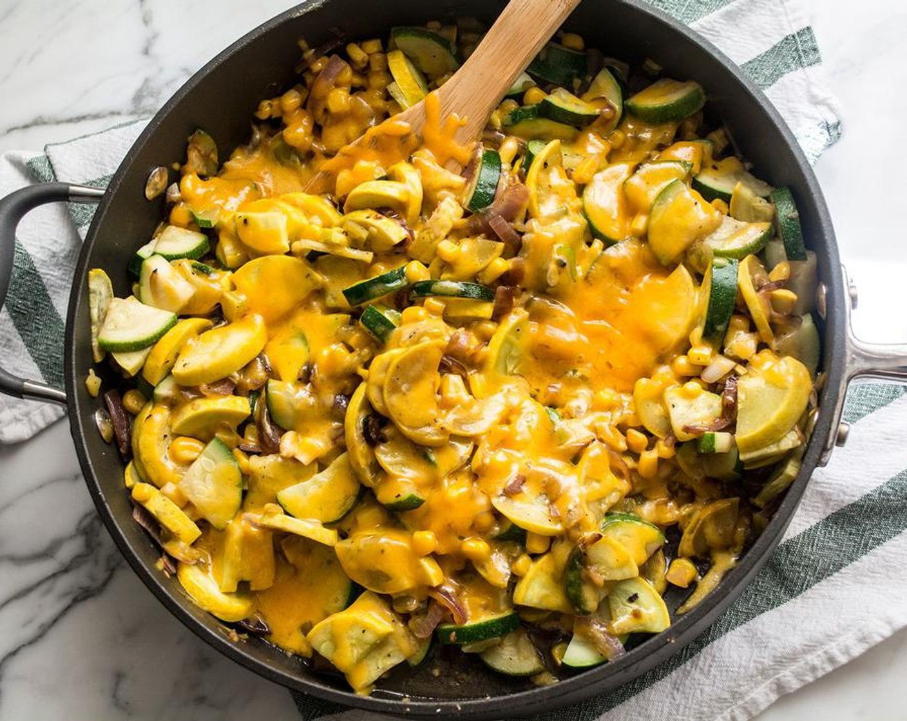

# Calabacitas New Mexican Style

*New Mexico's squash-corn-and-green-chile sauté: cubes of summer squash sautéed with sweet corn, roasted Hatch green chillies, onion, garlic and a touch of cream and grated Monterey Jack. The Pueblo-Hispanic NM home cook standard: vegetarian, the traditional summer side.*

**Serves:** 4-6

**Prep Time:** 15 minutes

**Cook Time:** 25 minutes

## Overview
New Mexican calabacitas is the traditional NM Pueblo-Hispanic summer vegetable side: cubes of zucchini and yellow squash sautéed with sweet corn kernels, chopped onion, garlic, and a generous heap of roasted-and-peeled Hatch green chillies, finished with a touch of cream and plenty of grated Monterey Jack cheese. The dish is similar to the Southwest version but with more pronounced NM Hatch chile presence. Vegetarian. Served alongside grilled meats, enchiladas, or as a one-pot vegetarian dinner with tortillas.

## Ingredients

- 2 large zucchini (cubed)
- 2 large yellow summer squash (cubed)
- 300 g sweet corn kernels
- 6 roasted-and-peeled Hatch green chillies (chopped; or 1 tin chopped green chiles)
- 1 large onion (chopped)
- 6 garlic cloves (crushed)
- 4 tablespoons butter
- 100 ml double cream
- 200 g grated Monterey Jack
- 1 ½ teaspoons fine sea salt
- 1 teaspoon ground black pepper
- 1 teaspoon ground cumin
- 1 teaspoon dried Mexican oregano

### To finish
- 1 small bunch fresh coriander (chopped)
- Spring onions

## Method

### Stage 1 - Sauté base
1. Melt butter in wide pan.
2. Cook onion 6 min.
3. Add garlic; cook 30 sec.

### Stage 2 - Add squash and corn
1. Add zucchini and yellow squash; cook 5 min.
2. Add corn; cook 3 min.

### Stage 3 - Add chillies and seasoning
1. Stir in chopped Hatch chillies, cumin, oregano, salt, pepper.
2. Cook 3 min.

### Stage 4 - Add cream and cheese
1. Add cream; stir.
2. Add Monterey Jack; stir off heat till melted.

### Stage 5 - Serve
1. Scatter coriander and spring onions.

## Notes
- **Hatch chillies essential.**
- **Don't overcook squash.**
- **Cheese off heat.**

## Variations
- **With pinto beans:** add tin; turns into a main.
- **Spicier:** include hot Hatch chillies.
- **With diced potato:** add cubed cooked potato.
- **Vegan:** skip cream and cheese; use cashew cream + nutritional yeast.

## Serving
- Alongside enchiladas, grilled meats, or as a vegetarian main with tortillas.

## Storage
- Keeps refrigerated 3 days.
- Reheat briefly.
- Don't freeze.
