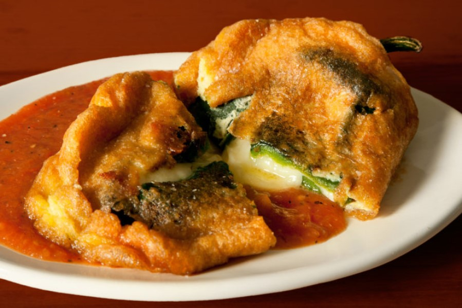

# New Mexico Chile Rellenos

*New Mexico's stuffed roasted chiles: roasted-and-peeled Hatch green chillies stuffed with Monterey Jack cheese, dipped in beaten egg-white batter, fried till golden, and smothered in red chile sauce or green chile gravy. The New Mexican classic: vegetarian, comforting, deeply regional.*

**Serves:** 4

**Prep Time:** 30 minutes

**Cook Time:** 20 minutes

## Overview
New Mexico chile rellenos are a New Mexican variation on the wider Mexican chile relleno tradition: large roasted-and-peeled Hatch green chillies (or Anaheim) with a slit cut in one side and seeds removed, stuffed generously with cubes of Monterey Jack cheese (the traditional NM choice; or pepper jack for spicier), then dipped in a light egg-white-and-yolk batter and pan-fried till the batter puffs golden. Served smothered in either red chile sauce (see red chile sauce in stacked enchiladas) or green chile gravy, topped with extra cheese (melted briefly under a grill), and garnished with crema, coriander and sliced raw onion.

## Ingredients

### Chillies
- 8 large fresh Hatch green chillies (or Anaheim or poblano)
- 200 g Monterey Jack (cubed into strips that fit the chilli)

### Batter
- 4 large eggs (separated)
- 60 g plain flour
- 1 teaspoon fine sea salt
- 1 teaspoon baking powder

### Frying
- 200 ml vegetable oil

### Sauce (choose red or green)
- 500 ml red chile sauce (see stacked enchiladas)
- OR 500 ml green chile sauce

### Topping
- 200 g grated Monterey Jack (extra for finishing)

### Garnish
- Mexican crema or sour cream
- Fresh coriander
- Sliced raw red onion
- Lime wedges

### To serve
- New Mexican rice
- Pinto beans
- Warm flour tortillas

## Method

### Stage 1 - Roast and peel chillies
1. Char chillies all over under grill or over open flame till blackened.
2. Steam in covered bowl 10 min.
3. Peel off skin (rinse fingers, don't rinse chillies; keeps flavour).
4. Make slit lengthwise in each; carefully remove seeds and ribs; leave stem intact.

### Stage 2 - Stuff
1. Carefully push a strip of Monterey Jack into each chilli.
2. Don't overfill; the chilli should close around the cheese.

### Stage 3 - Make batter
1. Whip egg whites to stiff peaks.
2. In another bowl, whisk yolks with flour, salt, baking powder.
3. Fold the whites into the yolk mixture gently.

### Stage 4 - Fry
1. Heat oil in wide pan over medium-high heat to 175°C (350°F).
2. Holding chilli by stem, dip in batter; let excess drip.
3. Lower carefully into oil; fry 2-3 min per side till golden and puffed.
4. Drain on paper towels.

### Stage 5 - Smother in sauce
1. Heat the chosen sauce.
2. Place chillies on plates.
3. Spoon hot sauce generously over.
4. Top with extra grated Monterey Jack.

### Stage 6 - Finish
1. Place briefly under hot grill to melt cheese (30 sec).
2. Scatter crema, coriander, red onion.
3. Lime wedges.

## Notes
- **Roast and peel carefully:** don't tear.
- **Whipped egg whites:** for the puffy batter.
- **Smother in sauce:** essential.
- **Cheese on top melted:** finish.

## Variations
**Christmas style:** half red, half green sauce on the same plate.
**With chicken or beef:** add shredded meat with cheese filling.
**Baked instead of fried:** brush with oil; bake at 220°C for 15 min.
**Vegan:** swap cheese for cashew-based "queso".

## Serving
With NM rice, pinto beans, warm flour tortillas. NM beer.

## Storage
- Best eaten immediately.
- Stuffed unbattered chiles keep refrigerated 2 days.
- Don't refrigerate fried; goes soggy.
