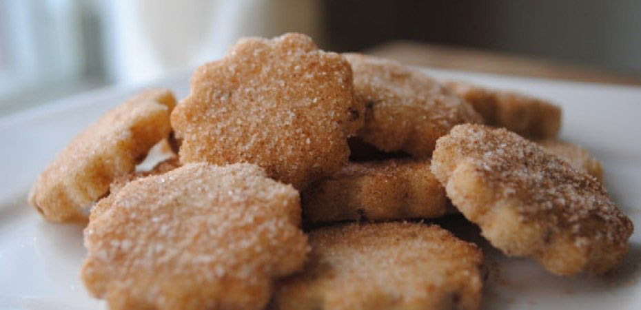

# Biscochitos (New Mexico Style)

*New Mexico's official state cookie: a buttery anise-cinnamon shortbread cookie cut into traditional shapes (fleur-de-lis, stars), baked till just pale gold, and dusted with cinnamon sugar. The Hispano-NM Christmas tradition. (Detailed in Southwest desserts; this is the canonical NM-claim version.)*

**Serves:** Makes 36 cookies

**Prep Time:** 30 minutes (plus 1 hour chilling)

**Cook Time:** 15 minutes

## Overview
Biscochitos are New Mexico's official state cookie (designated 1989) and the Hispano-NM Christmas baking tradition: a buttery shortbread cookie made with lard (canonical) or butter, flavoured with whole anise seeds, brandy, orange zest, ground cinnamon, baking powder and salt, rolled out and cut into shapes (the traditional fleur-de-lis is most iconic; or stars, ovals, hearts), baked till just pale gold, and immediately dusted with a generous coating of cinnamon sugar.

## Ingredients

### Dough
- 500 g plain flour
- 200 g lard (or butter)
- 200 g caster sugar
- 1 large egg
- 4 tablespoons brandy
- Zest of 1 orange
- 1 ½ teaspoons baking powder
- 1 teaspoon fine sea salt
- 1 ½ tablespoons whole anise seeds
- 1 teaspoon ground cinnamon

### Coating
- 80 g caster sugar
- 2 tablespoons ground cinnamon

## Method

### Stage 1 - Cream
1. Cream lard with sugar 4-5 min.
2. Add egg, brandy, orange zest, anise seeds.
3. Beat to combine.

### Stage 2 - Mix dry
1. Whisk flour, baking powder, salt, cinnamon.

### Stage 3 - Combine
1. Add dry to wet; mix to soft dough.

### Stage 4 - Chill
1. Wrap; refrigerate 1 hour.

### Stage 5 - Roll and cut
1. Preheat oven to 180°C (350°F).
2. Roll to 5 mm thickness.
3. Cut into shapes.

### Stage 6 - Bake
1. 12-15 min till pale gold.

### Stage 7 - Coat warm
1. Mix sugar and cinnamon.
2. Toss warm cookies in mixture.

### Stage 8 - Cool and serve
1. Cool on rack.

## Notes
- **Lard for proper texture.**
- **Don't overbake:** pale gold only.
- **Coat warm:** sugar adheres.

## Variations
**Butter version:** less canonical.
**With pecans:** add chopped pecans.
**Larger cookies:** roll thicker.

## Serving
At NM Christmas, weddings, special occasions.

## Storage
- Keeps in sealed tin 2 weeks.
- Freezes 3 months.
