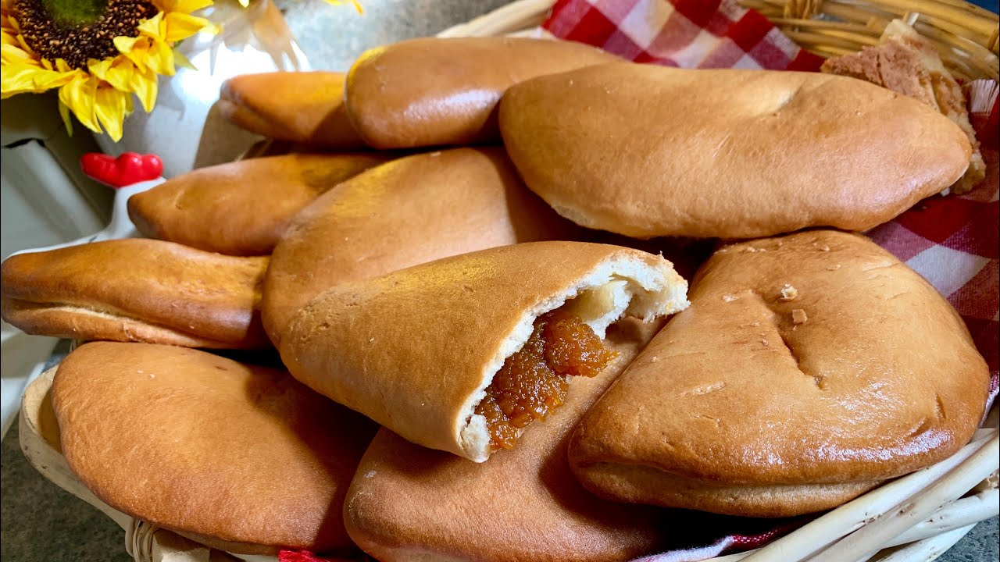

# Empanaditas de Calabaza

*New Mexico's small pumpkin turnovers: tiny half-moon pastries filled with sweetened pumpkin (or sweet potato), cinnamon and raisins, baked till the crust crisps golden and dusted with cinnamon sugar. The NM Christmas and feast-day tradition, made by the dozen for family gatherings.*

**Serves:** Makes 24 small empanaditas

**Prep Time:** 1 hour (plus 30 minutes pastry chilling)

**Cook Time:** 25 minutes

## Overview
Empanaditas de calabaza are New Mexico's small sweet pumpkin turnovers and a Hispano-NM Christmas tradition: a buttery shortcrust pastry rolled and cut into small rounds (6 cm), filled with sweetened pumpkin (or sweet potato) mashed with cinnamon, brown sugar, raisins, and sometimes piñon nuts (pine nuts; the NM staple); folded into half-moons and crimped; baked till the crust crisps golden; dusted with cinnamon sugar while warm. The small size makes them perfect for Christmas cookie trays and church bake sales; making them is a family activity.

## Ingredients

### Pastry
- 500 g plain flour
- 200 g cold butter (cubed)
- 100 g caster sugar
- 1 teaspoon fine sea salt
- 2 large egg yolks
- 4-6 tablespoons ice-cold water

### Filling
- 600 g cooked mashed pumpkin (or sweet potato; from roasted pumpkin)
- 150 g brown sugar
- 1 tablespoon ground cinnamon
- 1 teaspoon ground nutmeg
- ½ teaspoon ground cloves
- 80 g raisins
- 50 g piñon (pine) nuts (optional)
- 1 teaspoon vanilla
- Pinch of salt

### Egg wash
- 1 egg (beaten with 1 tablespoon milk)

### Coating
- 4 tablespoons caster sugar
- 1 tablespoon ground cinnamon

## Method

### Stage 1 - Make pastry
1. Whisk flour, sugar, salt.
2. Rub in cold butter to coarse crumbs.
3. Add egg yolks and water; mix to dough.
4. Wrap; chill 30 min.

### Stage 2 - Make filling
1. Mix mashed pumpkin, brown sugar, cinnamon, nutmeg, cloves, raisins, pine nuts (if using), vanilla, salt.

### Stage 3 - Roll and cut
1. Preheat oven to 180°C (350°F).
2. Roll pastry to 3 mm thickness.
3. Cut 6 cm circles.

### Stage 4 - Fill and fold
1. Place 1 teaspoon filling on each circle.
2. Brush edges with egg wash.
3. Fold to half-moon; crimp with fork.

### Stage 5 - Bake
1. Place on parchment-lined sheets.
2. Brush tops with egg wash.
3. Bake 18-22 min till deep golden.

### Stage 6 - Coat warm
1. Mix sugar and cinnamon.
2. Toss warm empanaditas to coat.

### Stage 7 - Cool and serve
1. Cool on rack.

## Notes
- **Small size:** 6 cm circles.
- **Mash filling smooth.**
- **Crimp edges with fork.**
- **Coat warm.**

## Variations
**Mince filling:** swap pumpkin for sweet meat-and-fruit mince.
**Without raisins:** kid-friendly.
**Spiced more:** add cardamom.
**Larger:** 10 cm circles; makes 12 larger empanadas.

## Serving
At NM Christmas, weddings, family gatherings.

## Storage
- Sealed container at room temp 1 week.
- Freezes 2 months.
