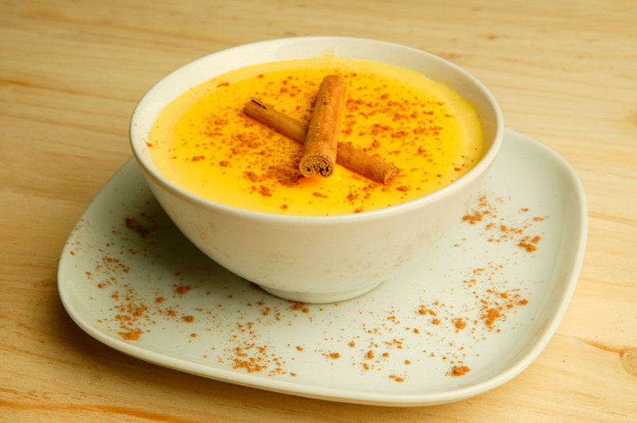

# Natillas

*New Mexico's vanilla custard: milk, sugar, egg yolks and vanilla cooked into a thick creamy custard, lightened with whipped meringue folded in, topped with cinnamon. The Hispano-NM dessert custard: light, creamy, comforting.*

**Serves:** 6

**Prep Time:** 20 minutes (plus 2 hours chilling)

**Cook Time:** 15 minutes

## Overview
Natillas is a New Mexican-Hispano vanilla custard dessert that bridges Spanish flan-style custards and NM home cooking: whole milk, sugar, vanilla and cinnamon cooked together with egg yolks and a touch of cornstarch into a thick smooth custard; whipped egg whites folded in to lighten the texture into something between a custard and a mousse. Served in individual cups or a wide bowl, topped with ground cinnamon and sometimes nutmeg, sometimes with mini meringue dollops floating on top. Three details: gentle cooking (don't curdle), egg whites folded in for lightness, cinnamon top.

## Ingredients

- 1 litre whole milk
- 200 g caster sugar
- 1 cinnamon stick
- 1 vanilla pod (or 2 teaspoons vanilla extract)
- 6 large eggs (separated)
- 4 tablespoons cornstarch
- ¼ teaspoon fine sea salt
- 1 teaspoon ground cinnamon (for topping)
- 1 teaspoon ground nutmeg (optional)

### Optional: meringue dollops
- 2 large egg whites (separate from above)
- 4 tablespoons caster sugar

## Method

### Stage 1 - Heat milk
1. In a heavy saucepan, combine milk, half the sugar, cinnamon stick and split vanilla pod.
2. Heat over medium, stirring, till just below boiling.
3. Cool 5 min; remove cinnamon stick and vanilla pod.

### Stage 2 - Combine yolks and cornstarch
1. In a bowl, whisk yolks with remaining sugar, cornstarch and salt till smooth.

### Stage 3 - Temper
1. Slowly pour warm milk into yolks while whisking constantly.
2. Return mixture to saucepan.

### Stage 4 - Cook
1. Cook over medium heat, whisking constantly, 5-8 min till thickened to a heavy custard.
2. Don't boil hard; eggs will scramble.

### Stage 5 - Whip whites and fold
1. In a clean bowl, whip 4 egg whites to stiff peaks.
2. Add 2 tablespoons sugar; whisk briefly.
3. Fold whites gently into the warm custard.

### Stage 6 - Pour and chill
1. Pour into individual cups or a wide bowl.
2. Chill 2 hours minimum.

### Stage 7 - Optional meringue dollops
1. Whip 2 separate egg whites with sugar to stiff peaks.
2. Drop spoonfuls onto the chilled custard just before serving.

### Stage 8 - Top and serve
1. Dust with cinnamon (and nutmeg if using).

## Notes
- **Don't boil:** eggs scramble.
- **Fold whites gently:** keep airy.
- **Chill 2+ hours.**

## Variations
**With brandy:** add 2 tablespoons brandy to the custard.
**With caramel:** drizzle caramel sauce on top.
**Without folded whites (denser):** skip the folding step.
**With raisins:** soak in brandy; sprinkle on top.

## Serving
After NM Christmas dinner; at family celebrations.

## Storage
- Refrigerated 3 days.
- Don't freeze.
