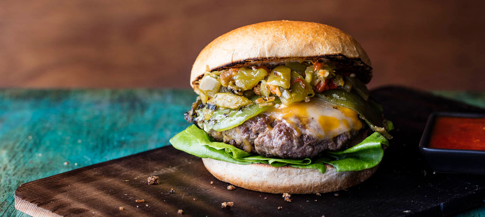

# New Mexico Green Chile Cheeseburger

*New Mexico's official state burger: a juicy beef patty topped with a generous heap of roasted Hatch green chillies and a melted slice of New Mexican Monterey Jack, on a soft white bun with lettuce, tomato, onion, mayo and pickles. The official state cuisine icon; New Mexicans take their green chile cheeseburgers very seriously.*

**Serves:** 4

**Prep Time:** 20 minutes (plus chile roasting)

**Cook Time:** 15 minutes

## Overview
The green chile cheeseburger is New Mexico's official state cuisine icon and the focus of statewide rivalries and "best of" rankings (the New Mexico Tourism Department maintains a Green Chile Cheeseburger Trail mapping the state's best versions): a juicy beef patty (80/20 ground chuck for proper fat) grilled or smashed in a hot pan, topped with a generous heap of roasted-and-peeled Hatch green chillies (the canonical New Mexico chile; mild or medium-hot from the Hatch valley harvest), a slice of Monterey Jack or pepper jack cheese, and served on a soft white bun with lettuce, tomato, raw onion, mayonnaise, ketchup or yellow mustard, and dill pickles. The dish defines New Mexico: the green chile is essential; without it, you have a generic American cheeseburger.

## Ingredients

### Burger patties
- 800 g ground chuck (80% lean / 20% fat)
- 1 ½ teaspoons fine sea salt
- 1 teaspoon ground black pepper
- 1 teaspoon garlic powder

### Hatch green chile topping
- 8-10 roasted-and-peeled Hatch green chillies (or Anaheim or poblano; deseeded and chopped); or 1 large tin chopped roasted green chillies
- 2 tablespoons butter
- 1 garlic clove (crushed)
- ½ teaspoon salt

### Cheese
- 4 slices Monterey Jack (or pepper jack)

### Buns
- 4 soft white hamburger buns (potato rolls if available)
- 2 tablespoons butter (for toasting buns)

### Garnishes
- Mayonnaise
- Yellow mustard
- Tomato slices
- Iceberg lettuce
- Sliced red onion
- Dill pickle slices

### To serve
- Crispy fries
- Cold New Mexican beer (Santa Fe, Marble)

## Method

### Stage 1 - Warm the chile
1. Heat butter in a small pan over medium heat.
2. Add crushed garlic; cook 30 sec.
3. Add chopped green chillies; warm 5 min.
4. Add salt.
5. Set aside.

### Stage 2 - Form patties
1. Combine ground chuck with salt, pepper, garlic powder.
2. Form into 4 patties slightly wider than the buns (they shrink).
3. Make a small dimple in the centre of each (prevents bulging).

### Stage 3 - Toast buns
1. Heat a wide pan over medium heat.
2. Butter cut sides of buns.
3. Toast cut-side-down 90 sec till golden.

### Stage 4 - Cook patties
1. Heat the pan to high.
2. Cook patties 3 min per side for medium.
3. In last 30 sec, top each patty with a slice of Monterey Jack and a generous spoonful of warm green chile.
4. Cover briefly to melt cheese.

### Stage 5 - Build burgers
1. Mayo on bottom bun.
2. Lettuce, tomato, red onion.
3. Patty with cheese and green chile.
4. Pickles.
5. Mustard on top bun (optional).
6. Close.

### Stage 6 - Serve
1. With fries.
2. Cold beer.

## Notes
- **Hatch chile essential:** the New Mexico signature.
- **Don't overcook patties:** medium.
- **Cheese over chile:** melts properly.
- **Soft white bun:** the canonical NM bread.

## Variations
**With bacon:** add 2 strips of bacon to each.
**Spicier:** include hot Hatch chiles; add chopped fresh jalapeño.
**Double patty:** stack 2 thinner patties.
**Vegetarian:** swap beef for a black bean patty or Beyond patty; same chile topping.

## Serving
With fries (or sweet potato fries), pickles. New Mexican beer.

## Storage
- Best eaten immediately.
- Cooked patties keep refrigerated 2 days.
- Don't refrigerate assembled.
