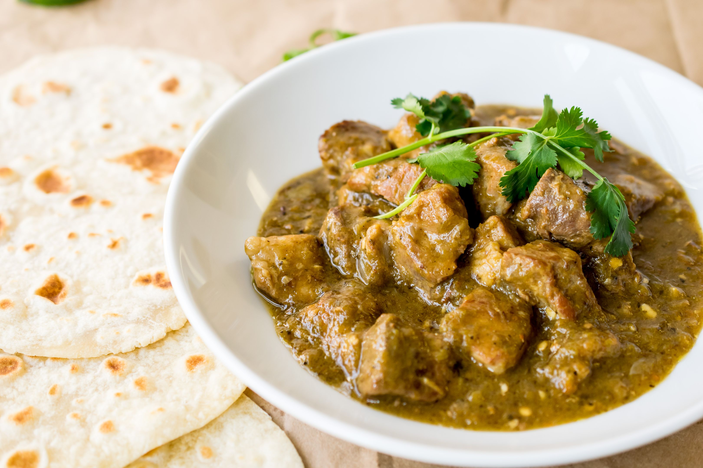

# New Mexico Green Chile Chicken Stew

*New Mexico's chicken-and-Hatch-chile stew: shredded chicken slow-cooked with roasted Hatch green chillies, potato, garlic, onion, oregano and chicken stock into a brothy hot green stew. The NM Christmas Eve and winter classic; eaten with flour tortillas and cheese.*

**Serves:** 6

**Prep Time:** 25 minutes

**Cook Time:** 50 minutes

## Overview
New Mexico green chile chicken stew is the traditional NM winter stew and a fixture of every Pueblo Christmas Eve, Hatch chile season feast, and ski-resort comfort meal: shredded chicken (poached separately or rotisserie) added to a stew of roasted-and-peeled Hatch green chillies, onion, garlic, cubed potato, chicken stock, dried Mexican oregano, cumin and salt. Brothy rather than thick. Served in deep bowls with warm flour tortillas, grated cheese on top, sour cream, and lime wedges.

## Ingredients

- 1 kg cooked shredded chicken (or rotisserie chicken meat)
- 1 kg fresh Hatch green chillies (roasted, peeled, chopped); or substitute with 500 g Anaheim + 500 g poblano + 1 small tin chopped green chiles
- 4 tablespoons vegetable oil
- 2 large onions (chopped)
- 8 garlic cloves (crushed)
- 4 medium potatoes (cubed)
- 1.5 litres hot chicken stock
- 2 bay leaves
- 1 tablespoon ground cumin
- 1 tablespoon dried Mexican oregano
- 1 ½ teaspoons fine sea salt
- 1 teaspoon ground black pepper
- 2 tablespoons plain flour (mixed with 4 tablespoons cold water for slight thickening)

### To finish
- 1 small bunch fresh coriander (chopped)
- Juice of 2 limes

### To serve
- Warm flour tortillas
- Grated Monterey Jack
- Sour cream
- Lime wedges
- Sliced jalapeños (extra heat)

## Method

### Stage 1 - Sauté aromatics
1. Heat oil in heavy pot.
2. Add chopped onions; cook 8 min.
3. Add garlic; cook 30 sec.

### Stage 2 - Add chillies
1. Add chopped roasted green chillies; cook 5 min.
2. Stir in cumin and oregano.

### Stage 3 - Add liquid and potato
1. Add cubed potatoes.
2. Pour in chicken stock.
3. Add bay leaves, salt, pepper.
4. Simmer 25 min till potatoes are tender.

### Stage 4 - Add chicken
1. Stir in shredded chicken.
2. Simmer 10 min.

### Stage 5 - Thicken slightly
1. Whisk flour-water slurry into stew.
2. Cook 5 min more to thicken slightly (still brothy).

### Stage 6 - Finish
1. Stir in lime juice and coriander.
2. Taste; adjust salt.

### Stage 7 - Serve
1. Ladle into deep bowls.
2. Top with grated cheese and sour cream.
3. Warm flour tortillas, lime wedges, jalapeños on the side.

## Notes
- **Roasted Hatch chillies essential.**
- **Brothy, not thick.**
- **Shredded chicken, not cubed.**
- **NM Christmas Eve classic.**

## Variations
**Spicier:** include hot Hatch chillies.
**With cheese melted in:** add 200 g grated cheese at the end; gives creamier version.
**Vegetarian:** skip chicken; add 1 tin pinto beans + 1 tin black beans.
**Pork version:** swap chicken for pork shoulder (cooked 90 min).

## Serving
In deep bowls with cheese, tortillas. Cold NM beer.

## Storage
- Keeps refrigerated 5 days; flavour deepens.
- Freezes 3 months.
- Day-after is excellent.
