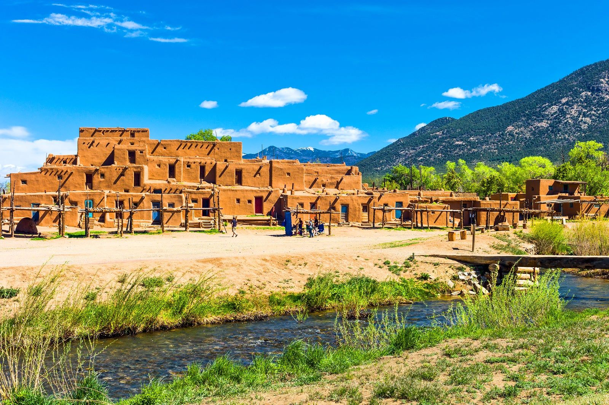

# New Mexico Cuisine

The cuisine of New Mexico, built around the state's two great chile crops (green and red, with the traditional question 'red, green, or Christmas?' on every restaurant menu): stacked red enchiladas with a deep mahogany red-chile sauce, green chile cheeseburgers as the unofficial state burger, posole rojo for winter, calabacitas (sautéed summer squash with green chile and corn) for late summer. Tamales, sopaipillas with honey, biscochitos (the state cookie) and Native American frybread sit alongside the Hatch-and-Chimayo chile heritage. The chiles are the throughline; everything else is supporting cast.
