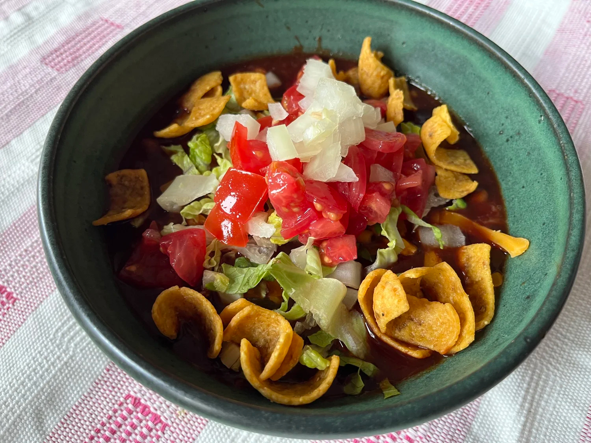

# New Mexico Frito Pie

*New Mexico's chile-and-Fritos: a bag of Fritos chips opened down the side, filled with hot New Mexico red or green chile (instead of Texas chili), topped with grated cheese, chopped onion, sour cream and pinto beans. The rival of Texas frito pie; New Mexicans claim invention; Texans dispute it. The Santa Fe Plaza Five and Dime traditional recipe.*

**Serves:** 4

**Prep Time:** 15 minutes (assumes pre-made chile sauce)

**Cook Time:** 5 minutes

## Overview
New Mexico frito pie is the New Mexican version of the Frito-bag dish (Texas has its own version with Texan no-beans chili; see Texas frito pie). New Mexicans claim invention at the Five and Dime in Santa Fe in the 1960s, where Teresa Hernández supposedly created it; Texans dispute. The NM version uses thick red chile sauce or green chile sauce (not Texas chili), warm pinto beans, grated cheese (cheddar or Monterey Jack), chopped raw onion, sour cream, and is eaten directly from the chip bag with a plastic fork.

## Ingredients

### Filling per serving
- 1 small bag (40-60 g) Fritos corn chips
- 200 ml hot NM red chile sauce (or green chile sauce)
- 100 g warm pinto beans
- 50 g grated cheddar or Monterey Jack
- 2 tablespoons chopped raw onion
- 2 tablespoons sour cream
- Sliced fresh chilli (optional)
- Fresh chopped coriander

## Method

### Stage 1 - Heat chile sauce and beans
1. Bring NM chile sauce to simmer.
2. Warm pinto beans separately.

### Stage 2 - Open bag
1. Cut along the long side of the Fritos bag to create a wide opening.

### Stage 3 - Fill
1. Ladle hot chile sauce directly into the bag.
2. Add warm pinto beans.
3. Top with cheese (the heat melts it).
4. Add chopped onion, sour cream.
5. Optional: sliced chilli, coriander.

### Stage 4 - Eat from bag
1. Provide a plastic fork.
2. Eat from the bag.

## Notes
- **NM red or green chile, not Texas chili.**
- **Pinto beans traditional NM.**
- **From the bag traditional.**
- **Eat immediately:** chips soften.

## Variations
- **Christmas:** half red, half green chile sauce.
- **With pulled pork:** add shredded carnitas.
- **With chorizo:** add cooked crumbled chorizo.
- **Family-style:** assemble in a baking dish for sharing.

## Serving
- At Santa Fe Plaza, Five and Dime, NM state fair. Cold beer.

## Storage
- Best immediately.
- Chile sauce keeps 1 week.
- Don't refrigerate assembled.
