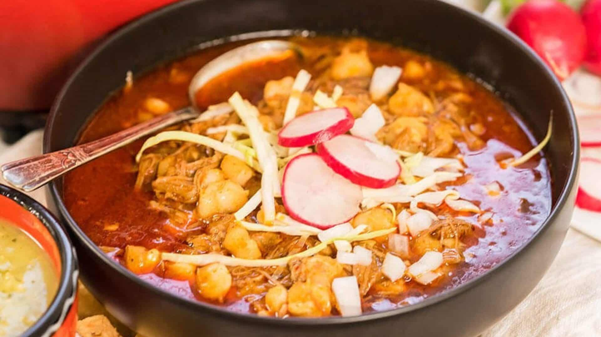

# New Mexico Posole Rojo

*New Mexico's red pork-and-hominy stew: cubed pork shoulder slow-cooked with hominy in a deeply spiced red chile broth made from rehydrated dried New Mexico red chillies, garlic, cumin and oregano. The Christmas Eve and feast-day classic of NM, particularly Pueblo and Hispanic households.*

**Serves:** 8

**Prep Time:** 25 minutes

**Cook Time:** 2 hours

## Overview
New Mexico posole rojo is the canonical New Mexican Christmas Eve and feast-day stew, distinct from but related to the Pueblo posole and the Mexican pozole. The NM version uses specifically New Mexico red chiles (chimayó red, or the canonical Hatch red), creating a deeper redder broth than the Pueblo or Sonoran versions. Cubed pork shoulder slow-cooked with hominy (the large-kernel corn treated with lime; available canned or dried), red chile paste, onion, garlic, oregano, cumin and bay leaves. Served in deep bowls with the canonical NM garnishes: shredded cabbage, sliced radishes, chopped raw onion, lime wedges, dried oregano, hot sauce, sliced jalapeños. Three details: NM red chiles (the local variety), hominy is the corn, table-side garnishes.

## Ingredients

- 1 kg pork shoulder (cubed into 3 cm pieces)
- 1 kg canned hominy (drained, rinsed)
- 10 dried New Mexico red chillies (or substitute with 6 ancho + 4 guajillo)
- 600 ml hot water (for soaking chillies)
- 4 tablespoons vegetable oil
- 2 large onions (chopped)
- 12 garlic cloves (crushed)
- 1.8 litres hot chicken or pork stock
- 4 bay leaves
- 1 tablespoon ground cumin
- 2 tablespoons dried Mexican oregano (some for cooking, some for table)
- 1 teaspoon ground coriander seed
- 2 teaspoons fine sea salt
- 1 teaspoon ground black pepper

### Table-side garnishes (canonical)
- 300 g finely shredded green cabbage
- 6-8 radishes (thinly sliced)
- 1 small white onion (chopped)
- 4 limes (wedged)
- 2 fresh jalapeños (sliced)
- Hot sauce
- Dried Mexican oregano (extra for sprinkling)
- 1 small bunch fresh coriander
- Warm corn or flour tortillas

## Method

### Stage 1 - Prep chillies
1. Toast briefly in dry pan.
2. Soak in hot water 30 min.
3. Drain; reserve soaking liquid.

### Stage 2 - Blend chile paste
1. Place soaked chillies in blender with 200 ml soaking liquid, half the garlic, cumin, coriander seed.
2. Blitz smooth.

### Stage 3 - Brown pork
1. Heat oil in heavy pot.
2. Brown pork in batches 4 min per side.
3. Set aside.

### Stage 4 - Sauté aromatics
1. Add chopped onions; cook 8 min.
2. Add remaining garlic; cook 30 sec.
3. Add chile paste; cook 4 min, stirring.

### Stage 5 - Combine and simmer
1. Return pork; add hominy, hot stock, bay leaves, oregano (half), salt, pepper.
2. Simmer 90 min till pork tender.

### Stage 6 - Finish
1. Taste; adjust salt.

### Stage 7 - Serve at table
1. Ladle into deep bowls.
2. Arrange table-side garnishes in small bowls.
3. Diners customise.

## Notes
- **NM red chillies essential.**
- **Hominy is the corn.**
- **Garnishes at the table.**
- **Better the next day.**

## Variations
**With chicken:** swap pork for chicken thigh.
**White posole:** skip the red chillies; gives milder version.
**Vegetarian:** skip pork; use vegetable stock + 2 tins pinto beans.
**Spicier:** include hot NM chillies; add chiles de árbol.

## Serving
In deep bowls with table-side garnishes. Christmas Eve, feast days, winter Sundays.

## Storage
- Keeps refrigerated 5 days; flavour deepens.
- Freezes 3 months.
- Day-after is famously better.
