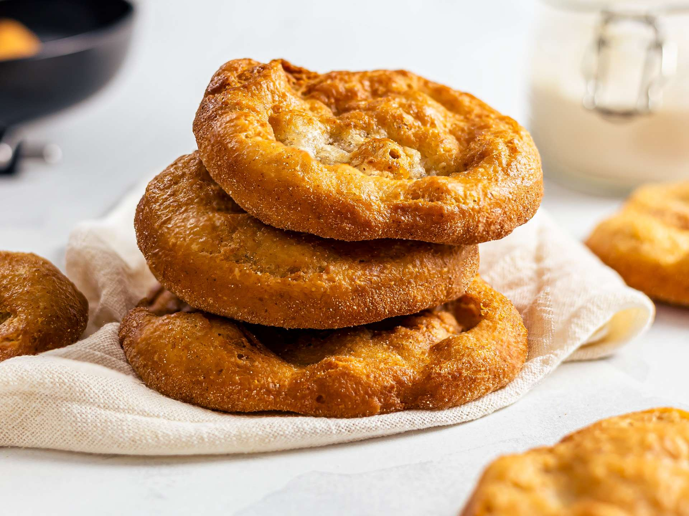

# New Mexico Frybread

*New Mexico's Navajo-Pueblo frybread: a soft yeasted flour dough rolled flat and deep-fried till puffed and golden. The canonical Native American Southwest bread, the base of Navajo tacos, eaten with honey or savoury fillings. The Pueblo and Navajo Nation traditional bread.*

**Serves:** 6 (6 large frybread)

**Prep Time:** 20 minutes (plus 1 hour dough resting)

**Cook Time:** 20 minutes

## Overview
New Mexico frybread (also Navajo frybread) is one of the most iconic Native American foods of the Southwest, particularly associated with the Navajo Nation and the Pueblo peoples: a soft yeasted-or-baking-powder-leavened flour dough (flour, baking powder, salt, water, sometimes lard) rolled flat into 20cm rounds and deep-fried in oil till puffed and golden. The dish has dark historical roots (the Long Walk of 1864 displaced Navajo people who were given rations of flour and lard, which became frybread); today it's the canonical Navajo Nation and Pueblo bread, sold at every Pueblo feast day, NM state fair, and Native American gathering. Used as the base of Navajo tacos (see southwest recipe), eaten with honey or jam as a sweet dessert, or stuffed with savoury fillings. Three details: yeasted or baking-powder leavened, deep-fried (not baked), eat immediately while puffed and warm.

## Ingredients

- 500 g plain flour
- 1 tablespoon baking powder
- 1 ½ teaspoons fine sea salt
- 3 tablespoons lard or vegetable shortening (or vegetable oil)
- 300 ml warm water (or warm milk)
- Vegetable oil for deep-frying (about 1 litre)

### Optional toppings (sweet)
- Honey
- Powdered sugar
- Cinnamon-sugar
- Jam

### Optional toppings (savoury)
- Navajo taco filling: seasoned beef + beans + lettuce + tomato + cheese
- Red or green chile sauce
- Grated cheese

## Method

### Stage 1 - Make dough
1. In a bowl, whisk flour, baking powder, salt.
2. Cut in lard till coarse crumbs.
3. Add warm water; stir to a soft dough.
4. Knead briefly 2 min.
5. Cover; rest 60 min.

### Stage 2 - Shape
1. Divide dough into 6 pieces.
2. Roll each into a thin round about 20 cm wide and 5 mm thick.

### Stage 3 - Heat oil
1. Heat oil to 175°C (350°F).

### Stage 4 - Fry
1. Lower one piece of dough at a time.
2. Fry 60-90 sec per side till puffed and deep golden.
3. Drain on paper towels.

### Stage 5 - Serve
1. Sweet: drizzle warm honey on top.
2. Savoury: top with Navajo taco fillings; or smother with chile sauce.
3. Eat immediately.

## Notes
- **Eat immediately:** lose their puff.
- **175°C oil temperature:** crucial.
- **Don't overcrowd the fryer.**

## Variations
**Navajo taco:** top with beef-and-bean filling + lettuce + cheese.
**With honey and powdered sugar:** the dessert version.
**Smaller portions:** mini frybread for canapés.

## Serving
At Pueblo feast days, Navajo gatherings, NM state fair. With honey or savoury fillings.

## Storage
- Best immediately.
- Dough keeps refrigerated 24 hours.
- Don't freeze cooked frybread; goes soggy.
