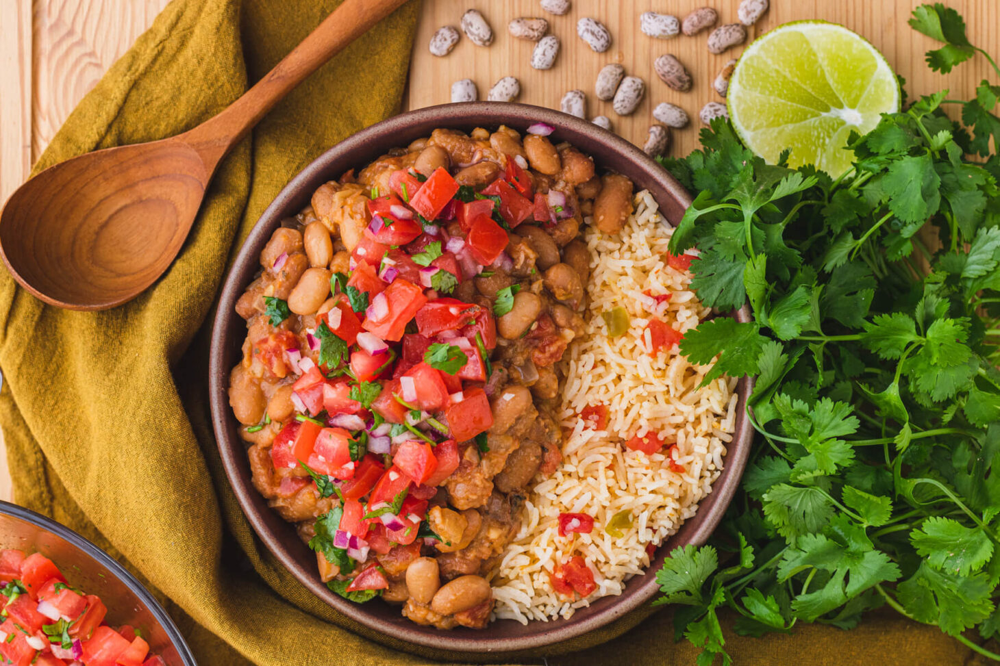

# New Mexico Pinto Beans

*New Mexico's pinto bean stew: dried pinto beans slow-cooked with onion, garlic, NM red chile pods, cumin, salt and oregano till the beans are tender and the broth thickens to a savoury brown stew. The canonical NM side, the bean alongside every NM meal.*

**Serves:** 6-8

**Prep Time:** 15 minutes (plus overnight bean soaking)

**Cook Time:** 2 hours

## Overview
NM pinto beans is the New Mexican canonical bean preparation, similar to but distinct from Texas ranch beans (less bacon, more NM red chile): dried pinto beans soaked overnight, slow-cooked with chopped onion, garlic, a few whole dried NM red chile pods (the canonical flavour), cumin, oregano, and salt; plus optionally a piece of salt pork or bacon for richness. Served alongside enchiladas, tacos, rellenos, or as part of a vegetarian plate with rice and tortillas.

## Ingredients

- 500 g dried pinto beans (soaked overnight, drained)
- 1 large onion (chopped)
- 8 garlic cloves (crushed)
- 2 dried NM red chile pods (or 2 ancho chillies; whole, just for flavour)
- 100 g salt pork or bacon (optional; diced)
- 2 bay leaves
- 1 tablespoon ground cumin
- 1 tablespoon dried Mexican oregano
- 1.5 litres water (or chicken stock)
- 1 ½ teaspoons fine sea salt
- 1 teaspoon ground black pepper

### To finish
- 1 small bunch fresh coriander
- 1 small fresh chilli (sliced; optional)

## Method

### Stage 1 - Sauté
1. (If using salt pork/bacon: heat in pot; render fat 5 min; remove crispy bits.)
2. Sauté onion in fat (or 2 tablespoons oil) 8 min.
3. Add garlic; cook 30 sec.

### Stage 2 - Add beans and liquid
1. Add soaked drained beans.
2. Add whole NM red chile pods.
3. Add bay leaves, cumin, oregano.
4. Pour in water/stock.

### Stage 3 - Slow-cook
1. Bring to simmer.
2. Cover slightly ajar.
3. Cook 90-120 min till beans are tender.

### Stage 4 - Season
1. Stir in salt and pepper.
2. Remove chile pods (or leave for spicier).

### Stage 5 - Serve
1. Scatter coriander.
2. Optional: top with crumbled bacon, sliced chilli.

## Notes
- **NM red chile pods:** the canonical flavour.
- **Slow-cook 2 hours.**
- **Salt at the end:** prevents tough skins.

## Variations
**Vegetarian:** skip bacon; otherwise identical.
**Spicier:** include hot NM chillies.
**With pork hock:** smoked pork hock for richer.
**Refried:** mash and fry in lard.

## Serving
Alongside any NM meal. With cornbread, tortillas.

## Storage
- Keeps refrigerated 5 days; flavour deepens.
- Freezes 3 months.
- Day-after is better.
