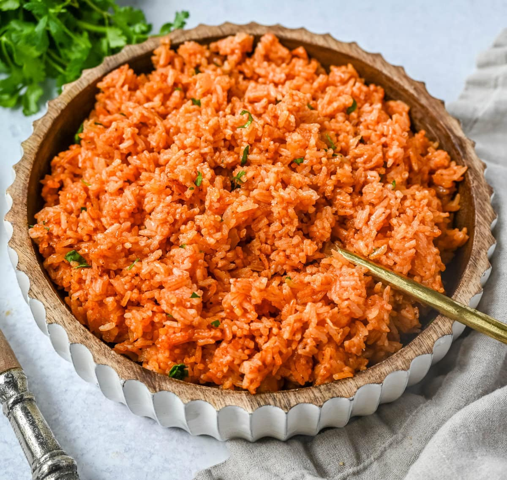

# New Mexico Spanish Rice

*New Mexico's red rice: long-grain rice cooked with onion, garlic, tomato sauce, chicken stock, cumin and a touch of NM red chile powder till the rice absorbs the broth and turns orange-red. The canonical NM rice side, the rice that turns up alongside enchiladas, tacos and rellenos.*

**Serves:** 6

**Prep Time:** 10 minutes

**Cook Time:** 30 minutes

## Overview
New Mexico Spanish rice (despite the name; the dish is American-Hispanic, not from Spain) is the canonical NM rice side: long-grain white rice toasted briefly in oil with chopped onion, garlic, then simmered in chicken stock with tomato sauce, ground cumin, dried Mexican oregano, salt and a touch of NM red chile powder for the canonical red colour. Served alongside enchiladas, tacos, rellenos. Three details: toast the rice (proper Mexican technique), tomato sauce + stock combo, NM red chile powder for colour.

## Ingredients

- 400 g long-grain white rice
- 4 tablespoons vegetable oil
- 1 medium onion (chopped)
- 6 garlic cloves (crushed)
- 800 ml hot chicken stock
- 200 g tomato sauce
- 2 tablespoons tomato paste
- 1 tablespoon NM red chile powder (or smoked paprika)
- 1 tablespoon ground cumin
- 1 tablespoon dried Mexican oregano
- 1 ½ teaspoons fine sea salt
- 1 teaspoon ground black pepper
- 100 g frozen peas (optional)
- 1 small carrot (diced; optional)

### To finish
- 1 small bunch fresh coriander
- Spring onions

## Method

### Stage 1 - Sauté
1. Heat oil in wide pot.
2. Add chopped onion; cook 5 min.
3. Add rice; stir 2-3 min till the grains are coated and slightly golden.

### Stage 2 - Add aromatics and sauce
1. Add garlic; cook 30 sec.
2. Add tomato paste; cook 1 min.
3. Add tomato sauce.
4. Stir in chile powder, cumin, oregano, salt, pepper.

### Stage 3 - Add stock
1. Pour in hot chicken stock.
2. Bring to simmer.

### Stage 4 - Cook covered
1. Reduce to lowest heat; cover tightly.
2. Cook 18 min covered.
3. Add peas and carrot (if using) in last 5 min.

### Stage 5 - Rest
1. Take off heat; keep lid on; rest 10 min.

### Stage 6 - Fluff and serve
1. Fluff with fork.
2. Scatter coriander and spring onions.

## Notes
- **Toast the rice:** essential Mexican technique.
- **Tomato sauce + stock:** the canonical NM combo.
- **NM red chile powder:** for colour.

## Variations
**With chorizo:** add crumbled cooked chorizo.
**Spicier:** double the chile powder.
**With saffron:** add a pinch.
**Vegetable stock:** for vegetarian.

## Serving
Alongside enchiladas, tacos, rellenos. NM beer.

## Storage
- Keeps refrigerated 4 days.
- Reheat with splash of water.
- Freezes 2 months.
