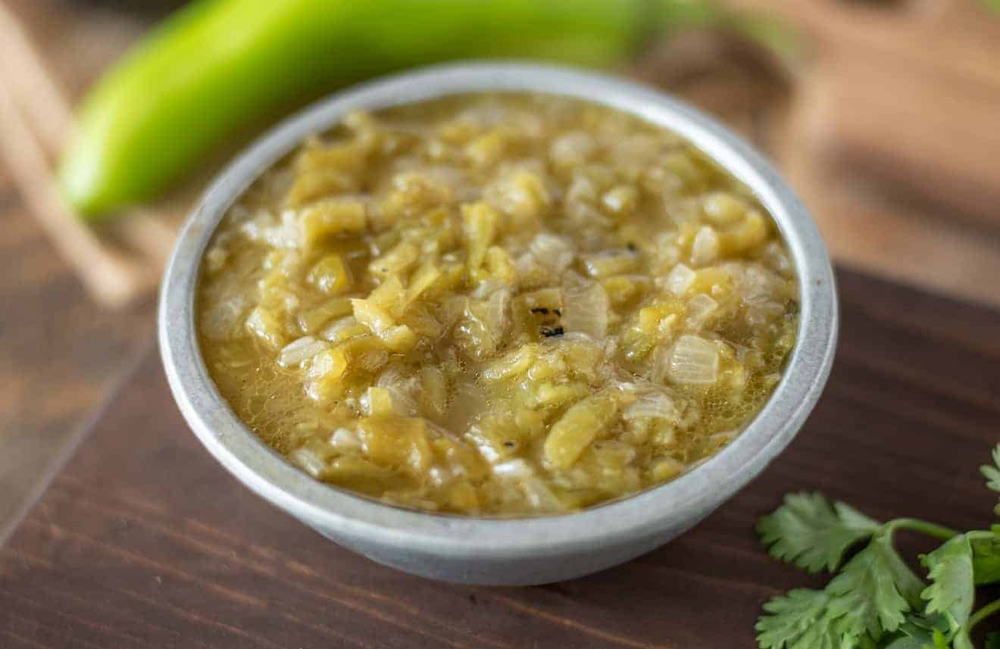

# New Mexico Green Chile Sauce

*New Mexico's foundational green chile sauce: roasted-and-peeled Hatch green chillies blended with onion, garlic, cumin and stock into a thick green sauce, cooked briefly with flour for body. The "green" half of New Mexico's red-vs-green debate; on burgers, in stews, in enchiladas, smothered on everything.*

**Serves:** Makes about 1 litre

**Prep Time:** 30 minutes (with chile roasting)

**Cook Time:** 20 minutes

## Overview
New Mexico green chile sauce is the green counterpart to the red chile sauce and equally foundational in NM cooking: roasted-and-peeled Hatch green chillies (the traditional NM chile, fresh-roasted in late summer; or substitute with Anaheim + canned green chiles) blended with onion, garlic, ground cumin, dried Mexican oregano, chicken stock, salt and pepper, then cooked in oil briefly with flour for slight thickening. Used on green chile cheeseburgers, in green chile stew, smothered over burritos and rellenos, in enchiladas verdes NM-style.

## Ingredients

- 1 kg roasted-and-peeled Hatch green chillies (or 600 g Anaheim + 1 large tin chopped green chiles); chopped
- 4 tablespoons vegetable oil
- 1 large onion (chopped)
- 8 garlic cloves (crushed)
- 4 tablespoons plain flour
- 800 ml hot chicken stock
- 2 tablespoons ground cumin
- 1 tablespoon dried Mexican oregano
- 1 ½ teaspoons fine sea salt
- 1 teaspoon ground black pepper
- 1 teaspoon ground coriander seed

## Method

### Stage 1 - Sauté
1. Heat oil in wide saucepan.
2. Add chopped onion; cook 8 min till soft.
3. Add garlic; cook 30 sec.

### Stage 2 - Add chillies and spices
1. Add chopped Hatch chillies.
2. Stir in cumin, oregano, coriander seed.
3. Cook 3 min.

### Stage 3 - Make roux
1. Sprinkle flour; whisk 2 min.

### Stage 4 - Add stock
1. Gradually whisk in hot chicken stock.
2. Bring to simmer.
3. Cook 12-15 min till thickened to gravy-like consistency.

### Stage 5 - Adjust
1. Season with salt and pepper.
2. If too thick, add water; if too thin, simmer longer.
3. For smoother sauce, blitz briefly with stick blender.

### Stage 6 - Use
1. Smother green chile cheeseburgers.
2. In green chile chicken stew.
3. On enchiladas verdes.
4. Drizzled on eggs.

## Notes
- **Hatch chillies essential.**
- **Roux for thickening.**
- **Optional blend smooth.**

## Variations
- **Spicier:** include hot Hatch chiles.
- **Christmas style (alongside red):** half red + half green on the plate.
- **Pork-flavoured:** use pork stock and add small piece of cooked pork.
- **Vegetarian:** vegetable stock.

## Serving
- On burgers, stews, enchiladas, eggs.

## Storage
- Keeps refrigerated 5 days.
- Freezes 6 months.
- Better after 24 hours.
