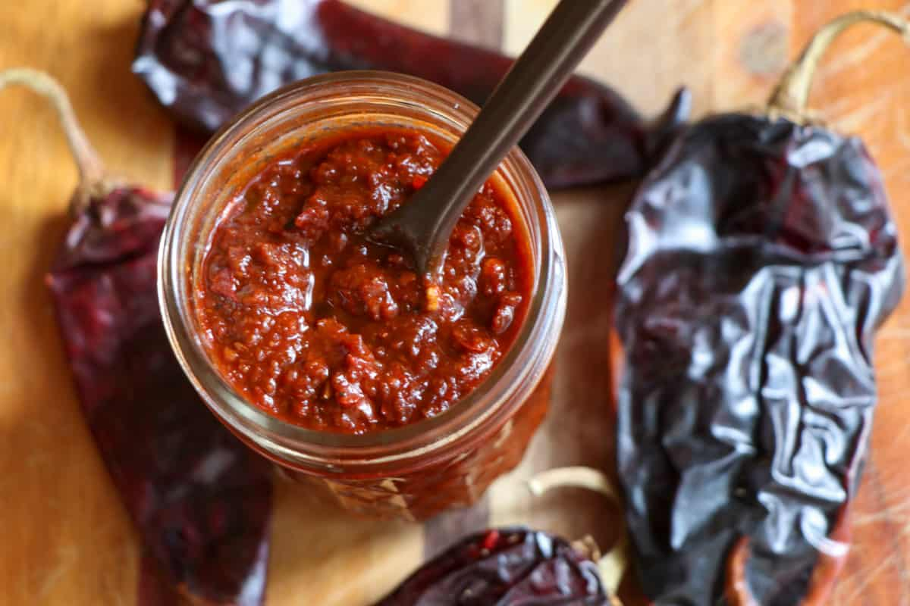

# New Mexico Red Chile Sauce

*New Mexico's foundational red chile sauce: dried NM red chiles rehydrated and blended with garlic, cumin, oregano and salt, then cooked in oil briefly to deepen. The base for enchiladas, posole, carne adovada, frito pie. The most important sauce in NM cooking.*

**Serves:** Makes about 1 litre

**Prep Time:** 15 minutes

**Cook Time:** 30 minutes

## Overview
New Mexico red chile sauce is the foundational sauce of New Mexican cooking and the traditional accompaniment to virtually every NM dish: dried New Mexico red chiles (or chimayó, or substitute with a mix of ancho and guajillo) rehydrated in hot water with garlic and onion, blended smooth with cumin, oregano and salt, then strained and cooked briefly in oil to deepen colour and flavour. Used in: stacked enchiladas, blue corn enchiladas, carne adovada, posole rojo, tamales, smothered burritos, frito pie.

## Ingredients

- 14 dried New Mexico red chiles (or chimayó; or mix of 8 ancho + 6 guajillo); stems and seeds removed
- 1 litre hot water (for soaking)
- 1 large onion (chopped)
- 8 garlic cloves (crushed)
- 2 tablespoons ground cumin
- 2 tablespoons dried Mexican oregano
- 1 teaspoon ground coriander seed
- 4 tablespoons vegetable oil
- 2 tablespoons plain flour (for slight thickening)
- 1 ½ teaspoons fine sea salt
- 1 teaspoon ground black pepper
- 1 tablespoon apple cider vinegar (brightens)
- 1 teaspoon caster sugar (balances)

## Method

### Stage 1 - Toast and soak chillies
1. Toast dried chillies briefly in a dry pan.
2. Cover with hot water in a bowl.
3. Soak 30 min till softened.
4. Drain; reserve soaking liquid.

### Stage 2 - Blend
1. Place soaked chillies in blender with chopped onion, garlic, cumin, oregano, coriander seed, salt, pepper, sugar.
2. Add 300 ml of the reserved chilli liquid.
3. Blitz to a smooth sauce.
4. Strain through a fine sieve to remove the skins.

### Stage 3 - Cook in oil
1. Heat oil in a wide saucepan over medium heat.
2. Sprinkle flour; whisk for 1 min.
3. Pour in the strained sauce.
4. Cook 15-20 min, stirring, till the sauce darkens and thickens slightly.
5. Stir in vinegar.

### Stage 4 - Adjust
1. Add more chilli liquid to thin if too thick.
2. Taste; adjust salt.

### Stage 5 - Use
1. As enchilada sauce.
2. Smother burritos.
3. Base for carne adovada.
4. Pour over rellenos.
5. Drizzle over frito pie.

## Notes
- **NM red chiles traditional:** chimayó preferred.
- **Strain after blending:** removes skins.
- **Cook briefly to deepen.**
- **Adjust thickness with water.**

## Variations
- **Spicier:** include hot NM chiles or 2 chiles de árbol.
- **With cocoa:** add 1 tablespoon cocoa powder; deeper umami.
- **Mild:** skip the seeds entirely.

## Serving
- On enchiladas, tamales, burritos, rellenos. With NM food.

## Storage
- Keeps refrigerated 1 week.
- Freezes 6 months in portions.
- Reheat before serving.
