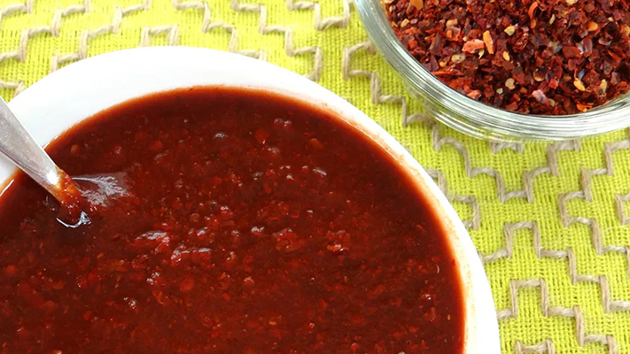

# Salsa de Chimayó

*New Mexico's chimayó red chile relish: dried chimayó red chillies blitzed with garlic, vinegar, oregano and salt into a thick red relish. The northern New Mexico Tewa-Pueblo tradition; uses the famous chimayó chile of the Espanola Valley.*

**Serves:** Makes 250 ml

**Prep Time:** 15 minutes

**Cook Time:** 10 minutes

## Overview
Salsa de Chimayó is a New Mexican specialty sauce using the traditional chimayó chile (the deep-red dried chile from the Chimayó region in northern NM's Espanola Valley, prized for its complex slightly fruity flavour): dried chimayó chillies briefly toasted, rehydrated, then blitzed with crushed garlic, apple cider vinegar, dried oregano, ground cumin and salt into a thick relish-like sauce. Used as a condiment alongside NM meals: on grilled meats, in enchiladas, as a finishing drizzle.

## Ingredients

- 10 dried chimayó red chiles (or substitute with mix of dried NM red + ancho)
- 400 ml hot water (for soaking)
- 8 garlic cloves
- 4 tablespoons apple cider vinegar
- 4 tablespoons olive oil
- 1 tablespoon dried Mexican oregano
- 1 tablespoon ground cumin
- 1 ½ teaspoons fine sea salt
- 1 teaspoon caster sugar
- ½ teaspoon ground black pepper

## Method

### Stage 1 - Toast and soak chiles
1. Toast briefly in dry pan.
2. Soak in hot water 30 min.

### Stage 2 - Blend
1. Drain chiles; reserve some liquid.
2. Blitz with garlic, vinegar, olive oil, oregano, cumin, salt, sugar, pepper, and 100 ml soaking liquid.
3. Blitz to a thick chunky paste.

### Stage 3 - Cook briefly
1. Heat the paste in saucepan over medium heat 5 min, stirring.

### Stage 4 - Cool
1. Transfer to jar.
2. Cool.

### Stage 5 - Use
1. As a condiment with NM meals.
2. As marinade.

## Notes
- **Chimayó chiles traditional.**
- **Brief cook deepens flavour.**

## Variations
- **Spicier:** add 2 chiles de árbol.
- **Without vinegar:** more chile-forward.

## Serving
- On grilled meats, in NM meals, as condiment.

## Storage
- Keeps refrigerated 1 month.
- Freezes 6 months.
