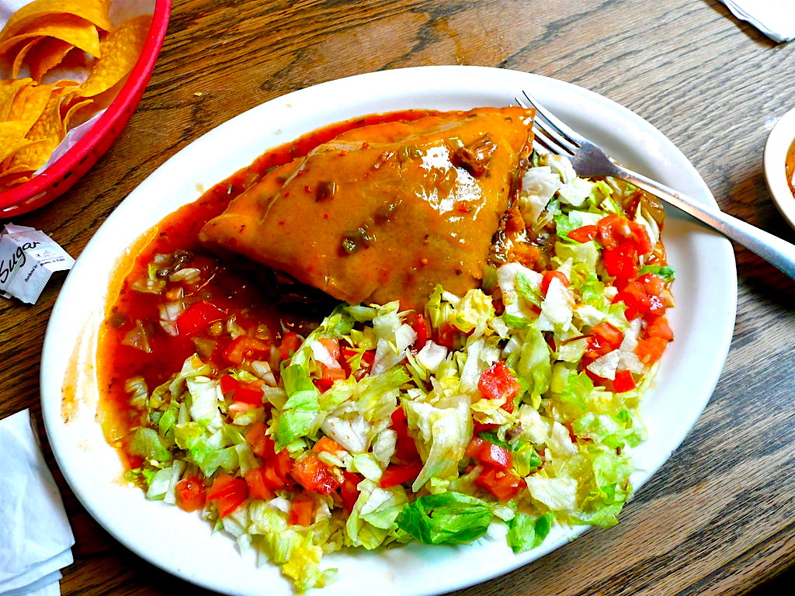

# Sopaipilla Relleno

*New Mexico's stuffed sopaipilla: a puffed sopaipilla (the NM hollow fried bread) opened and stuffed with carne adovada (red chile pork) or refried beans, topped with red or green chile sauce, melted cheese, lettuce, tomato and sour cream. The Santa Fe restaurant classic; bridges savoury main and sweet bread.*

**Serves:** 4

**Prep Time:** 20 minutes (assumes pre-made sopaipillas and adovada)

**Cook Time:** 10 minutes

## Overview
Sopaipilla relleno is the New Mexican savoury stuffed sopaipilla, distinct from the sweet dessert version with honey: large puffed sopaipillas (see Southwest sopaipillas recipe) opened at a corner with a knife to reveal the hollow inside, then stuffed generously with carne adovada (the NM red-chile pork; see carne adovada in southwest), refried beans, and grated Monterey Jack. Smothered in red or green NM chile sauce (or both for Christmas style), topped with more melted cheese, shredded lettuce, diced tomato, sliced raw onion, sour cream, and fresh coriander.

## Ingredients

### Sopaipillas
- 8 large fresh sopaipillas (see sopaipillas recipe in southwest)

### Filling
- 600 g carne adovada (red chile pork; see carne adovada recipe in southwest)
- 400 g warm refried pinto beans
- 200 g grated Monterey Jack

### Sauce
- 500 ml red chile sauce
- OR 500 ml green chile sauce
- (or 250 ml each for Christmas style)

### Topping
- 200 g grated cheese (Monterey Jack)
- 200 g shredded iceberg lettuce
- 2 medium tomatoes (diced)
- 1 small red onion (chopped)
- 200 ml sour cream
- 1 small bunch fresh coriander
- Sliced jalapeños
- Lime wedges

### To serve
- New Mexican rice
- Pinto beans alongside

## Method

### Stage 1 - Warm fillings
1. Warm carne adovada in pan.
2. Warm refried beans separately.
3. Warm chile sauce.

### Stage 2 - Open sopaipillas
1. Use a small sharp knife to cut a slit on one side of each puffed sopaipilla.
2. Open the slit carefully.

### Stage 3 - Stuff
1. Spoon 3 tablespoons of refried beans into each.
2. Add 4 tablespoons of carne adovada.
3. Add 2 tablespoons of grated Monterey Jack.

### Stage 4 - Plate and smother
1. Place stuffed sopaipillas on plates (1-2 per person).
2. Ladle hot chile sauce generously over.
3. Top with grated cheese.

### Stage 5 - Briefly melt cheese
1. Place under hot grill for 30 sec to melt cheese.

### Stage 6 - Garnish and serve
1. Top with lettuce, tomato, onion, sour cream, coriander, jalapeños.
2. Lime wedges.
3. NM rice and beans on the side.

## Notes
- **Properly puffed sopaipillas essential.**
- **Generous filling.**
- **Smother in sauce.**
- **Eat immediately.**

## Variations
**Christmas style:** half red, half green chile sauce.
**With chicken adovada:** swap pork for chicken in the red-chile sauce.
**Cheese-only (vegetarian):** beans + cheese, no meat.
**With beef:** swap adovada for slow-cooked NM beef in red chile.

## Serving
Smothered on plates. NM beer, sweet tea. Santa Fe restaurant classic.

## Storage
- Best immediately.
- Components separately keep.
- Don't refrigerate assembled.
