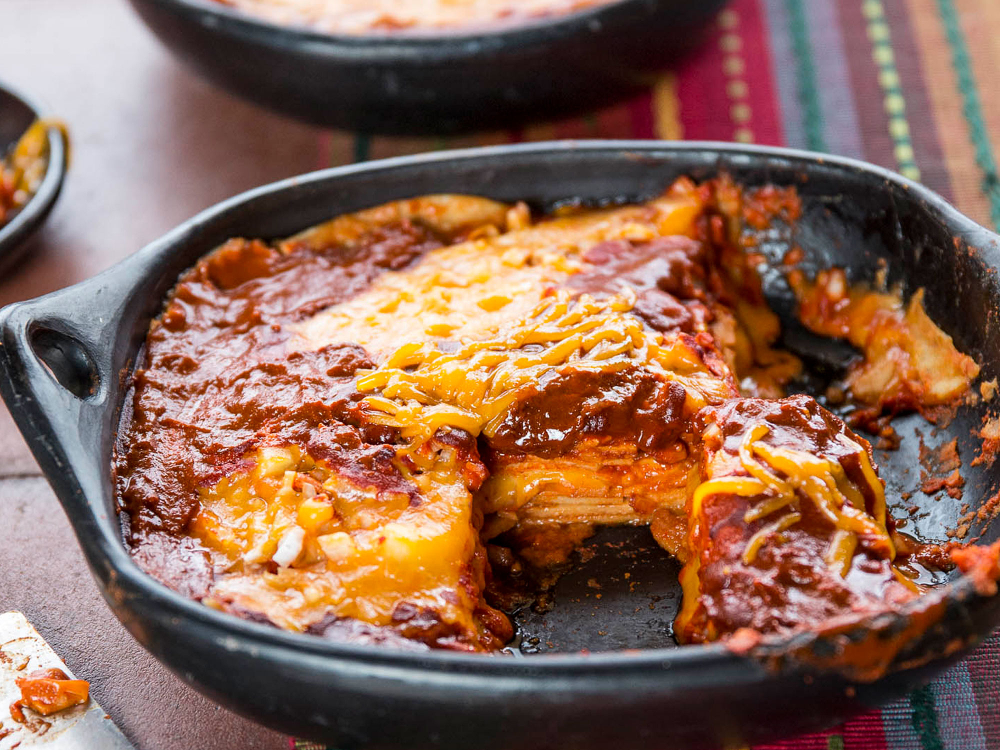

# New Mexico Stacked Red Enchiladas

*New Mexico's signature enchilada style: layers of corn tortillas, red chile sauce, shredded chicken (or beef), grated cheddar and Monterey Jack, stacked flat (not rolled) and baked till bubbly. Topped with a fried egg in the traditional New Mexican style; "Christmas style" if served with both red AND green chile.*

**Serves:** 4

**Prep Time:** 25 minutes

**Cook Time:** 25 minutes

## Overview
Stacked red enchiladas is the traditional New Mexican enchilada style, distinct from the Mexican rolled version: layers of corn tortillas (briefly heated in oil to make pliable), red chile sauce (made from rehydrated dried New Mexico red chiles blended with garlic, oregano and cumin), shredded chicken (or beef, or just cheese for vegetarian), grated cheddar and Monterey Jack, stacked flat in 3-4 layers, baked till the cheese melts and the dish is bubbling. Topped with a fried egg (sunny-side up) for the traditional New Mexican presentation. If served with both red AND green chile sauces on the same plate, it's called "Christmas style".

## Ingredients

### Red chile sauce
- 8 dried New Mexico red chiles (stems and seeds removed); or substitute with mix of ancho + guajillo
- 600 ml hot chicken stock
- 1 large onion (chopped)
- 8 garlic cloves
- 1 tablespoon ground cumin
- 1 tablespoon dried Mexican oregano
- 2 tablespoons vegetable oil
- 2 tablespoons plain flour
- 1 ½ teaspoons fine sea salt
- 1 teaspoon ground black pepper

### Filling
- 600 g cooked shredded chicken (or beef)
- 1 small onion (finely chopped)
- 1 teaspoon ground cumin

### Tortillas
- 12 corn tortillas
- 4 tablespoons vegetable oil (for warming)

### Cheese
- 300 g grated sharp cheddar
- 200 g grated Monterey Jack

### Topping
- 4 fried eggs (for serving; sunny-side up)
- 1 small bunch fresh coriander
- 1 small red onion (sliced)
- Sliced raw jalapeño
- Lime wedges

### To serve
- New Mexican rice
- Refried beans
- Sour cream
- Sliced avocado

## Method

### Stage 1 - Make red chile sauce
1. Toast dried chiles briefly in dry pan.
2. Pour hot stock over; soak 30 min.
3. Transfer to blender with onion, garlic, cumin, oregano.
4. Blitz smooth.
5. Heat oil in saucepan; sprinkle flour; whisk 1 min.
6. Pour in blended sauce; cook 8 min till thickened.
7. Season with salt and pepper.

### Stage 2 - Prep filling
1. Mix shredded chicken with chopped onion and cumin.

### Stage 3 - Soften tortillas
1. Heat vegetable oil in wide pan.
2. Pass each tortilla briefly through hot oil 5 sec per side.
3. Drain on paper towels.

### Stage 4 - Assemble stacks
1. Preheat oven to 200°C (400°F).
2. In individual oven-safe plates (4 of them), or in a wide baking dish:
3. Layer 1: tortilla.
4. Layer 2: shredded chicken + onion (one quarter).
5. Layer 3: red chile sauce.
6. Layer 4: grated cheese.
7. Repeat: tortilla, chicken, sauce, cheese.
8. Top with a third tortilla and final layer of sauce and cheese.

### Stage 5 - Bake
1. Bake 12-15 min till cheese is bubbly and golden.

### Stage 6 - Top with egg
1. Fry 4 eggs sunny-side up.
2. Place one on top of each stack.

### Stage 7 - Serve
1. Scatter coriander, red onion, jalapeño.
2. Sliced avocado, sour cream alongside.
3. NM rice and refried beans.

## Notes
- **Stacked, not rolled:** New Mexican signature.
- **Fried egg on top:** essential.
- **Christmas style:** red AND green chile sauces.

## Variations
**Christmas style:** half red chile sauce, half green chile sauce on the same plate.
**With beef:** swap chicken for shredded beef.
**Cheese-only:** vegetarian.
**With pinto beans in layers:** add layer of refried beans between tortillas.

## Serving
Individual stacks with rice and beans. Cold beer.

## Storage
- Best eaten immediately.
- Components separately keep 4 days.
- Assemble fresh.
