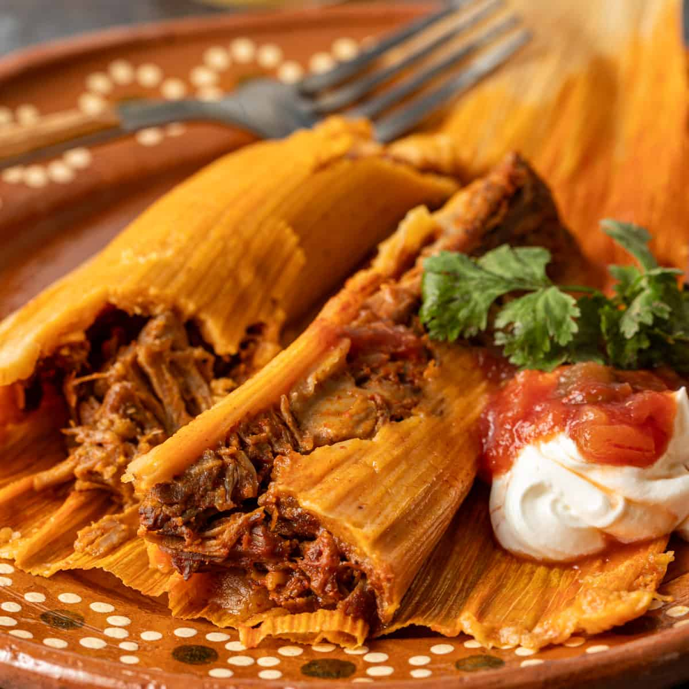

# Tamales Rojos

*New Mexico's red chile pork tamales: masa harina (corn flour) dough flavoured with red chile, wrapped around a filling of slow-cooked red chile pork, folded in corn husks, and steamed till tender. The NM Christmas Eve and feast-day classic: a labour of love, family undertaking, deeply traditional.*

**Serves:** Makes 24 tamales

**Prep Time:** 1.5 hours

**Cook Time:** 1.5 hours

## Overview
New Mexico tamales rojos are the canonical NM Christmas Eve and major feast-day labour of love: masa harina (the Mexican corn flour) mixed with lard, salt, chicken stock and red chile paste to make a thick spreadable dough, spread on softened dried corn husks, topped with a small portion of slow-cooked red chile pork (cubed pork shoulder simmered in NM red chile sauce till tender and shredded), folded into rectangular packets, and steamed for 90 minutes. The Christmas Eve tamale tradition is a family undertaking: three generations gathering around a table assembling dozens or hundreds of tamales in an afternoon. Three details: corn husks must be soaked, masa with lard for proper texture, slow-cook the pork.

## Ingredients

### Pork filling
- 800 g pork shoulder (cubed)
- 8 dried NM red chillies (or 4 ancho + 4 guajillo)
- 500 ml hot water (for soaking)
- 8 garlic cloves
- 1 onion (chopped)
- 2 tablespoons cumin
- 2 tablespoons oregano
- 1 ½ teaspoons salt
- 600 ml chicken stock

### Masa
- 800 g masa harina
- 250 g lard (or vegetable shortening)
- 1.2 litres hot chicken stock
- 2 teaspoons salt
- 4 tablespoons reserved red chile paste (from above)
- 2 teaspoons baking powder

### Corn husks
- 30 dried corn husks (soaked in hot water 2 hours till pliable)

### Equipment
- Large steamer or stockpot with steamer insert
- String for tying

## Method

### Stage 1 - Cook pork
1. Toast dried chillies; soak in hot water 30 min; reserve liquid.
2. Blend chillies with onion, garlic, cumin, oregano, salt and 200 ml soaking liquid till smooth.
3. Brown pork in oil; add chile paste; cook 5 min.
4. Add chicken stock; simmer covered 90 min till pork is tender.
5. Shred pork; reserve sauce.
6. Mix shredded pork with some sauce to make a moist filling.

### Stage 2 - Make masa
1. In wide bowl, beat lard with electric mixer 5 min till fluffy.
2. Beat in salt and baking powder.
3. Alternate adding masa harina and warm chicken stock, beating to a thick spreadable paste.
4. Beat in 4 tablespoons of the reserved red chile paste.
5. Test: a small bit of masa should float in water if properly beaten.

### Stage 3 - Soak husks
1. Soak corn husks in hot water 2 hours.

### Stage 4 - Assemble
1. Take a softened husk; lay flat with the smooth side up, wide end toward you.
2. Spread 2 tablespoons of masa thinly down the centre (leave 5 cm border at top, 2 cm at sides).
3. Place 2 tablespoons of pork filling down the centre of the masa.
4. Fold the two long sides over the filling (so masa meets masa).
5. Fold the narrow tip of the husk up over the bottom; the open top stays open.
6. Place seam-side-down in a baking dish.
7. Repeat for all 24 tamales.

### Stage 5 - Steam
1. Set up a large steamer or stockpot with a steamer insert.
2. Arrange tamales open-end-up in the steamer (so the filling doesn't leak).
3. Cover with extra corn husks and a damp cloth.
4. Steam 75-90 min, adding water as needed (don't let it run dry).

### Stage 6 - Test
1. Take one out; let cool slightly.
2. Open the husk; the masa should be firm and pull cleanly away from the husk.
3. If too sticky, steam longer.

### Stage 7 - Serve
1. Serve hot in their husks.
2. Diners unwrap their own.
3. With extra red chile sauce, sour cream, salsa.

## Notes
- **Lard for proper masa texture:** vegetable shortening substitute.
- **Float test:** masa should float in water.
- **Steam properly:** 75-90 min.
- **Family activity:** gather to assemble.
- **Make in large batches:** freeze.

## Variations
**Green chile chicken tamales:** swap pork for chicken; red chile for green.
**Cheese and jalapeño:** vegetarian; cheese strip + sliced jalapeño as filling.
**Sweet tamales:** sweetened masa + raisins + cinnamon.
**Beef tamales:** swap pork for shredded beef.

## Serving
At Christmas Eve, weddings, feast days. With red or green chile sauce, sour cream, salsa. Mexican beer.

## Storage
- Steamed tamales keep refrigerated 5 days.
- Re-steam to reheat (or microwave wrapped).
- Freeze 3 months; reheat by re-steaming for 30 min.
- Uncooked tamales freeze 6 months; cook from frozen for 90 min.
