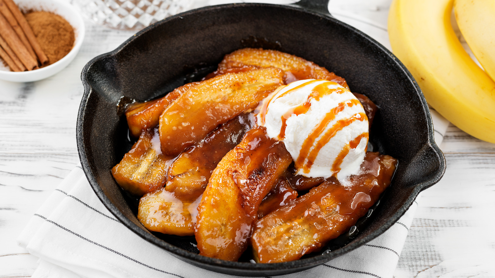

# Bananas Foster

*The Brennan's tableside flambé: bananas glazed in brown sugar, butter, cinnamon and dark rum, then set alight and spooned over vanilla ice cream. Invented at Brennan's Restaurant, New Orleans, 1951.*

**Serves:** 4

**Prep Time:** 5 minutes

**Cook Time:** 8 minutes

## Overview
Bananas Foster was invented in 1951 by chef Paul Blangé at Brennan's Restaurant on Royal Street in New Orleans, when the restaurant's owner Owen Brennan asked for a banana dessert to use up a glut of fruit coming in through the port. Blangé combined brown sugar, butter and cinnamon, added the bananas, flamed it with dark rum and banana liqueur, and named the dish after his friend Richard Foster, a New Orleans crime commissioner. Sixty-plus years later it is still made tableside at Brennan's, with the waiter ringing a small brass bell as the flame goes up.

The dish is a two-minute job once the bananas are sliced. The flambé is mostly theatre (the alcohol is mostly cooked off after the flame dies down), but it does caramelise the surface of the bananas and burns off some of the harsh edge of the rum, leaving a deeper, rounder sauce. Children love the flames; adults love the rum.

## Ingredients
- 4 ripe but firm bananas (peeled and cut into 5 cm chunks on the diagonal)
- 75 g unsalted butter
- 100 g dark brown sugar
- ½ tsp ground cinnamon
- Pinch of ground nutmeg
- 60 ml banana liqueur (crème de banane; optional but classic)
- 60 ml dark rum (Myers's, Gosling's or any aged Jamaican-style)
- 4 generous scoops vanilla ice cream, to serve

## Method

### Stage 1 - Build the sauce
1. Melt the butter in a wide heavy frying pan over medium heat.
1. Stir in the brown sugar, cinnamon and nutmeg. Cook 2 minutes, stirring, until the sugar dissolves into the butter and the mixture becomes a thick, glossy syrup.

### Stage 2 - Add the bananas
1. Add the banana chunks and turn them gently in the syrup to coat. Cook 1 minute on the first side, then turn and cook 30 seconds on the second. The bananas should be warmed through but still holding their shape.

### Stage 3 - Flambé
1. Off the heat. Pour the banana liqueur into the pan, then the rum.
1. With a long match or a wand lighter, carefully ignite the alcohol over the pan. Stand back. The flame will rise impressively for 20-30 seconds and then settle. Do not lean over the pan.
1. Return to medium heat and tilt the pan gently to redistribute the burning liquid. When the flames die naturally, the alcohol has cooked off and the sauce should be glossy and amber.

### Stage 4 - Serve
1. Scoop vanilla ice cream into 4 serving bowls.
1. Spoon the bananas and hot sauce over the top. The ice cream will start to melt around the edges immediately.
1. Serve at once.

## Notes
- **Firm bananas, not soft.** Bananas with brown spots are too ripe; the chunks fall apart in the syrup. Yellow-with-green-tipped bananas hold up best.
- **The flambé is genuine cooking, not just show.** The burning rum caramelises the sugar further and removes the raw alcoholic edge. Skipping the flame leaves a sweeter, less complex sauce.
- **Stand well back when lighting.** Rum flames can leap 30 cm above the pan. Tie hair back, push back the loose sleeves.
- **No banana liqueur?** Substitute with an extra 30 ml of rum and a teaspoon of vanilla extract.
- **Cooking gas is easier than induction.** An induction hob will not let the alcohol vapours catch easily; gas flames a portion of the rum vapour as it pours, which starts the flambé reliably.

## Variations
- **With ice cream variations:** brown butter pecan or rum raisin make excellent alternatives to plain vanilla.
- **Without alcohol:** the sauce works with 60 ml apple juice and 30 ml lemon juice in place of the spirits. Different but pleasant.
- **With a flatbread or pancake:** spoon over a fresh waffle or thick-cut French toast instead of ice cream for a brunch version.

## Serving
- A New Orleans presentation traditionally rings a small brass bell or chime when the flame goes up. Worth recreating at the table with a glass struck by a knife if you have an audience.

## Storage
The sauce does not keep; flambé it fresh and serve. The bananas continue to soften and weep into the sauce overnight; leftovers become a sweet banana porridge, fine on toast the next morning but unrecognisable as the original dish.
