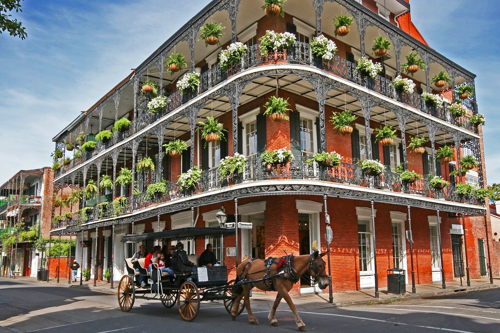

# New Orleans Cuisine

The cooking of the city itself, distinct from the broader Louisiana umbrella above it. Antoine's oysters Rockefeller and pompano en papillote, Brennan's bananas Foster, Café du Monde beignets, Galatoire's trout meunière, Commander's Palace turtle soup. Pralines from the sidewalk stands and gumbo from the corner restaurant. A city cuisine built on French restaurant tradition, African and Caribbean technique, and the unmatched Gulf shellfish coming up the river.
