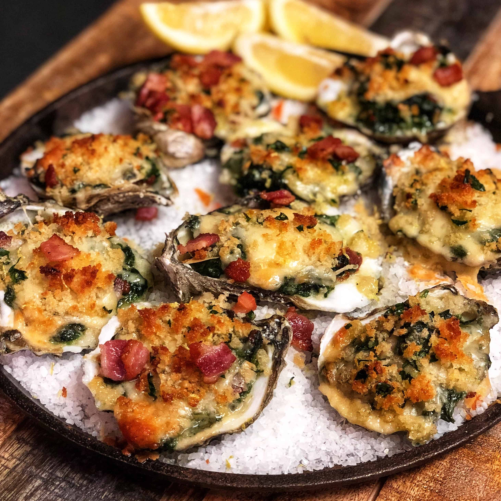

# Oysters Rockefeller

*Antoine's 1899 invention: oysters baked under a buttery emerald-green sauce of herbs, breadcrumbs and a kiss of Pernod, named for John D. Rockefeller because the sauce is "rich as Rockefeller". The original recipe remains a secret.*

**Serves:** 4 (3 oysters each as a starter)

**Prep Time:** 25 minutes

**Cook Time:** 8 minutes

## Overview
Oysters Rockefeller was invented in 1899 at Antoine's Restaurant on St Louis Street in New Orleans by Jules Alciatore, son of the founder. The original recipe is allegedly still locked in the restaurant safe and has never been published; the rumour that it contains spinach is a popular myth. The actual original is built on watercress, parsley, celery leaf, green onion and a whisper of Pernod, with breadcrumbs as a binder and butter to enrich. The colour is brilliant green; the flavour is herbaceous and rich at once, with the briny oyster underneath holding the dish.

This recipe is a careful approximation. It does not use spinach (a frequent and incorrect departure); it does use a generous handful of fresh herbs. The oysters are shucked and laid on rock salt to keep them stable, topped with the green herb butter, and broiled briefly until the surface bubbles and just starts to brown. Five minutes at the table from the moment they leave the broiler.

## Ingredients
- 12 fresh oysters (on the half shell, with their liquor)
- 500 g coarse rock salt (or coarse sea salt, for the platter)

### Green herb butter
- 100 g unsalted butter (softened)
- 1 bunch watercress (about 80 g; trimmed)
- 1 small bunch flat-leaf parsley (about 30 g; chopped)
- 4 spring onions (white and pale-green parts; finely sliced)
- 2 celery sticks with leaves (very finely chopped)
- 1 garlic clove (minced)
- 2 tbsp dry breadcrumbs (preferably panko or fine fresh)
- 1 tbsp Pernod (or other anise liqueur; Herbsaint if you have it)
- 1 tsp Worcestershire sauce
- ½ tsp Tabasco
- Salt to taste
- A few twists of black pepper

## Method

### Stage 1 - Make the herb butter
1. Place the watercress, parsley, spring onions, celery and garlic in a food processor. Pulse until very finely chopped but not puréed. Aim for a damp, vivid green mince.
1. Add the softened butter, breadcrumbs, Pernod, Worcestershire and Tabasco. Pulse until just incorporated; the mixture should still look green-flecked, not uniformly pale.
1. Season with salt and black pepper. Transfer to a small bowl and refrigerate 15 minutes to firm up.

### Stage 2 - Prepare the oysters
1. Preheat the broiler/grill on its highest setting.
1. Pour the rock salt into a large heavy ovenproof platter or roasting tin, in a layer 1.5 cm deep. This is the bed for the oysters; it holds them level and conducts heat.
1. Shuck the oysters, keeping the deeper half-shell with the meat and as much liquor as possible. Discard the flat top shell.
1. Nestle each oyster (in its shell) into the rock salt bed, pressing gently so the shell sits level.

### Stage 3 - Top and broil
1. Spoon a generous teaspoon of the herb butter onto each oyster, covering the meat completely. The herb butter should be 5-6 mm thick.
1. Slide the platter under the hot broiler, 10-12 cm from the heat source. Watch carefully.
1. Broil 3-5 minutes, until the butter is bubbling vigorously and the surface is just starting to brown in spots. Do not over-broil; over-cooked oysters become rubbery quickly.

### Stage 4 - Serve
1. Carry the hot platter to the table. The rock salt holds the heat for several minutes; the oysters continue to bubble.
1. Provide small oyster forks. Eat directly from the shell.

## Notes
- **No spinach.** This is the single most common misconception. The original was watercress and herbs; spinach gives a duller, more vegetal result. Stick with watercress.
- **Pernod or Herbsaint, not raw absinthe.** The anise should be a faint background note. Too much and the dish tastes medicinal.
- **The rock salt is structural and thermal.** It holds the shells level and keeps the oysters hot from below as you eat. A baking tray of crumpled foil works as an emergency substitute.
- **Eat them hot.** Once cooled, the herb butter sets back into a solid layer and the texture is wrong. Five minutes from broiler to mouth is the target.
- **Buying oysters:** medium-sized Gulf oysters (the New Orleans original) are correct in size; East-Coast Wellfleet or Bluepoint also work. Tiny Kumamotos are too small for the topping. Always buy live, in-shell, on ice.

## Variations
- **Oysters Bienville** (Arnaud's, 1920s): the savoury cousin, with chopped shrimp, mushroom and béchamel in place of the green herb butter.
- **Oysters Mosca:** a Louisiana variation with breadcrumbs, garlic and oregano, baked under olive oil.

## Serving
A traditional New Orleans starter: 3 oysters per person, with a cold glass of Sancerre or Muscadet. Half a baguette on the side for mopping the herb butter from the empty shells.

## Storage
The herb butter keeps 5 days refrigerated, or freezes 3 months. The oysters themselves must be served the moment they come out of the broiler; reheated oysters Rockefeller is best avoided.
