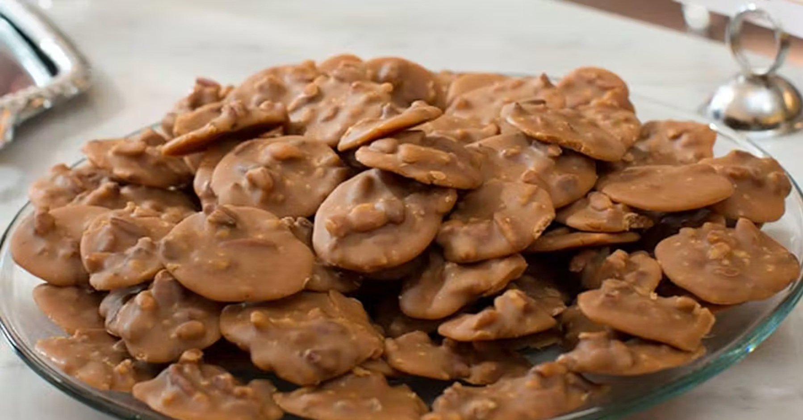

# Pralines

*The New Orleans pecan candy: brown sugar, butter and cream cooked to soft-ball stage, stirred with toasted pecans, dropped onto parchment and left to set into crumbly, fudgy discs. Sold from sidewalk stands in the French Quarter for 200 years.*

**Makes:** about 20 pralines

**Prep Time:** 10 minutes

**Cook Time:** 15 minutes (plus 30 minutes setting)

## Overview
A New Orleans praline (pronounced PRAH-leen in the city, not PRAY-leen) is not the same thing as the French original. The French version is whole almonds in cooked sugar, more like a brittle. The New Orleans version was adapted by the Ursuline nuns and free women of colour in the 18th century, who substituted local pecans for almonds and added cream and butter, producing something softer and more dessert-like. A praline is fudgy, brown-sugar-sweet, full of toasted pecan, and crumbles slightly at the edge.

The recipe is straightforward in principle and tricky in practice: it is a candy, and candy is unforgiving on temperature. A reliable instant-read thermometer is the difference between perfect pralines and a sticky mess. The target is 116°C (the soft-ball stage). Two degrees too low and the pralines never set; two degrees too high and they go hard like brittle.

## Ingredients
- 250 g pecan halves (toasted)
- 200 g light brown sugar
- 100 g granulated white sugar
- 120 ml double cream (or evaporated milk)
- 60 g unsalted butter
- 1 tsp vanilla extract
- ¼ tsp fine salt
- Pinch of bicarbonate of soda (helps the texture)

## Method

### Stage 1 - Toast the pecans
1. Heat a dry frying pan over medium heat. Add the pecan halves and toast 3-4 minutes, stirring frequently, until aromatic and just darker. Tip onto a plate to cool.

### Stage 2 - Prepare the setting surface
1. Lay a sheet of baking parchment on a flat heat-resistant work surface (a marble slab is ideal; a clean stone or laminate counter works too).
1. Have two large spoons (or a tablespoon and a teaspoon) ready beside the parchment.

### Stage 3 - Cook the candy
1. Combine the brown sugar, white sugar, cream, butter and salt in a heavy-bottomed saucepan (at least 2 litre capacity, as the mixture foams considerably). Set on medium heat.
1. Stir until the sugars dissolve completely and the mixture comes to a boil.
1. Clip a candy thermometer to the side of the pan, the bulb in the liquid but not touching the bottom.
1. Cook, stirring occasionally, until the mixture reaches 116°C (240°F, the soft-ball stage). This takes 6-9 minutes. Watch the thermometer closely from 110°C; the temperature rises quickly at the end.

### Stage 4 - Cool and stir
1. Take the pan off the heat immediately when 116°C is reached.
1. Add the vanilla, bicarbonate of soda and the toasted pecans. Stir vigorously with a wooden spoon for 30-60 seconds. The mixture will lose its glossy translucency and turn opaque and slightly creamy. This is the cue that it is ready to drop.

### Stage 5 - Drop the pralines
1. Working quickly, spoon heaped tablespoons of the mixture onto the parchment, leaving 3 cm between each. The mixture will spread slightly. If it starts to set before you finish, the pan is too cool; you can return it briefly to low heat (10 seconds) and continue.
1. Leave to set at room temperature, 30-40 minutes. The pralines are ready when the surface is firm to the touch and the underside has set hard.

## Notes
- **A candy thermometer is non-negotiable.** Soft-ball stage cannot be reliably judged by eye or by the cold-water test alone. A thermometer is £10, lasts a lifetime, and is the difference between every praline being right and most batches failing.
- **Stir vigorously off the heat.** The 30-60 seconds of stirring is what produces the crumbly, slightly grainy texture. Skipping it gives a smooth fudge, which is good but not a praline.
- **Move fast at the dropping stage.** The mixture sets quickly. Two spoons are faster than one. If you are slow, you may get 15 large pralines instead of 20 medium ones; both are fine.
- **Humidity matters.** Pralines absorb moisture from the air and turn sticky on damp days. Make them on dry days, or run the air conditioning before you start.

## Variations
- **Bourbon pralines:** stir 1 tbsp bourbon in with the vanilla. The alcohol cooks off, leaving an oaky, slightly smoky background note.
- **Chocolate pralines:** drizzle melted dark chocolate over the cooled pralines.
- **Praline ice cream:** finely chop a few cooled pralines and fold into vanilla ice cream in the final minute of churning.

## Serving
A praline is a sweet snack rather than a dessert in its own right; eat one with coffee at the end of a meal, or as a treat with a glass of cold milk. New Orleans pralines are sold to tourists from sidewalk stands; a serious one can buy a small box and eat them all the way back to the hotel.

## Storage
- Keeps 2 weeks in an airtight tin at room temperature. Do not refrigerate; the moisture turns them sticky.
- Freezes 3 months wrapped individually in foil. Defrost at room temperature.
- Pralines that have gone slightly hard can be refreshed in a 100°C oven for 30 seconds.
