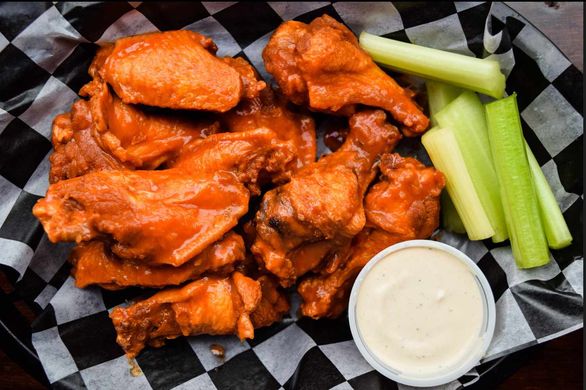

# Buffalo Wings

*Buffalo, New York's iconic chicken: deep-fried chicken wings tossed in a tangy hot buttery sauce made of cayenne hot sauce and butter, served with celery sticks and blue cheese dressing. Invented at the Anchor Bar in Buffalo in 1964; the canonical sports bar and Super Bowl snack.*

**Serves:** 4-6

**Prep Time:** 15 minutes

**Cook Time:** 15 minutes

## Overview
Buffalo wings (named for Buffalo, NY, not for buffalo meat) are one of America's most beloved bar foods and were invented at the Anchor Bar in Buffalo in 1964 by Teressa Bellissimo, who reportedly made them on the spot for her son and his friends with what she had in the kitchen: chicken wings (the whole wing, separated into the drumette and the flat) deep-fried till crispy (no breading, just deep-fried as-is), then tossed in a sauce of Frank's RedHot original sauce (the canonical brand) and melted butter (the canonical proportion is 1:1 by volume, with some preferring more or less butter). Served with celery sticks and blue cheese dressing (or ranch in much of America, though blue cheese is the Buffalo original).

## Ingredients

### Wings
- 1.5 kg chicken wings (separated into drumettes and flats; tips discarded or saved for stock)
- 2 teaspoons fine sea salt
- 1 teaspoon ground black pepper
- 2 teaspoons baking powder (optional; for extra crispness)

### Frying
- Vegetable oil for deep-frying (about 1.5 litres)

### Buffalo sauce
- 120 ml Frank's RedHot sauce (canonical)
- 120 g butter
- 1 tablespoon Worcestershire sauce
- 1 tablespoon white vinegar
- ½ teaspoon garlic powder
- ½ teaspoon cayenne (extra heat)
- 1 teaspoon honey (optional; balances)

### Blue cheese dressing
- 200 g blue cheese (Roquefort, Gorgonzola, or local)
- 200 ml sour cream
- 100 ml mayonnaise
- 100 ml buttermilk
- 1 tablespoon white wine vinegar
- 4 garlic cloves (crushed)
- 1 small bunch chives (chopped)
- 1 teaspoon Worcestershire
- ½ teaspoon fine sea salt
- ½ teaspoon ground black pepper

### To serve
- 8 sticks celery
- 4 sticks carrot (optional)
- Cold beer

## Method

### Stage 1 - Prep wings
1. Pat wings very dry with paper towels (essential for crispy skin).
2. Toss with salt, pepper, and baking powder (if using).
3. Optional: refrigerate uncovered on a rack 4-12 hours to dry the skin further.

### Stage 2 - Make blue cheese dressing
1. Crumble blue cheese.
2. Whisk sour cream, mayonnaise, buttermilk, vinegar, garlic, Worcestershire, salt, pepper.
3. Fold in blue cheese (leave some chunks).
4. Stir in chives.
5. Chill 30 min.

### Stage 3 - Heat oil
1. Heat oil to 190°C (375°F) in heavy deep pot.

### Stage 4 - Fry
1. Fry wings in batches 8-10 min till deeply golden and crispy.
2. Internal temp 75°C (165°F).
3. Drain on paper towels.

### Stage 5 - Make Buffalo sauce
1. Melt butter in a saucepan.
2. Add Frank's RedHot, Worcestershire, vinegar, garlic powder, cayenne, honey (if using).
3. Whisk till smooth.
4. Keep warm.

### Stage 6 - Toss
1. Place hot wings in a large bowl.
2. Pour warm sauce over.
3. Toss thoroughly to coat.

### Stage 7 - Serve immediately
1. Pile on platters.
2. Celery sticks and blue cheese dressing in separate bowls for dipping.
3. Carrots optional.
4. Cold beer.

## Notes
- **Pat wings VERY dry:** for crispy skin.
- **Frank's RedHot canonical:** other hot sauces are too thick/wrong.
- **Blue cheese not ranch:** Buffalo original.
- **Eat immediately while hot.**

## Variations
**Mild:** swap half the hot sauce for melted butter.
**XXX hot:** add 2 tablespoons cayenne + 1 chopped fresh chilli.
**Honey hot:** double the honey.
**Baked (less authentic):** 220°C 40 min, no oil.

## Serving
At sports bars, tailgates, Super Bowl parties. Cold beer.

## Storage
- Best immediately.
- Cooked refrigerate 2 days; reheat in oven at 200°C 10 min.
- Sauce keeps refrigerated 2 weeks.
- Blue cheese dressing keeps refrigerated 1 week.
