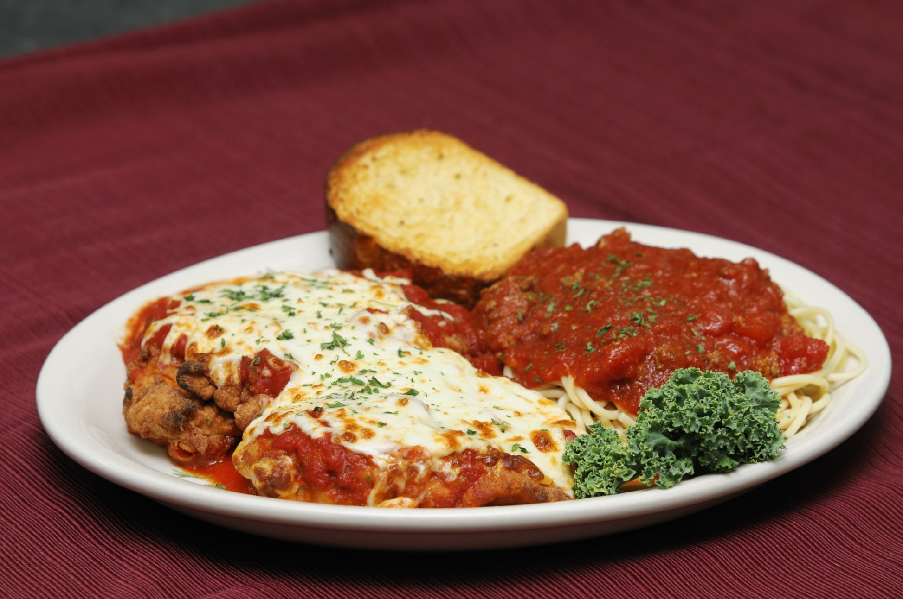

# Chicken Parmigiana (New York Italian-American Style)

*New York Italian-American's iconic chicken dish: chicken breasts pounded thin, breaded in seasoned panko, pan-fried till golden, then topped with marinara sauce, mozzarella and grated Parmesan and baked till the cheese melts and bubbles. Served over spaghetti or with garlic bread. The Italian-American red-sauce-joint classic.*

**Serves:** 4

**Prep Time:** 25 minutes

**Cook Time:** 25 minutes

## Overview
Chicken parmigiana (also called chicken parm) is one of the most iconic Italian-American dishes and a Brooklyn/Queens/Bronx red-sauce-joint staple; a dish that emerged in New York's Italian neighbourhoods in the early 20th century as a chicken adaptation of the Sicilian melanzane alla parmigiana (which uses aubergine). Chicken breasts pounded thin (or "scaloppini"), dredged in flour, then beaten egg, then seasoned panko-and-Parmesan breadcrumbs, pan-fried in olive oil till deeply golden, then topped with a generous ladle of marinara sauce (tomato + garlic + basil), shredded mozzarella and grated Parmesan, and baked till the cheese melts and the sauce bubbles. Served over spaghetti with marinara (traditional NY red-sauce style), or as a sub-style sandwich on a sturdy roll.

## Ingredients

### Chicken
- 4 chicken breasts (about 200 g each)
- 2 teaspoons fine sea salt
- 1 teaspoon ground black pepper
- 1 teaspoon garlic powder

### Three-stage breading
- 150 g plain flour
- 3 large eggs (beaten with 2 tablespoons milk)
- 250 g panko breadcrumbs
- 80 g grated Parmesan
- 1 tablespoon dried oregano
- 1 teaspoon garlic powder
- 1 teaspoon onion powder

### Frying
- 100 ml olive oil

### Marinara sauce
- 2 tins (400 g each) crushed tomatoes
- 8 garlic cloves (crushed)
- 1 small onion (finely chopped)
- 4 tablespoons olive oil
- 1 tablespoon dried oregano
- 1 tablespoon dried basil
- 1 teaspoon caster sugar
- 1 ½ teaspoons fine sea salt
- ½ teaspoon ground black pepper
- 1 small bunch fresh basil (chopped)

### Cheese topping
- 300 g shredded low-moisture mozzarella
- 80 g grated Parmesan
- Fresh basil leaves for garnish

### To serve
- 500 g spaghetti (cooked)
- Garlic bread
- Mixed leaf salad
- Red wine

## Method

### Stage 1 - Pound chicken
1. Place chicken breasts between cling film.
2. Pound to 1cm thick with a meat mallet or heavy pan.
3. Season with salt, pepper, garlic powder.

### Stage 2 - Make marinara
1. Heat oil; cook chopped onion 6 min.
2. Add garlic; cook 30 sec.
3. Add crushed tomatoes, oregano, dried basil, sugar, salt, pepper.
4. Simmer 25 min.
5. Stir in fresh basil at end.

### Stage 3 - Three-stage breading
1. Set up 3 bowls: flour, beaten eggs, panko + Parmesan + oregano + garlic and onion powder.
2. Dredge chicken in flour.
3. Dip in egg.
4. Press into panko mixture, coating thoroughly.

### Stage 4 - Pan-fry
1. Heat olive oil in wide pan.
2. Fry chicken 3-4 min per side till deep golden.
3. Drain on paper towels.

### Stage 5 - Assemble and bake
1. Preheat oven to 200°C (400°F).
2. Place fried chicken in a baking dish.
3. Spoon marinara over each piece.
4. Top with mozzarella and Parmesan.

### Stage 6 - Bake
1. Bake 12-15 min till cheese is bubbling and golden.

### Stage 7 - Serve
1. Place on plates over spaghetti.
2. Extra marinara on the side.
3. Fresh basil leaves.
4. Garlic bread, salad alongside.

## Notes
- **Pound chicken thin:** even cooking.
- **Three-stage breading:** for proper crust.
- **Don't drown in sauce:** keeps crust crispy.
- **Mozzarella + Parmesan combo.**

## Variations
**Chicken parm sub:** stuff in a sturdy hero roll with sauce and cheese.
**Veal parm:** swap chicken for veal scaloppini.
**Eggplant parm:** swap chicken for breaded aubergine slices (the Italian original).
**Shrimp parm:** pan-fried breaded shrimp.

## Serving
At Italian-American red-sauce restaurants. Sunday family dinners.

## Storage
- Refrigerated 3 days.
- Reheat in oven covered 15 min at 180°C.
- Freezes 2 months.
