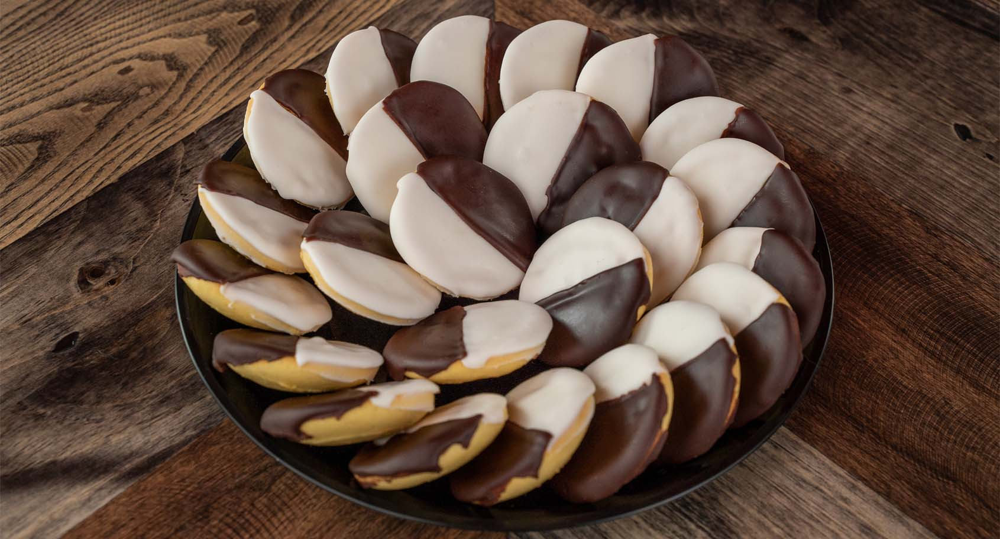

# Black and White Cookies

*New York's iconic bakery cookie: a soft cake-like vanilla cookie (more like a flat sponge cake) iced in two halves (one half white vanilla fondant, one half dark chocolate fondant), giving the traditional half-and-half black-and-white appearance. The NYC Jewish-bakery classic; the cookie featured in Seinfeld.*

**Serves:** Makes 12 large cookies

**Prep Time:** 25 minutes

**Cook Time:** 18 minutes (plus 1 hour cooling)

## Overview
Black and white cookies are one of New York's most iconic bakery items and a fixture of every Jewish bakery and bodega in Manhattan and Brooklyn (Glaser's Bake Shop in the East Village made them from 1902 to 2018; William Greenberg's Desserts on the Upper East Side still does): not really a cookie in the crisp sense (more a flat soft cake), but called a cookie nonetheless. A vanilla cake batter (butter, sugar, eggs, vanilla, milk, flour, baking powder) dropped onto a baking sheet to make 8-10 cm wide round flat cookies; baked till just-set, flat side up. Once cool, iced in two halves: one half white vanilla fondant, one half dark chocolate fondant, with a sharp dividing line down the middle.

## Ingredients

### Cookie batter
- 350 g plain flour
- 1 ½ teaspoons baking powder
- ¼ teaspoon baking soda
- ½ teaspoon fine sea salt
- 200 g butter (softened)
- 250 g caster sugar
- 2 large eggs
- 1 tablespoon vanilla extract
- 250 ml whole milk
- ¼ teaspoon lemon extract (optional; classic)

### Vanilla icing
- 400 g icing sugar
- 4 tablespoons hot water
- 2 tablespoons light corn syrup (or golden syrup)
- 1 teaspoon vanilla extract

### Chocolate icing
- 300 g icing sugar
- 80 g unsweetened cocoa powder
- 4 tablespoons hot water (more as needed)
- 2 tablespoons light corn syrup
- 2 tablespoons melted butter
- 1 teaspoon vanilla extract

## Method

### Stage 1 - Mix dry
1. Whisk flour, baking powder, baking soda, salt.

### Stage 2 - Cream butter and sugar
1. Cream butter and sugar 4 min till pale.
2. Add eggs one at a time, beating between.
3. Beat in vanilla and lemon extract.

### Stage 3 - Combine
1. Alternate adding dry ingredients and milk to the butter mixture.
2. Mix gently till smooth.

### Stage 4 - Scoop
1. Preheat oven to 175°C (350°F).
2. Line baking sheets with parchment.
3. Drop 60g scoops of batter onto sheets, spaced well apart (they spread).
4. Smooth tops gently with damp fingers.

### Stage 5 - Bake
1. Bake 15-18 min till just set and very pale gold (don't let them brown).
2. Cool on rack completely.

### Stage 6 - Make vanilla icing
1. Whisk icing sugar with hot water, corn syrup, vanilla.
2. Should be thick but pourable; add more water as needed.

### Stage 7 - Make chocolate icing
1. Whisk icing sugar, cocoa, hot water, corn syrup, melted butter, vanilla.
2. Same consistency.

### Stage 8 - Ice
1. Turn cookies flat-side-up.
2. Use a small offset spatula or knife.
3. Ice half of each cookie with vanilla icing, going right to the centre line.
4. Let set 5 min.
5. Ice the other half with chocolate icing.
6. The sharp dividing line is the traditional look.

### Stage 9 - Set
1. Let icing set 30 min before stacking.

## Notes
- **Cake-like batter:** not crisp cookie.
- **Flat side up:** for proper icing.
- **Sharp dividing line:** traditional look.
- **Don't overbake:** keeps tender.

## Variations
- **Larger size:** 15 cm cookies, the deli-counter size.
- **Mini:** 4 cm cookies for parties.
- **With lemon icing:** instead of vanilla.
- **With ganache instead of chocolate fondant:** richer.

## Serving
- At NY bakeries, bodegas, Jewish delis. With coffee.

## Storage
- Room temp in sealed tin 1 week.
- Don't refrigerate (icing weeps).
- Don't freeze iced.
- Un-iced freeze 1 month.
